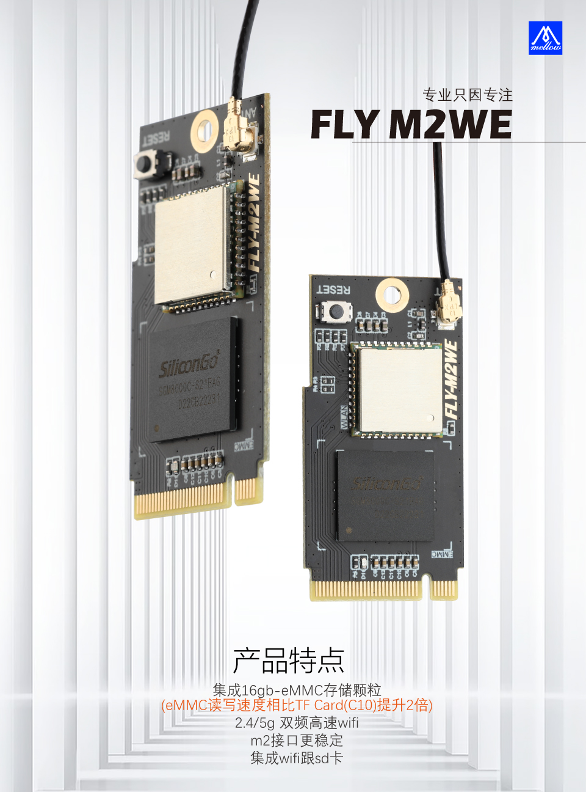

## 1.3  eMMC WiFi模块烧录

?> FLY-M2WE只适用于FLY-π，FLY-Gemini v2，FLY-Gemini v3

?> 不要带电插拔模块，此模块不支持热插拔

>[!TIP]
>使用SD卡给M2WE烧录镜像与使用USB给M2WE烧录镜像可以二选一即可，无需多次烧录

### 1.3.1 产品详情

[FLY3D打印机M2WE板16G eMMC 5g wifi用于KlIpper双子座V2.0PI主板-淘宝网 (taobao.com)](https://item.taobao.com/item.htm?spm=a230r.1.14.6.1a4840a8a8t04w&id=685372879431&ns=1&abbucket=16#detail "点击即可跳转")



### 1.3.2 1迁移SD卡镜像


   FLY-M2WE提供了16G的eMMC和5G WiFi，能够提供更稳定的系统运行和更快的网络传输。（建议使用2.4GWiFi，虽然速度稍慢，但是距离远，连接也更稳定）

?> FLY-M2WE只适用于FLY-π和FLY-Gemini v2,FLY-Gemini v3 不要带电插拔模块，此模块不支持热插拔

?>  FLY-M2WE只适用于FLY-π和FLY-Gemini v2,FLY-Gemini v3

?> **使用SD卡烧录给M2WE镜像需要提前把镜像烧录到SD卡中**

?> **使用SD卡烧录给M2WE镜像后可以将SD卡拆除**

**[FLY_M2WE eMMC购买地址](https://item.taobao.com/item.htm?spm=a1z10.5-c-s.w4002-23066022675.38.25636b45lpxmgF&id=685372879431 "点击即可跳转")**

      1. FLYOS v2.9.6开始已经完全支持M2WE
      2. WiFi驱动已经预装，直接插上并固定好即可


?> 如果同时有SD卡和emmc，并且两个都有系统，会优先启动SD卡系统

   首先请安装好M2WE模块及天线，准备烧录系统。烧录镜像系统有两种方法，一种是将现有的SD卡系统迁移至eMMC模块，下面将对着两种使用方法做介绍。

1. 给Gemini 或 π 安装好M2WE模块并上电启动
2. 连接到SSH
3. 执行下面的命令, 可能会提示输入密码，输入``mellow``回车
   ```bash
   sudo nand-sata-install
   ```


   4. 选择``Boot from eMMC - system on eMMC``选项后按回车键（一般默认选项就是，直接按回车键）

      

   5. 出现``This script will erase your eMMC. Continue?``时选择``Yes``按回车键（一般默认选项就是，直接按回车键）

      

   6. 选择文件系统类型为``ext4``按回车键（一般默认选项就是，直接按回车键）

   7. 耐心等待直到出现进度条（如果等待超过2分钟仍未出现下图进度条请按``CTRL+C``来终止操作，然后重启设备后重试）

      

   8. 系统迁移过程中请勿断电及进行其他操作，直到迁移完成

      

   9. 迁移完成，直接按回车键，等待设备完全关机

   10. 关机后取下SD卡，重新上电开机，此时已经可以通过eMMC中的系统来启动

### 1.3.3 使用USB烧录M2WE

>[!TIP]
>如果使用SD卡烧录镜像后无需在使用此方法再次烧录镜像

**通过USB为eMMC烧录系统镜像**

1. 先下载安装需要的软件

   [USB驱动安装工具 Zadig-2.7](https://cdn.mellow.klipper.cn/Utils/zadig-2.7.exe)

   [FLY-BOOT安装程序](https://cdn.mellow.klipper.cn/Utils/FLY-BOOT-Setup.msi)

   [系统镜像烧录工具 Win32diskimager-1.0](https://cdn.mellow.klipper.cn/Utils/win32diskimager-1.0.0-install.exe)

2. 除了第一个Zadig不需要安装可直接运行，另外两个需要安装。安装过程全都点``下一步``或者``Next``就可以了

3. 打开Zadig，顶部菜单栏``Options``里勾选``List All Devices``

   

4. 按着BOOT键并且将双头USB接入电脑


4. 将附赠的双公头USB线一端连接到电脑，然后长按上图中的按钮，将双公头USB线另一端连接到Gemini或Pi的下图中的USB接口


?> 确保是在按键按下状态时将设备连接到电脑的


5. 如果一切正常，此时zadig中会多出一个``Unknow Device #x``或者``USB Device(VID_1f3a_PID_efe8)``，选择它


6. 选择设备后检查一下USB ID是否与上图一致，如果不是请重新选择其他设备
7. 上图中的第二处只能选择``WinUSB(vxxxxxxx)``版本号无所谓
8. 点击``Install Driver``安装驱动


9. USB驱动安装成功 (驱动只安装一次，如果以后再次烧录不用再安装驱动)

10. 打开安装好的FLY-BOOT，点击``检查设备``


11. 如果前面的步骤操作无误，则会提示发现可用设备（如果没有发现可用设备请仔细查看第4步）


12. 点击``启动BOOT``，如果正常则会提示已成功启用BOOT


13. 现在可以打开文件资源管理器，多出一个14.5G的U盘（16G eMMC显示大小为14.5G）
14. 这样就可以直接用Win32diskimager或balenaEtcher来烧录系统镜像，盘符选择为这个14.5GU盘的盘符
15. 镜像烧录完成后，请配置 [FLY_Config](/board/fly_pi/FLY_π_fly_config.md "点击即可跳转")
