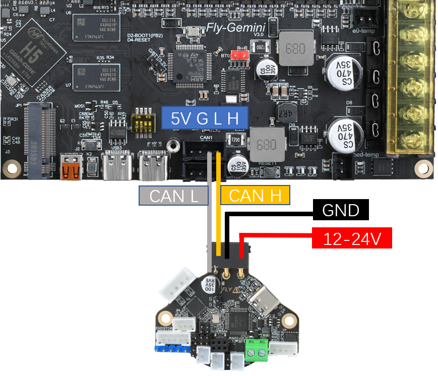
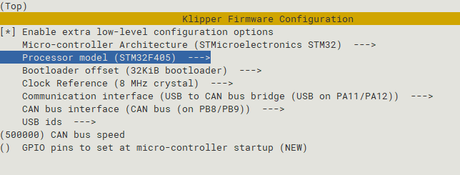

# 15. Gemini v3桥接CAN

CAN总线是一种用于实时应用的串行通讯协议总线，它可以使用双绞线来传输信号，是世界上应用最广泛的现场总线之一。CAN协议用于汽车中各种不同元件之间的通信，以此取代昂贵而笨重的配电线束。该协议的健壮性使其用途延伸到其他自动化和工业应用。CAN协议的特性包括完整性的串行数据通讯、提供实时支持、传输速率高达1Mb/s、同时具有11位的寻址以及检错能力。

3D打印机上使用CAN总线来减少打印头连接到主板的走线数量，原来需要十几根线，使用CAN后只需要使用四根线即可，大大减少走线数量，降低布线难度。

一般3D打印机上使用CAN需要使用U2C来将CAN信号转换成USB端口，而Super8板载了CAN收发器，因此CAN和主板共享通讯带宽来与上位机通讯，无需额外使用U2C来转换信号。板载CAN收发的方法也被称为**桥接CAN**。

本章只简要概述桥接CAN的使用，具体使用教程请查看ST36/42使用教程、SHT36 V2使用教程、SB2040使用教程。

## 15.1 CAN接线

以SHT36V2为例，接线如下图所示



## 15.2 主板固件参数配置

Klipper固件配置界面如下图。编译固件后，按照 [Gemini V3固件编译和烧录](/board/fly_gemini_v3/flash "点击即可跳转") 给出的方法，将固件刷入主板中。



## 15.3 查看CAN uuid

固件刷好后，先不连接SHT36V2工具板，使用下面的命令读取Gemini V3主板的CAN ID。

也可以使用 FLY 的ID读取工具使用方法请查看：[查看CAN uuid](/advanced/can?id=查看can-uuid "点击即可跳转") （此方法仅限Fly上位机）

?> 使用桥接CAN会有两个uuid，请注意区分主板id和CAN板id。在不连接CAN板的情况下读到的就是主板id。

```
~/klippy-env/bin/python ~/klipper/scripts/canbus_query.py can0
```

出现``Found canbus_uuid=11aa22bb33cc``则查找到设备ID。其中``11aa22bb33cc``为设备uuid，可直接填入klipper配置文件。

> 如果没有出现CAN uuid，请检查固件配置是否正确，固件是否烧录成功

 ```
[mcu ]
#serial: /dev/serial/by-id/usb-Klipper_stm32f407*******   # 注释掉这一行
canbus_uuid: 3251a329e6e3                                # 在此处填写主板的CAN ID
 ```

在读到主板CAN ID之后，将uuid填写到配置文件保存后，断开主板电源，接好SHT36V2。

## 15.4 SHT36 V2固件刷写

主板桥接CAN固件刷好后，还需要刷写SHT36 V2工具板的固件才能正常使用。

> 由于SHT36 V2是使用CanBoot刷写固件，因此需要先刷好**主板桥接CAN固件**，并正确**连接SHT工具板和主板**才能刷写SHT工具板的固件。

SHT36 V2刷写教程：[SHT36 V2固件编译和烧录](/board/fly_sht_v2/flash "点击即可跳转")

其他型号的CAN工具板，请自行前往本网站的对应产品查看

