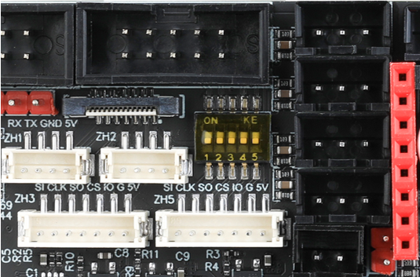

# 4. Gemini拨码开关说明

Gemini开创性的将上位机与主板集成在一块PCB上，因此上位机连接到主板无需额外的数据线，使用拨码开关配置即可

## 4.1 4P拨码开关使用说明

* 如图所示，需要将第 **1**、**2** 个拨码开关向上拨至打开状态，**3**、**4** 保持关闭状态。linux-usb1 直连 stm32-usb 

  > [!TIP]
> 这是最常用的，也是出厂的默认模式，可以理解为使用 USB 线 连接上位机到主板，这个拨码扮演的角色是 USB 线 

> [!TIP]
> 在这个模式下，图中所示的USB口会被占用，不能再插入其他USB设备

* 如果将 **1**、**2** 拨码开关拨到关闭状态，**3**、**4** 拨码开关拨到打开状态，则将STM32 连接到下方的Type-C口

  > [!TIP]
> 这种方式几乎用不到

  

## 4.2 5P拨码开关使用说明

全部打开将用于 RRF 的 SBC 模式，STM32 的 SPI 连接到 linux mcu 的 spi0

> [!TIP]
> 使用 **Klipper** ，无需改动！！！

