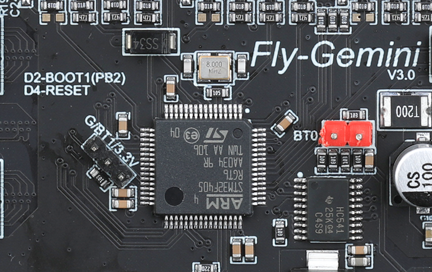
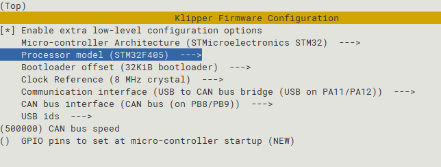

# 5. 固件编译烧录

> [!TIP]
> Gemini v3烧录时**不要**在``G/BT1/3.3V``处插入任何跳线帽，烧录完成后无需将插入任何跳线



## 5.1 拨码开关设置

* 拨码开关``1``,``2``打开将下位机与上位机通过内置USB连接，拨码``3``,``4``打开将下位机USB连接到板载Type-C端口
* ``1``,``2``为一组，``3``,``4``为一组。两组不可同时打开


## 5.2 固件编译

编译固件前请确保 [连接到SSH](/board/fly_gemini/host/FLY_π_ssh.md "点击即可跳转")

这里只进行简要说明，完整编译步骤请查看：[编译klipper固件](/board/fly_super8/firmware?id=_1-编译klipper固件 "点击即可跳转")。

* 普通USB固件配置


* USB桥接CAN固件配置
* Gemini v3建议使用Klipper的USB桥接CAN固件，可以省去一个UTOC来通过CAN连接工具板



* 执行命令```make -j4```来编译固件

## 5.3 固件烧录

* 执行下面的命令来添加一键烧录工具，这个命令只执行一次，后续烧录不用
* ```bash
wget -O gemini-tools_install.sh https://cdn.mellow.klipper.cn/Utils/gemini-tools/gemini-tools_install.sh && sudo bash gemini-tools_install.sh gemini-v3-tools
 ```
 
 > [!TIP]
> **如果提示hid-flash错误可以执行下面命令，没有就无需执行**
 
 ```
 cd ~/klipper/lib/hidflash && make
 ```
  > [!TIP]
> 执行下面的命令来自动烧录固件
 ```
sudo gemini-v3-tools -f ~/klipper/out/klipper.bin
```
* 注意：以上命令烧录固件会将``~/klipper/out/klipper.bin``烧录到下位机，请在烧录前编译好固件

* 进入烧录模式

```
  sudo gemini-v3-tools -h
  ```
  
* 正常启动MCU

  ```
  sudo gemini-v3-tools -s
  ```

  

* 重置MCU

  ```
  sudo gemini-v3-tools -r
  ```

  


> [!TIP]
> 烧录完成后无需将插入任何跳线
