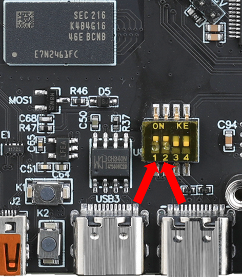

# 9. 固件编译烧录

> [!TIP]
> Gemini v3烧录时**不要**在``G/BT1/3.3V``处插入任何跳线帽，烧录完成后无需将插入任何跳线


## 1. 拨码开关设置

* 拨码开关``1``,``2``打开将下位机与上位机通过内置USB连接，拨码``3``,``4``打开将下位机USB连接到板载Type-C端口
* ``1``,``2``为一组，``3``,``4``为一组。两组不可同时打开



## 2. 固件编译

编译固件前请确保 [连接到SSH](/board/fly_gemini/host/FLY_π_ssh.md "点击即可跳转")

这里只进行简要说明，完整编译步骤请查看：[编译klipper固件](/board/fly_super8/firmware?id=_1-编译klipper固件 "点击即可跳转")。

> [!TIP]
> 固件配置方法只是参考，需要按主板提供配置来配置

**固件配置方法**


* 普通USB固件配置


* USB桥接CAN固件配置
* Gemini v3建议使用Klipper的USB桥接CAN固件，可以省去一个UTOC来通过CAN连接工具板


* 执行命令```make -j4```来编译固件

## 3. 固件烧录

* 执行下面的命令来添加一键烧录工具，这个命令只执行一次，后续烧录不用

  ```bash
  curl -kfsSL https://cdn.mellow.klipper.cn/Utils/fly-flash/fly-flash_install.sh | sudo bash -s -- "gemini-v3"
  ```


  > [!TIP]
> 执行下面的命令来自动烧录固件

```bash
sudo fly-flash -d gemini-v3 -h -f ~/klipper/out/klipper.bin
```

* 注意：以上命令烧录固件会将``~/klipper/out/klipper.bin``烧录到下位机，请在烧录前编译好固件

>[!Warning]
>请注意烧录完固件无需执行下方指令

* 进入烧录模式

```bash
 sudo fly-flash -d gemini-v3 -h
```

* 正常启动MCU

```bash
sudo fly-flash -d gemini-v3 -s
```


* 重置MCU

```bash
sudo fly-flash -d gemini-v3 -r
```
