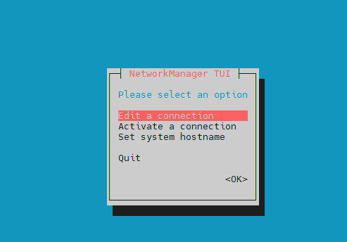
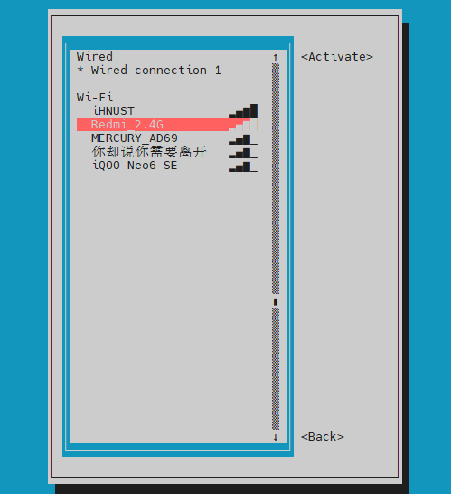
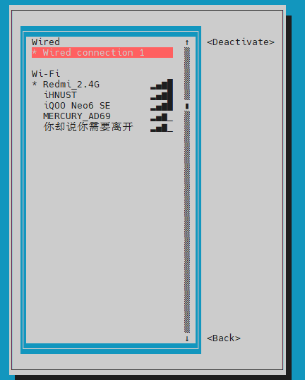

# 5. SSH连接

* 请提前准备好Putty或其他SSH终端工具

## 5.1 串口连接

* 使用USB Type-c线材将FLY-π与电脑连接


* 如果主板与电脑连接正常，打开设备管理器，就可以看到CH340的端口了

  

* 打开Putty，进行如下设置,端口填写前面在设备管理器看到的端口


* 一切正常的话就可以看到启动画面了

  

* 等待片刻，出现这个画面就是启动了


* 查看IP，如果配置了FLY-Config中的WIFI则开机后就会自动连接
* 在终端中输入命令```ip a|grep inet```回车
* 在返回内容中找到与你路由器同段的IP即可访问

> 如果是主板启动很久后才连接的SSH那么请连接后按几下回车键
>

?> 使用typec连接到ssh时，登录的为root账户，建议切换到普通账户后再进行操作！！！输入`su fly`命令，切换到普通用户

* 此时会提示输入用户名，在新窗口终端中输入```fly```后回车


* 提示输入密码，输入```mellow```后回车


## 5.2 远程连接

* 如果主板已经启动且已经连接到网络，可以使用IP连接到SSH
* 打开Putty，进行如下设置，IP填写前面查看的，也可以在路由器后台查看
* 注意，Putty选择SSH而不是Serial


* 第一次连接回弹出这个窗口，点击“是”即可


* 会提示输入用户名，在新窗口终端中输入```fly```后回车


* 提示输入密码，输入```mellow```后回车


* 登录成功

* 至此，您已经完成FLY-Gemini的SSH登陆

# 4. WiFi连接

?> 请打开FLY_config配置文件，打开方式请参照[打开fly_Config](/board/fly_gemini/host/FLY_π_fly_config.md "点击即可跳转")

连接WiFi一共有两种方式

## 4.1 通过FLY_Config连接WiFi

找到WIFI配置，将WIFI处的flase改成true，并将WiFi名称和密码填写上，保存，插回上位机。等待几分钟后，进入路由器后台管理界面查看IP地址。


## 4.2 通过SSH软件连接

使用 [串口连接](/board/fly_gemini/host/FLY_π_ssh.md "点击即可跳转") 到SSH软件后使用nmtui命令连接WiFi

1. 在SSH软件输入`sudo nmtui`命令后回车，再输入`mellow`，会出现下图所示界面




2. 选择`Activate a connection`后回车


3. 进入如下界面，通过键盘上的`↑``↓`键选择要连接的WiFi后，回车，输入密码后等待连接成功




4.连接成功后如图所示



5. 按`ESC`键退出，返回命令行界面，输入`ifconfig`，图中`192.168.2.126`即为上位机的IP地址


