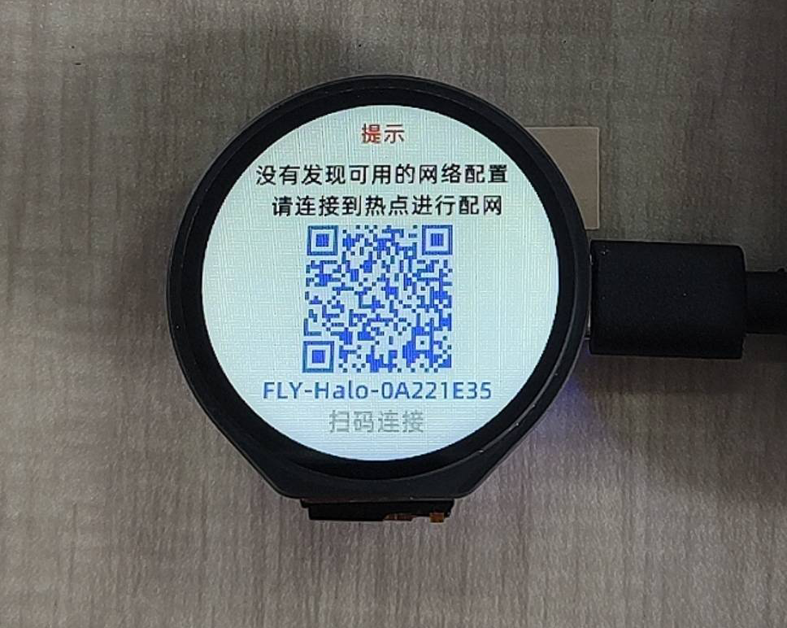
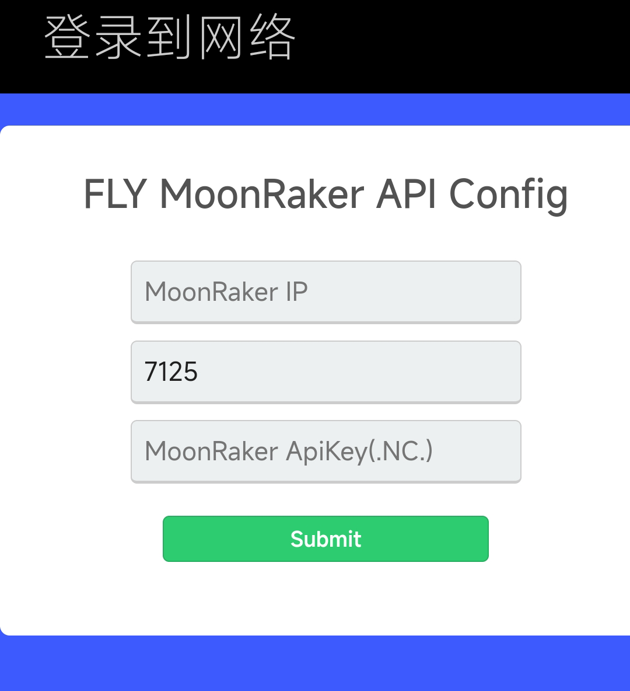

# 开始使用

## 注意事项

> [!TIP]
> 必读

> [!TIP]
> 必读

> [!TIP]
> 必读

0. 首次使用必须连接网络，如果您的WIFI无法连接互联网。halo将无法获取首次开机的配置下发
1. 设置页面中所有设置只有点击**保存设置**设备重启后才会生效
2. 堵料检测功能默认关闭，在设置启用堵料检测重启后才可以从首页向上滑进入
3. 打完关机功能默认关闭，可在设置中启用
4. 所有弹窗中需要取消打印或暂停打印的按钮都必须长按，单击无效（防止误触）
5. 系统服务页面中Host服务为上位机主机
6. 使用官方固件时请不要尝试更换主控芯片或FLASH芯片

> 注意：如果您的`moonraker.conf`配置文件大小超过4MB您可能无法正常使用。如果出现异常请缩减`moonraker.conf`配置文件的大小

## 系统固件更新

* halo版本更新分为全量更新及OTA增量更新两种
    * 全量更新：涉及底层的较大升级，需要使用USB烧录全量固件包
    * 增量更新：正常OTA升级，在设备信息页面检查更新即可

## 1. 语言选择

## 2 .使用手机扫码并且配置WIFI

> [!TIP]
> 部分移动设备可能没有扫码连接WiFi的功能，可以在手机WIFI设置中连接名为**FLY-halo-xxxxxxxx**的热点

> [!TIP]
> 如果连接热点后没有弹出网页需要手动去浏览器打开链接

> [!Warning]
>
> Halo屏幕无法搜索到隐藏的WIFI

如果连接wifi后手机并没有跳转可以访问下面网址进入控制台

[http://192.168.4.1/](http://192.168.4.1/)

### 2.1 选择需要连接的WIFI

选择需要连接的WIFI

### 2.2 输入连接KLIPPER的IP

在MoonRaker IP处输入KLIPPER的ip

### 2.3 保存并且退出

halo会自动重启并且连接KLIPPER，halo自带的热点会自动关闭

