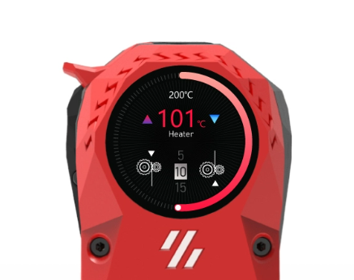
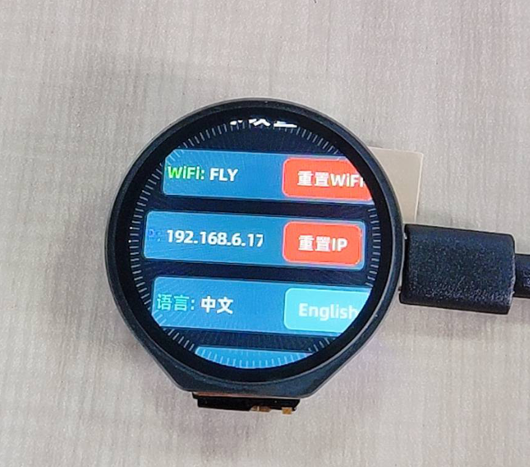

# FLY_halo

## 1.  首页

单击热床或者热端，从屏幕正上方顺时针滑动需要到达的温度后在点击热床或者热端即可设定温度。

如果需要显示mcu温度与上位机温度需要添加此配置

```
[temperature_sensor mcu]
sensor_type: temperature_mcu      # 关联mcu（默认）

[temperature_sensor host]        # 上位机温度
sensor_type: temperature_host     # 关联上位机
```


> **注意最高温度是读取配置里面的设置**


## 2. 挤出

长按可图标可设置热端温度，挤出长度和挤出速度

> **halo只支持单个热端的控制**



## 3. 系统服务

点击服务可以暂停、重启、启动


## 4. 设置

1. 重置WIFI
2. 重置KLIPPER的IP
3. 语言选择
4. 屏保时间、息屏时间、背光、屏幕旋转等功能



## 5.设备信息


