# 安装指导

## 安装到Voron Stealthburner

1. Halo安装到Stealthburner需要使用我们提供的适配件
2. 先下载我们提供的两个STL并自行打印
3. [Stealthburner_main_body(Adapt_to_Halo).stl(点击下载)](https://cdn.mellow.klipper.cn/Utils/Stealthburner_main_body(Adapt_to_Halo).stl)
4. [Halo_mounting_bracket.stl(点击下载)](https://cdn.mellow.klipper.cn/Utils/Halo_mounting_bracket.stl)
5. [Stealthburner_CW2_Assembly-2 v9.step(点击下载)](https://cdn.mellow.klipper.cn/STEP/Stealthburner_CW2_Assembly-2-v9.step)

### 安装步骤

    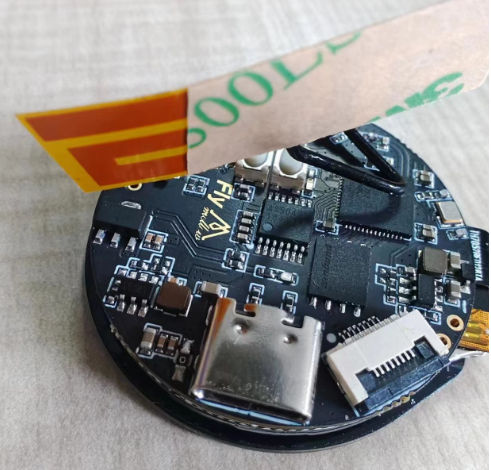
    

    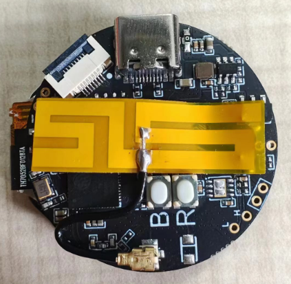

1. 先按照上图给Halo安装好天线

----

    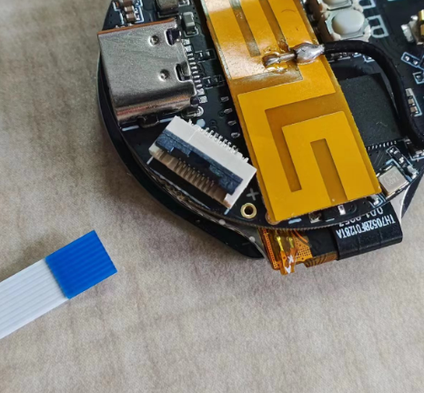
    

    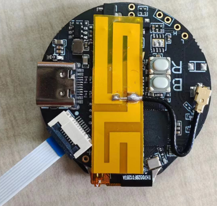

2. 按照上图安装FPC排线（FPC线方向不要装反，蓝色面朝上）

----

    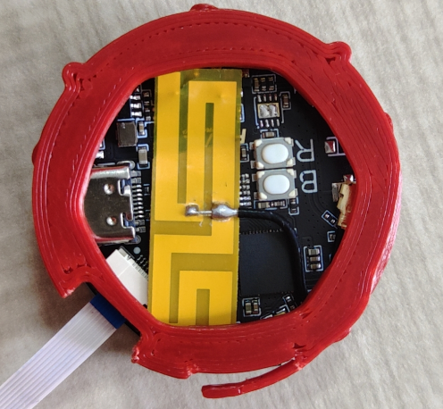
    

    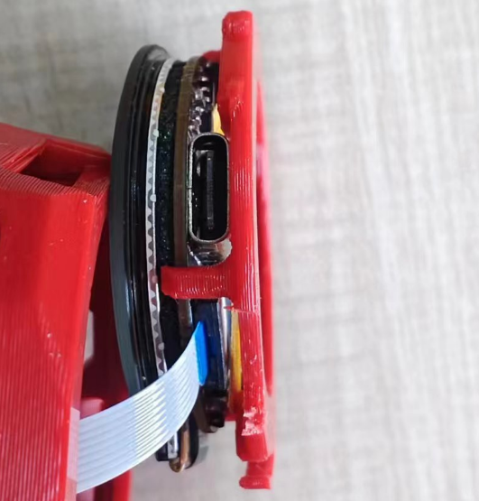

    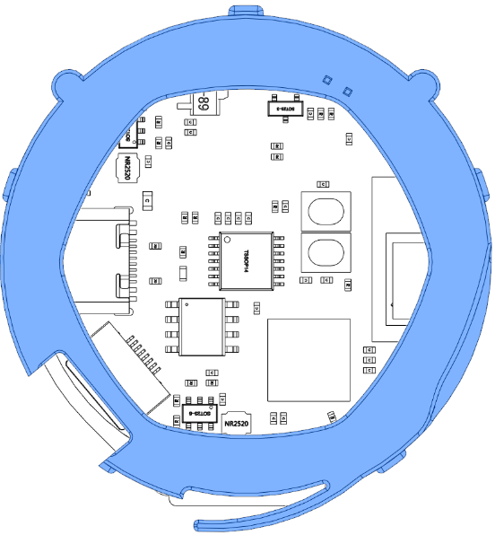
    

    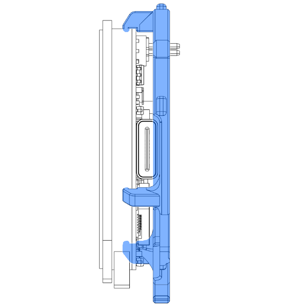

3. 按照上图安装Halo固定支架（注意安装方向，支架缺口位置对准FPC出线）

----

    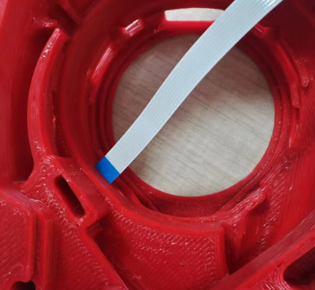
    

    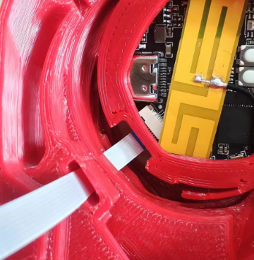

4. 按照上图将FPC穿过线孔

----

    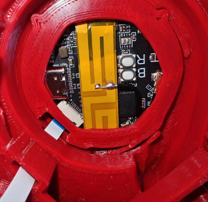
    

    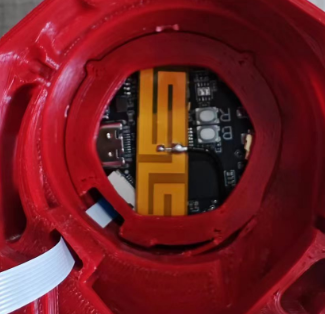

5. 按照上图1中的先将下方的卡扣对齐，然后再将上面按进去。上图2为安装好的样子

----

    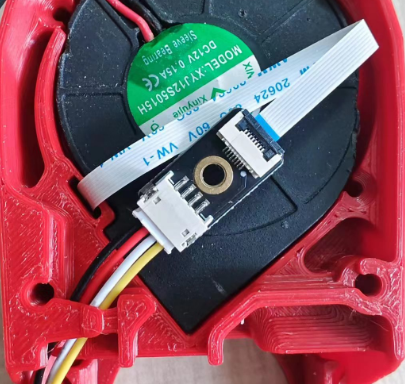

6. 安装转接板及接驳线
7. 出线位置可以按照你的习惯来，不一定要贴着在风扇背面
8. 出线颜色说明**黑色为负极GND**，**红色为正极VCC可接受电压为DC12-24V**，**白色为GPIO47 可用于堵料检测**，**黄色为GPIO48 可用于打完停机**

----

END

## 安装到堵料套件

* 待更新

----

END

