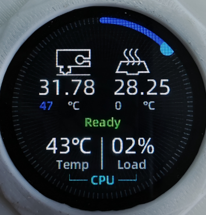

# Halo页面操作介绍

## 页面结构

```
  打印文件页面           首页             挤出页面            系统服务             设置              设备信息
+-------------+    +-------------+    +-------------+    +-------------+    +-------------+    +-------------+
|             |    |             |    |             |    |             |    |             |    |             |
| Print Files |<-->|     Home    |<-->|   Extrude   |<-->| Sys Service |<-->|   Setting   |<-->|  Dev Info   |
|             |    |             |    |             |    |             |    |             |    |             |
+-------------+    +-------------+    +-------------+    +-------------+    +-------------+    +-------------+
                         ∧
                         |
                         ∨
                   +-------------+
                   |             |
                   | Blocking Det|
                   |             |
                   +-------------+
                     堵料检测页面
            (设置中启用堵料检测才会有这个页面)
```

----

<center>END</center>

## 首页

<div style="display:flex;flex-direction:row;">
    
    <div style="width:20px;"></div>
    
</div>


* 上图1中的可操作区域与下方序号对应
  1. 单击：进入挤出温度设置，通过拖动环形条来调整温度，再次单击区域1可确认设置温度
  2. 单击：进入热床温度设置，通过拖动环形条来调整温度，再次单击区域2可确认设置温度

----

<center>END</center>

## 挤出页面

<div style="display:flex;flex-direction:row;">
    
    <div style="width:20px;"></div>
    
</div>

* 上图1中的可操作区域与下方序号对应
  1. 单击：挤出头目标温度加1
  2. 长按：进入挤出温度设置，通过拖动环形条来调整温度，再次单击可确认设置温度
  3. 单击：挤出头目标温度减1
  4. 单击：挤出
  5. 上下滑动：可选择挤出或回抽的长度，单位mm
  6. 单击：回抽
  7. 长按：进入上图2中的挤出速度设置，上下滑动选择挤出速度，单位mm/s，选择后单击周围空白区域退出

----

<center>END</center>

## 系统服务页面

<div style="display:flex;flex-direction:row;">
    
    <div style="width:20px;"></div>
    
</div>

* 单击上图1中相应的服务会弹出上图2中的弹窗，可启动，重启，关闭相应的系统服务
* 后续OTA会支持Moonraker中能操作的所有服务

----

<center>END</center>

## 设置页面

* 待更新

----

<center>END</center>
