>[!TIP]
>SD卡烧录与USB烧录只需要使用其中一种烧录即可

>[!WARNING]
>如果已经使用SD卡对M2WE进行了系统烧录，则无需使用以下方法在烧录

# 4 使用USB烧录M2WE

   #### 4.1 通过USB为eMMC烧录系统镜像

1. 先下载安装需要的软件

   [USB驱动安装工具 Zadig-2.7](https://cdn.mellow.klipper.cn/Utils/zadig-2.7.exe)

   [FLY-BOOT安装程序](https://cdn.mellow.klipper.cn/Utils/FLY-BOOT-Setup.msi)

   [系统镜像烧录工具 Win32diskimager-1.0](https://cdn.mellow.klipper.cn/Utils/win32diskimager-1.0.0-install.exe)

2. 除了第一个Zadig不需要安装可直接运行，另外两个需要安装。安装过程全都点``下一步``或者``Next``就可以了

3. 打开Zadig，顶部菜单栏``Options``里勾选``List All Devices``

   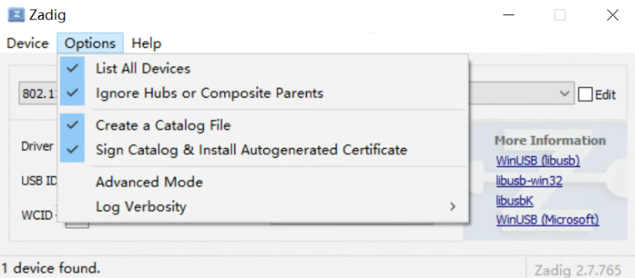

4. 按着BOOT键并且将双头USB接入电脑

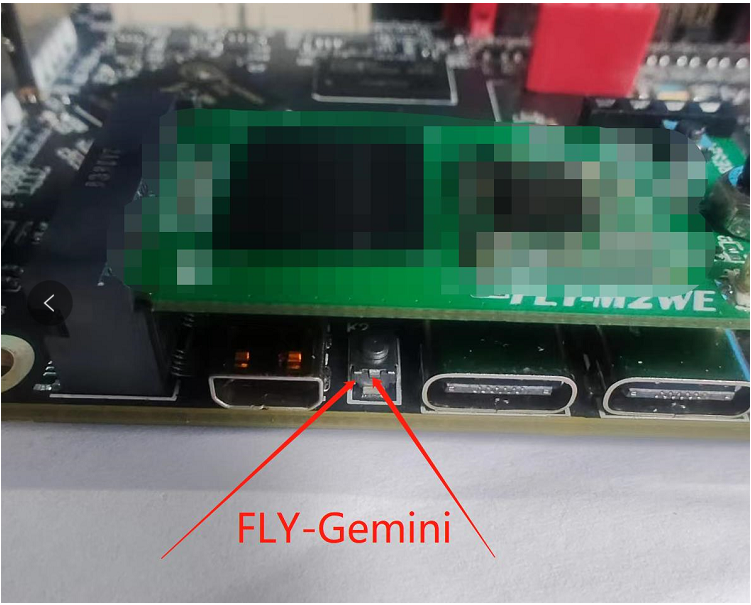

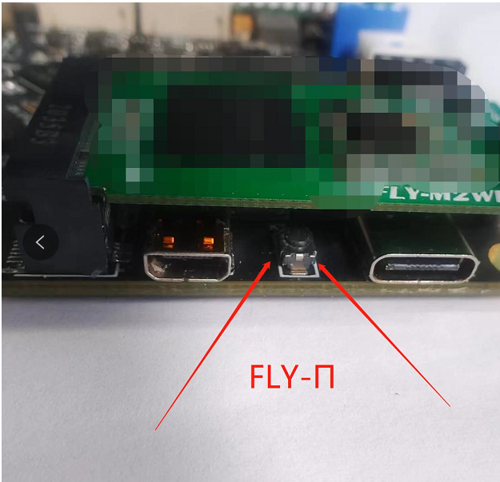

4. 将附赠的双公头USB线一端连接到电脑，然后长按上图中的按钮，将双公头USB线另一端连接到Gemini或Pi的下图中的USB接口

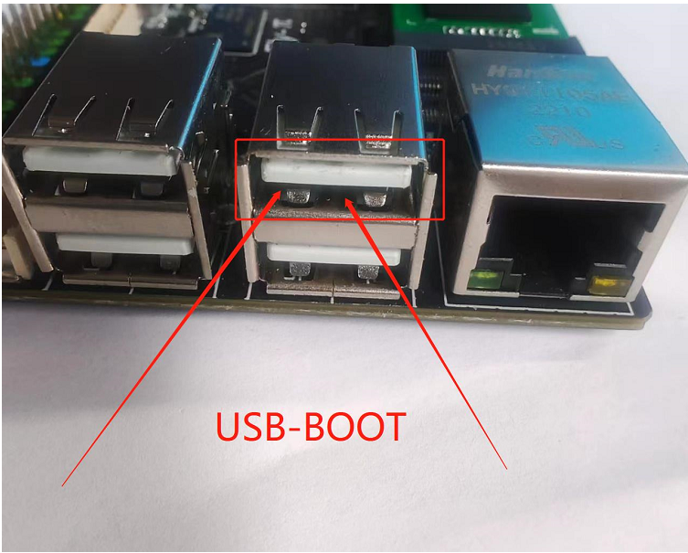

> [!TIP]
> 确保是在按键按下状态时将设备连接到电脑的

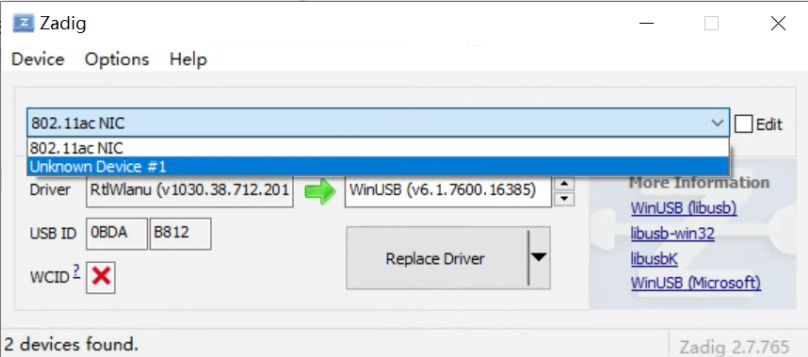

5. 如果一切正常，此时zadig中会多出一个``Unknow Device #x``或者``USB Device(VID_1f3a_PID_efe8)``，选择它

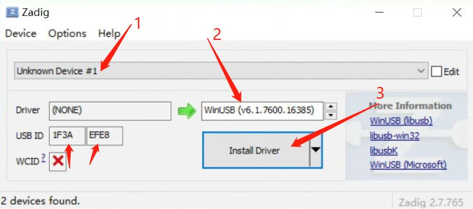

6. 选择设备后检查一下USB ID是否与上图一致，如果不是请重新选择其他设备
7. 上图中的第二处只能选择``WinUSB(vxxxxxxx)``版本号无所谓
8. 点击``Install Driver``安装驱动

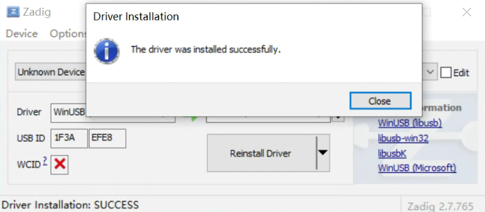

9. USB驱动安装成功 (驱动只安装一次，如果以后再次烧录不用再安装驱动)

10. 打开安装好的FLY-BOOT，点击``检查设备``

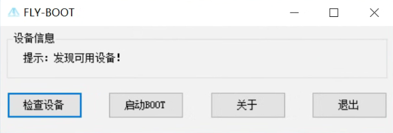

11. 如果前面的步骤操作无误，则会提示发现可用设备（如果没有发现可用设备请仔细查看第4步）

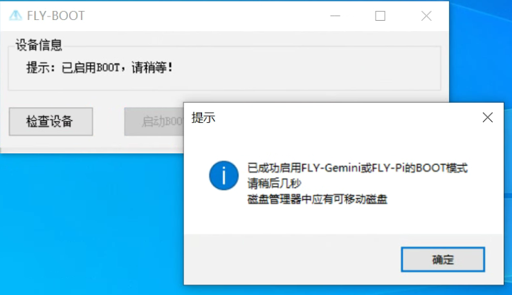

12. 点击``启动BOOT``，如果正常则会提示已成功启用BOOT

    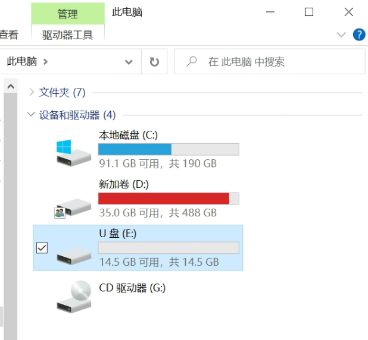

13. 如果弹出未知磁盘等设备可以查看 如何重新格式化M2WE

    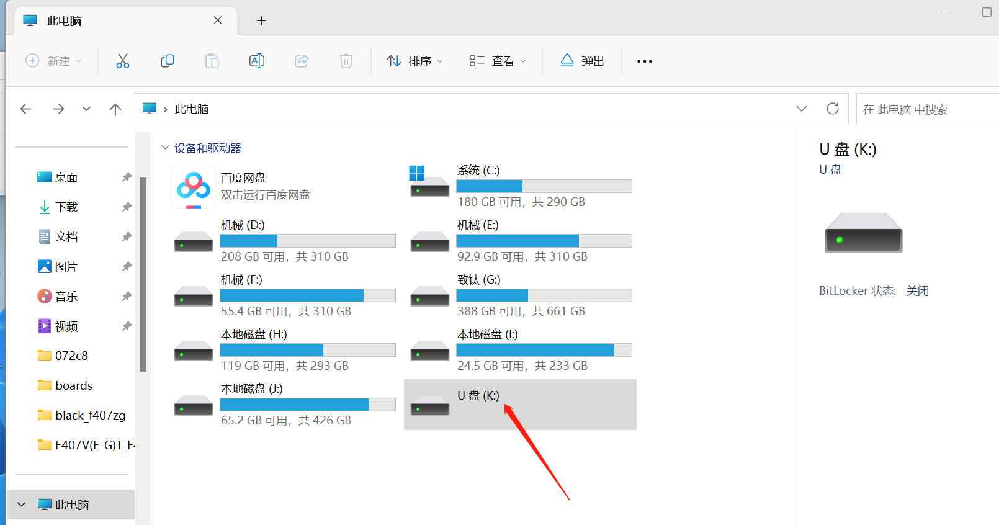

14. 现在可以打开文件资源管理器，多出一个14.5G的U盘（16G eMMC显示大小为14.5G）
15. 这样就可以直接用Win32diskimager或balenaEtcher来烧录系统镜像，盘符选择为这个14.5GU盘的盘符
16. 镜像烧录完成后，请配置 [FLY_Config](/board/fly_pi/FLY_π_fly_config.md "点击即可跳转")

## 4.2 如何重新格式化M2WE

如果写入失败或者需要重新刷写镜像时，请按如下操作：

1. 点击“**此电脑**” 

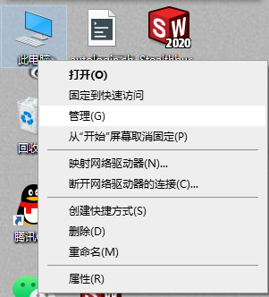

2. 再点击“**磁盘管理**”，找到刚刚插入的内存卡（可移动磁盘），选中后单击右键，点击“**删除卷**”，

3. 单击右键再单击右键**“新建简单卷**”，新建分区请注意选择文件系统格式为**FAT32**，一直点下一步，直至完成，便将内存卡格式化为只有一个盘。

   当然也可以借助第三方工具来格式化内存卡和eMMC。

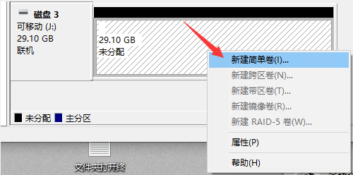

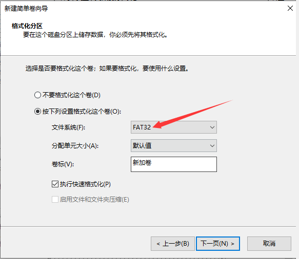

4. 现在可以打开文件资源管理器，多出一个14.5G的U盘（16G eMMC显示大小为14.5G）

5. 这样就可以直接用Win32diskimager或balenaEtcher来烧录系统镜像，盘符选择为这个14.5GU盘的盘符

6. 镜像烧录完成后，请配置 [FLY_Config](/board/fly_pi/FLY_π_fly_config.md "点击即可跳转")
