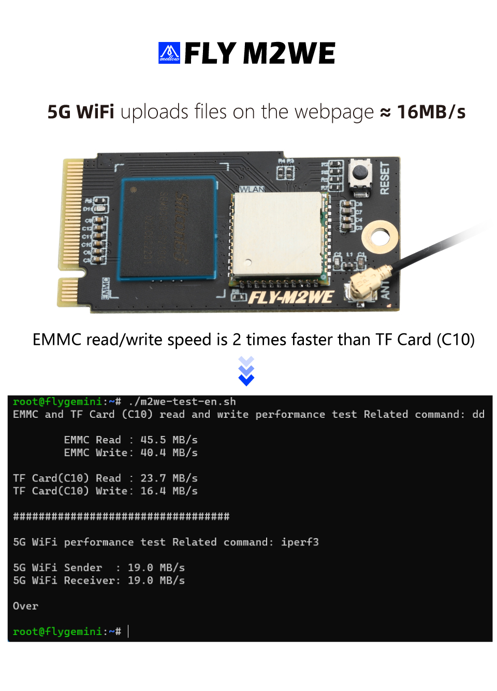

# M2WE使用

> [!TIP]
> FLY-M2WE只适用于FLY-π ,FLY-Gemini v2,FLY-Gemini v3,FLY-Pi-V2

> [!TIP]
> 不要带电插拔模块，此模块不支持热插拔

## 产品详情

[FLY3D打印机M2WE板16G eMMC 5g wifi用于KlIpper双子座V2.0PI主板-淘宝网 (taobao.com)](https://item.taobao.com/item.htm?spm=a230r.1.14.6.1a4840a8a8t04w&id=685372879431&ns=1&abbucket=16#detail "点击即可跳转")

