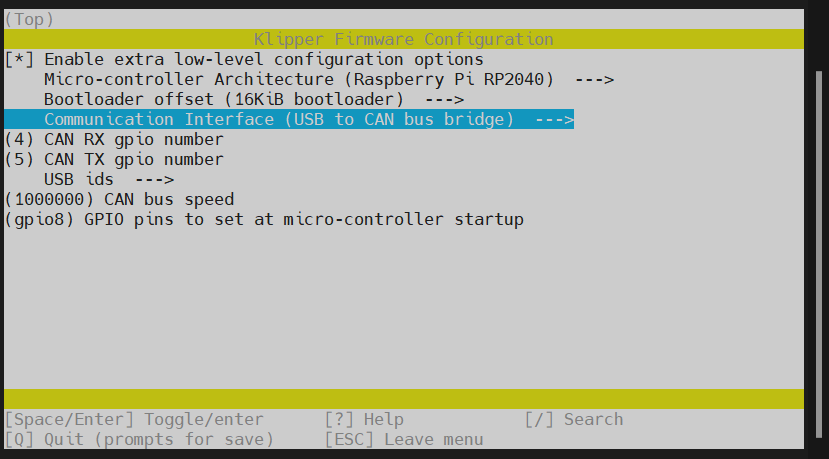

# 固件烧录

> [!Warning]
>
> 烧录固件之前确保已完成[上位机连接ssh](introduction/conntossh.md "点击即可跳转")文档
>
> Micro4预先安装了katapult固件并且使用USB连接

# 固件注意事项

请使用**MobaXterm_Personal**等**SSH工具**连接通过**网络**到您的上位机，并且需要确定以下几点

1. **请确保上位机安装好了Klipper服务**
2. **请确保登录的用户必须是安装好Klipper的用户**
3. **请确保你的输入法是英文**
4. **请确保你的上位机可以正常搜索到设备**
5. **请确保以上注意事项都做到，否则无法进行下一步**


* 连接到SSH后输入下面的命令并回车：

     ```
     cd  && cd ~/klipper  && make clean && rm -rf .config && make menuconfig
     ```

* 现在应该出现了Klipper编译配置界面，**↑ ↓ 键**选择菜单，**回车键**确认或进入菜单

# 编译Klipper固件

* 请根据自己的机器选择编译相应的固件

* 请确保使用**MobaXterm_Personal**等**SSH工具**连接到上位机，并且是**安装好klipper的用户**参考教程:[上位机连接 SSH](https://mellow.klipper.cn/#/introduction/conntossh?id=通过wifi或者网线连接上位机)

* 上位机连接SSH后输入`cd klipper`并且回车


* 输入`rm -rf .config && make menuconfig`，并且回车
* 其中`rm -rf .config`是为了清理之前编译的固件参数


* 回车后将出现下面界面
* 看到此界面后就可以开始编译固件


* 选择`Enable extra low-level configuration options`并且**回车**，此项是打开其他配置选项
* 选择`    Micro-controller Architecture (Atmega AVR)  --->`回车进去找到`( ) Raspberry Pi RP2040`然后回车


* 选择`    Bootloader offset (No bootloader)  --->`回车然后选择`( ) 16KiB bootloader`在回车


* 选择`()  GPIO pins to set at micro-controller startup (NEW)`输入`gpio8`然后回车


* 至此USB固件编译完成输入`Q`与`Y`进行退出保存
* 如果需要编译**USB桥接CAN固件需要修改选择**`Communication interface (USBSERIAL) `回车，在选择` Communication interface (USB to CAN bus bridge)  --->`即可

<!-- tabs:start -->

## ****USB固件配置****


## ****CAN桥接固件配置****


<!-- tabs:end -->

* 输入`Q`保存然后输入`Y`退出即可编译固件
* 输入`make`即可编译固件
* 出现`  Creating bin file out/klipper.bin`代表本次编译固件成功


# 固件烧录

* 输入 ``ls /dev/serial/by-id/*`` 回车。如果一切正常，则会出现下面一行蓝色的ID。


* 第一次刷固件需要使用下方指令，请注意`-d`后面有空格

```
~/klippy-env/bin/python ~/klipper/lib/canboot/flash_can.py  -d <你的设备串口地址>
```

* 参考指令

```
~/klippy-env/bin/python ~/klipper/lib/canboot/flash_can.py -d /dev/serial/by-id/usb-katapult_stm32f072xb_12345-if00
```

* 更新USB固件需要在编译好最新固件后输入下方命令更新，请注意`=`后面没有空格

```
make flash FLASH_DEVICE=<你的设备串口地址>
```

* 更新USB桥接CAN固件需要在编译好最新固件后输入下方命令重置进去Katapult

```
~/klippy-env/bin/python3 ~/katapult/scripts/flashtool.py -i can0 -u <MCU ID> -r
```

* 然后输入即可更新，请注意`=`后面没有空格

```
make flash FLASH_DEVICE=<你的设备串口地址>
```

# 确定固件是否烧录成功

* 如果固件刷完后此led会在闪烁情况下变成常亮


