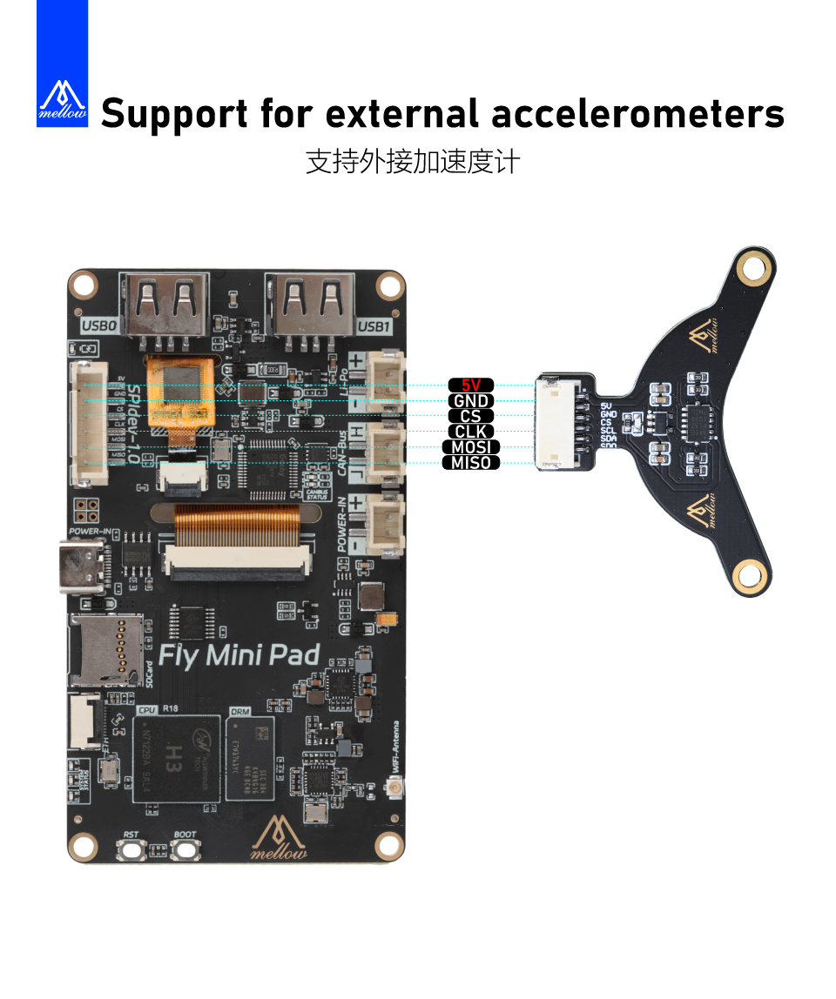

>[!TIP] 
>
>**请注意线序是否正确，接错有可能损坏机器**

>[!warning] 
>
>如果MINI PAD使用不了加速度计,可以通过ssh连接到上位机后输入命令：``sudo apt-get install -y libopenblas-dev``解决

```cfg
[mcu host]
serial: /tmp/klipper_host_mcu

[adxl345]
cs_pin: host:None
spi_bus: spidev1.0

[resonance_tester]
accel_chip: adxl345
#accel_chip_y: adxl345 bed
probe_points:
    100, 100, 20  # an example
```

