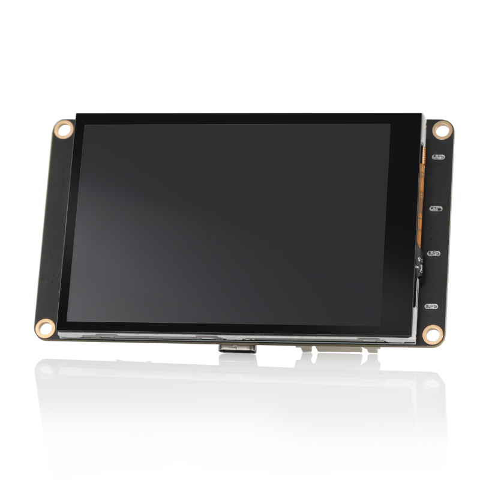
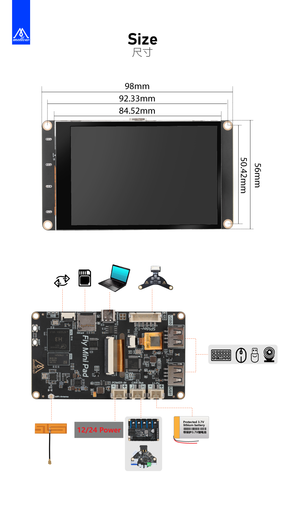

# 产品简介

Fly-MINI-Pad是一款入门级Klipper上位机

**特点**

* CPU：高性能全志H3芯片，4核64位Cortex-A7
* GPU：Mali-400 MP2
* RAM：512MB DDR3
* ROM：支持最大128GB SDCARD
* WIFI :  板载2.4G WiFi
* 外设：SPI x1，USB x2，Type-C x1
* 接口：三个XH2.54-2P接口分别支持，POWER-IN供电支持最高24V输入，CAN-BUS支持CAN总线连接，LI-PO支持3.7V并且带保护的锂电池供电/充电接口
* 为Klipper定制的系统，无需安装系统等复杂的操作，小白更容易上手
* 屏幕分电容屏/电阻屏，分辨率320*480

## 产品详情

## FLY-MINI Pad

## 尺寸说明

----

> [!TIP]
> 重要

* 非FLY上位机请按[CAN使用](/advanced/can_rpi.md)文档配置好CAN
* 使用CanBoot请查看[CanBoot使用](/advanced/canboot.md)

