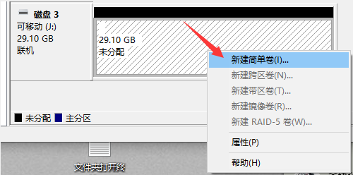

## 1 准备

1. 先安装好软件**Win32DiskImager**与解压工具
2. SD卡插入读卡器，将读卡器插到电脑USB接口
3. 请确保烧录的sd卡做好备份
4. 系统镜像需要确定是Lite2的系统！！！

## 2. 格式化SD卡

  烧录镜像需要格式化SD卡，请按如下操作：

  1. 点击“**此电脑**” 

  

  2. 再点击“**磁盘管理**”，找到刚刚插入的内存卡（可移动磁盘），选中后单击右键，点击“**删除卷**”，

  

  3. 单击右键再单击右键**“新建简单卷**”，新建分区请注意选择文件系统格式为**FAT32**，一直点下一步，直至完成，便将内存卡格式化为只有一个盘。
   
     当然也可以借助第三方工具来格式化内存卡和eMMC。

  

  

  

4. 现在可以打开文件资源管理器，多出一个14.5G的U盘（16G eMMC显示大小为14.5G）

## 3. 将下载好的系统镜像解压

* 将下方系统镜像解压出来
* img.md5这个文件无需解压

## 4. 使用Win32diskimage来烧录系统镜像

* 红色选择需要烧录的文件
* 橙色选择需要烧录的sd卡
* 蓝色将系统烧录到sd卡中
>[!Tip]
>
>请确保烧录的设备是否选择正确

* 确认烧录然后等待烧录完成

* 烧录完成

* 镜像烧录完成后，请配置 [FLY_Config](/board/fly_pi_lite2/config "点击即可跳转")
