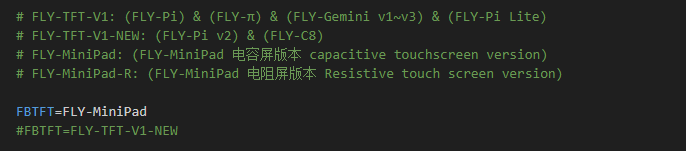
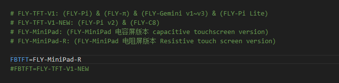

# 屏幕使用

另外还需要指定使用的屏幕类型才能够正常使用！！！按下图中的提示修改为对应的配置即可。

* 请注意屏幕版本

<!-- tabs:start -->

### **FLY-MiniPad 电容屏版本**

* HDMI屏幕只需要修改Display此选项即可

### **FLY-MiniPad 电阻屏**

<!-- tabs:end -->

* TFT屏幕旋转只能选择**90**或者**270**

