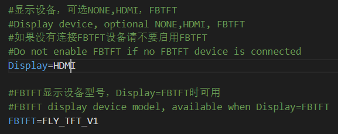

# 屏幕使用

找到下图所示选项，将``klipperscreen=flase``修改为``klipperscreen=true``，则可启用klipperscreen屏幕。

另外还需要指定使用的屏幕类型才能够正常使用！！！按下图中的提示修改为对应的配置即可。

<!-- tabs:start -->

### **HDMI**

* HDMI屏幕只需要修改Display此选项即可

### **TFT**

* 请注意屏幕版本
* FLY-MiniPad: (FLY-MiniPad 电容屏版本 capacitive touchscreen version)
* FLY-MiniPad-R: (FLY-MiniPad 电阻屏版本 Resistive touch screen version)

* TFT屏幕旋转只能选择**90**或者**270**

<!-- tabs:end -->