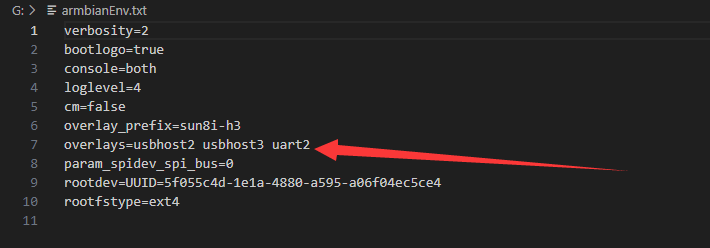
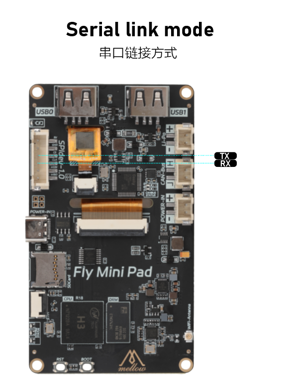

## 打开BOOT盘

>[!Warning]
>
>请注意使用此方法后无法在使用mini pad的加速度接口外接加速度计

打开BOOT盘找到`armbianEnv.txt`并且打开

将`overlays=usbhost2 usbhost3 uart2`中的**uart2**修改成**uart3**保存即可



## 接线方法

请注意mini-pad的TX要接刷了串口固件主板的RX

请注意mini-pad的RX要接刷了串口固件主板的TX

才可以连接刷了串口固件的主板



## 配置方法

```
[mcu]
serial: /dev/ttyS3
baud：250000
#   使用的波特率。默认是250000
restart_method:command
#   这个参数控制着重置单片机的方式
#   可选项是'arduino'、'cheetah'、'rpi_usb'和'command'
#   'arduino'方法（翻转DTR）通常适用于Arduino板或其克隆板
#   'cheetah'方法是一个特殊的方法，通常适用于一些富源盛的Cheetah板
#   'rpi_usb'方法对于使用树莓派的USB供电的单片机十分有效
#   它简单地关闭所有USB端口的电源来完成单片机的重置
#   'command'方法调用向单片机发送klipper命令来重置它们自己
#   当单片机连接到串口时默认是'arduino'，否则默认是'command'
```

