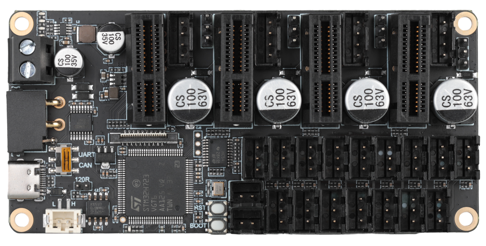

# 产品简介

Fly-MMU是多功能工具板是一款高性能控制板，专为3D打印机和自动化设备设计。它集成了强大的H723微控制器，支持多达4个TMC步进电机驱动器，并且支持高压驱动，自带11个限位开关输入而且可通过FPC扩展出16个限位，以及4个舵机控制输出。该工具板兼容Klipper固件，并提供CAN总线和RS232连接选项，以实现灵活的通信和控制方案。

# 产品特点

* 主控采用32位主频550MHz的ARM Cortex-M7系列STM32H723主控芯片
* 支持四个驱动扩展，并且支持最高48V的高压TP5160驱动
* 多个限位扩展，板载11个限位口，并且可以通过FPC扩展出16个限位口
* 支持klipper固件使用USB，CAN与RS232连接
* 支持RRF固件使用CAN连接
* 预留CAN扩展口，使用CAN情况下可通过CAN扩展口连接其它设备

# 产品详情

* MCU: 采用32位主频550MHz的ARM Cortex-M7系列STM32H723ZET6主控芯片
* 电源输入：HVIN:12V/48V与VIN:12V/24V
* 扩展接口：11个限位，4个舵机，1个RGB，1个CAN扩展口与FPC扩展口可扩展16个限位
* 驱动：支持TP2209与TP5160,并且可以使用其他FLY的TP驱动

