# 3. 固件烧录
> 烧录固件之前确保已完成[上位机连接到ssh](introduction/conntossh.md "点击即可跳转")文档

## 1. 编译Klipper固件

请使用**MobaXterm_Personal**等**SSH工具**连接通过**网络**到您的上位机，并且需要确定以下几点

1. **请确保上位机安装好了Klipper服务**
2. **请确保登录的用户必须是安装好Klipper的用户**
3. **请确保你的输入法是英文**
4. **请确保你的上位机可以正常搜索到设备**
5. **请确保以上注意事项都做到，否则无法进行下一步**


* 连接到SSH后输入下面的命令并回车：

     ```
     cd  && cd ~/klipper  && make clean && rm -rf .config && make menuconfig
     ```

* 现在应该出现了Klipper编译配置界面，**↑ ↓ 键**选择菜单，**回车键**确认或进入菜单

<!-- tabs:start -->

### ****CAN 固件配置****
>[!TIP]
>请确保工具板拨码拨到正确位置
>
>**烧录时候请确保工具板已经正常连接到UTOC或者刷好桥接固件的工具板上**

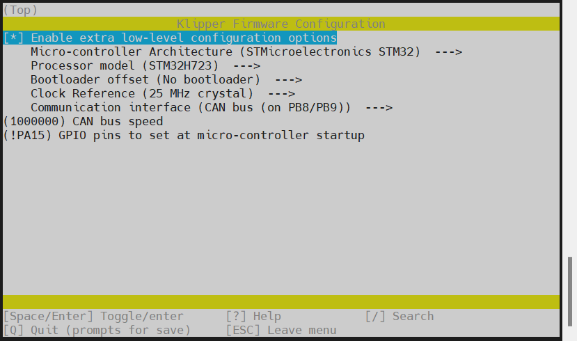

* 选择`[ ] Enable extra low-level configuration options`然后**回车**


* 选择`    Micro-controller Architecture (Atmega AVR)  --->`回车进去找到`() STMicroelectronics STM32`然后回车

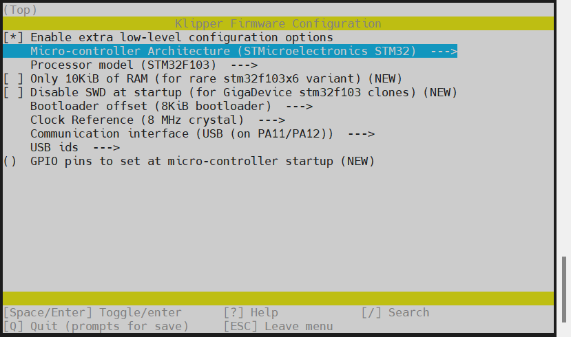

* 选择`Processor model (STM32F103)  --->`回车然后选择`( ) STM32H723`在回车

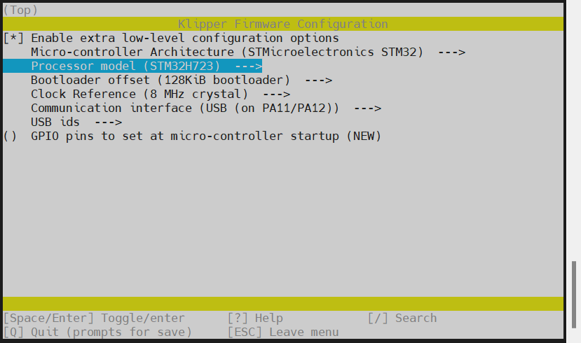

* 选择`    Bootloader offset (128KiB bootloader)  --->`回车然后选择`( ) No bootloader`回车

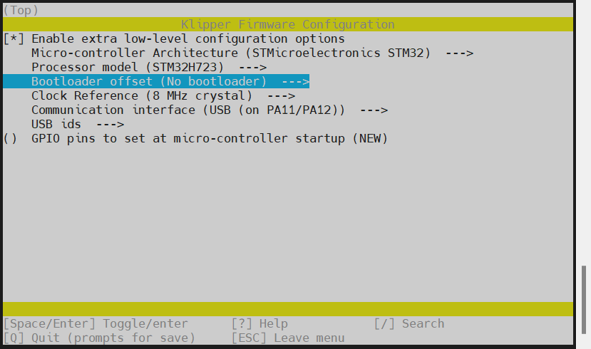

* 选择`    Clock Reference (8 MHz crystal)  --->`回车然后选择`( ) 25 MHz crystal`回车

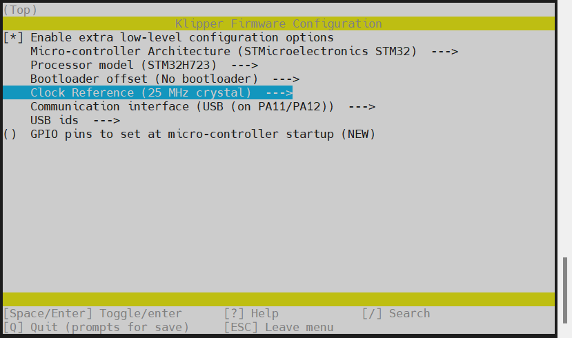

* 选择`Communication interface (USB (on PA11/PA12))  --->`回车然后选择`( ) CAN bus (on PB8/PB9)`回车

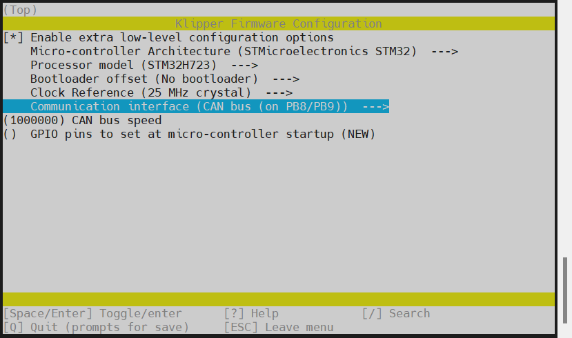

* `(1000000) CAN bus speed`为can速率默认为1M，不建议自己修改
* 选择`()  GPIO pins to set at micro-controller startup (NEW)`输入`!PA15`然后回车
* 请注意 **!** 请使用英文输入法输入


* 输入`Q`保存然后输入`Y`退出即可编译固件
* 输入`make`即可编译固件
* 出现`  Creating bin file out/klipper.bin`代表本次编译固件成功

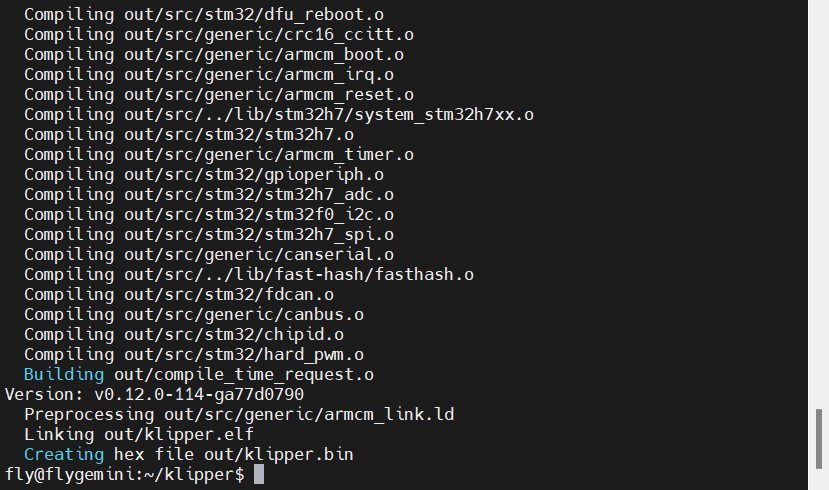


### ****RS232 固件配置****

>[!TIP]
>请确保工具板拨码拨到正确位置

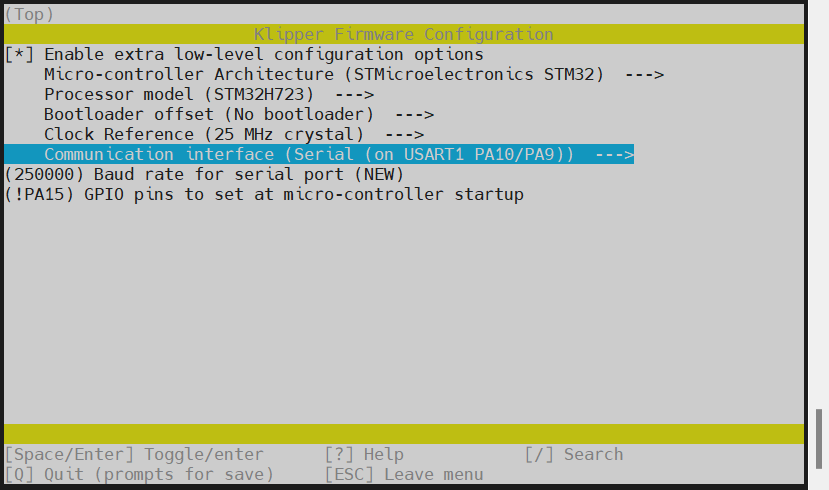

* 选择`[ ] Enable extra low-level configuration options`然后**回车**


* 选择`    Micro-controller Architecture (Atmega AVR)  --->`回车进去找到`() STMicroelectronics STM32`然后回车


* 选择`Processor model (STM32F103)  --->`回车然后选择`( ) STM32H723`在回车


* 选择`    Bootloader offset (128KiB bootloader)  --->`回车然后选择`( ) No bootloader`回车


* 选择`    Clock Reference (8 MHz crystal)  --->`回车然后选择`( ) 25 MHz crystal`回车


* 选择`Communication interface (USB (on PA11/PA12))  --->`回车然后选择`( ) Serial (on USART1 PA10/PA9)`回车

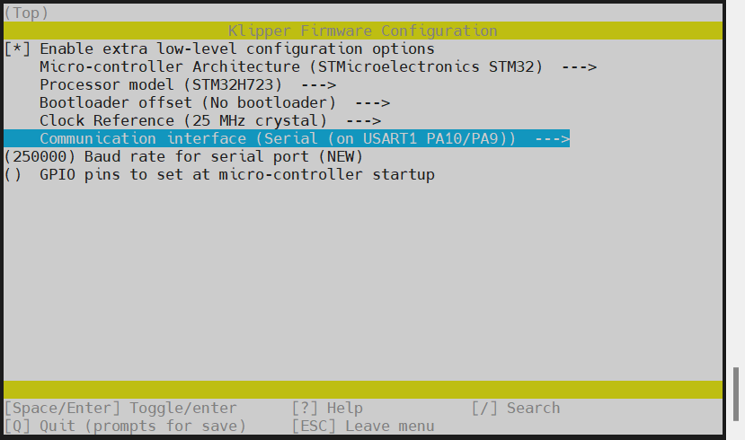

* `(250000) Baud rate for serial port (NEW)`为RS232速率默认为250K，不建议自己修改
* 选择`()  GPIO pins to set at micro-controller startup (NEW)`输入`!PA15`然后回车
* 请注意 **!** 请使用英文输入法输入

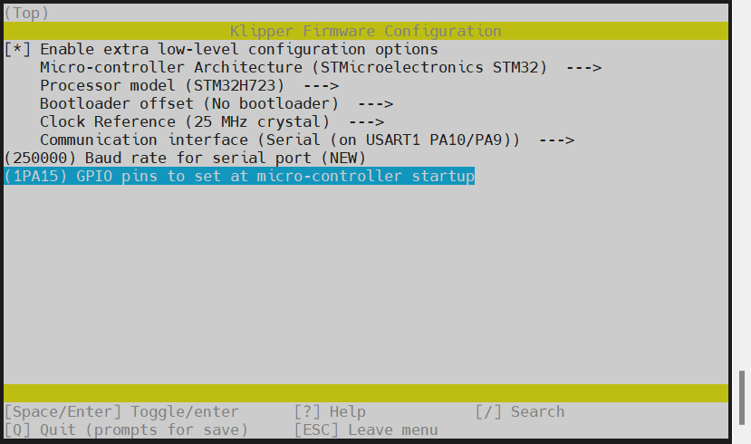

* 输入`Q`保存然后输入`Y`退出即可编译固件
* 输入`make`即可编译固件
* 出现`  Creating bin file out/klipper.bin`代表本次编译固件成功


<!-- tabs:end -->

## 2. 烧录固件

<!-- tabs:start -->

### **Klipper上位机烧录**

1. 安装烧录工具

```bash
sudo apt install dfu-util -y
```

2. 使用Type-C数据线将MMU板连接到Linux设备，请确保连接前按着BOOT接入Linux设备
3. 执行下面的命令查看是否连接成功，出现**0483:df11**则代表MMU进入烧录模式

```bash
lsusb
```

* 因系统版本问题可能显示其他名字，如果有`0483:df11`则代表进入烧录模式


4. 烧录固件(烧录前确保已经编译过固件)

```bash
cd && cd ~/klipper && make flash FLASH_DEVICE=0483:df11
```
5. 没有报错则烧录成功,如果出现报错请重新检查每个步骤操作


6. 出现上图内容则烧录成功

### **使用电脑USB烧录**

1. 下载烧录工具[STM32CubeProgrammer](https://cdn.mellow.klipper.cn/Utils/STM32CubeProgrammer.zip)
2. 解压烧录工具到任意目录，进入`STM32CubeProgrammer/bin`目录，双击打开`STM32CubeProgrammer.exe`
3. 使用**MobaXterm_Personal**左边文件目录找到`klipper`选择然后找到`out`打开，并且将`klipper.bin`复制到电脑上
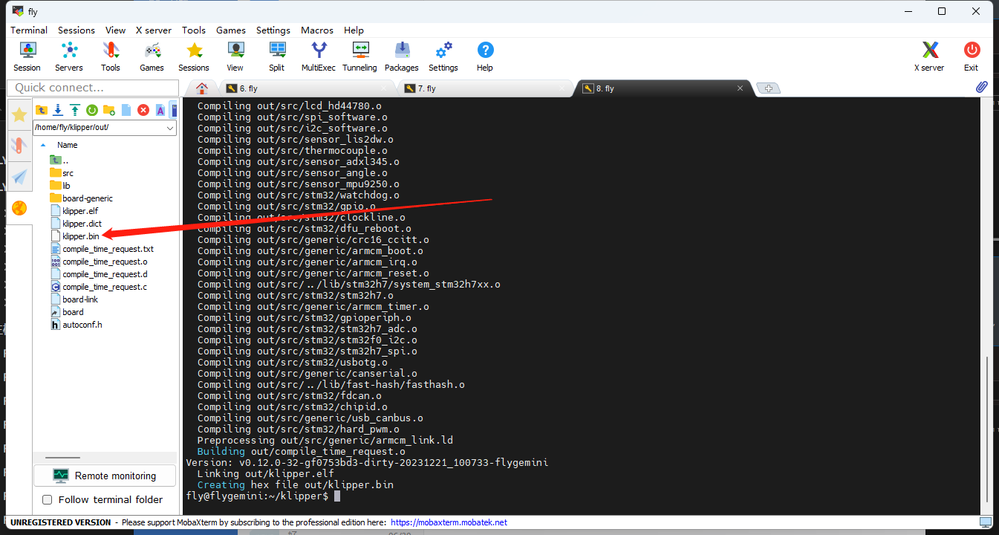
4. 使用Type-C数据线将MMU板连接到电脑，请确保连接前按着BOOT接入Linux设备
5. STM32CubeProgrammer中选择USB模式，并刷新，连接

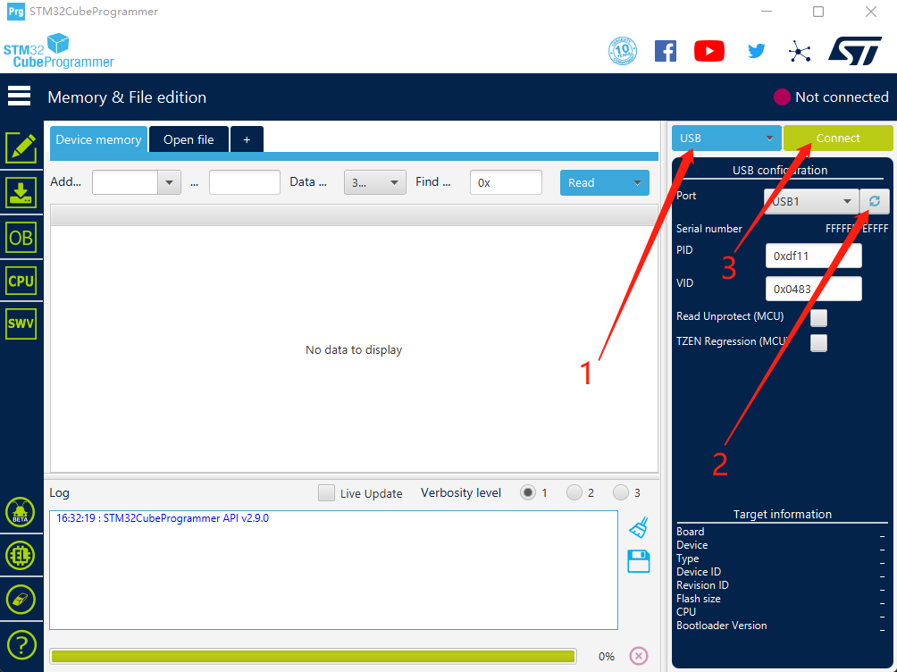

6. 如果没有出现错误弹窗则连接成功
7. 打开固件文件，在弹窗中选择前面编译完成的固件文件(klipper.bin)

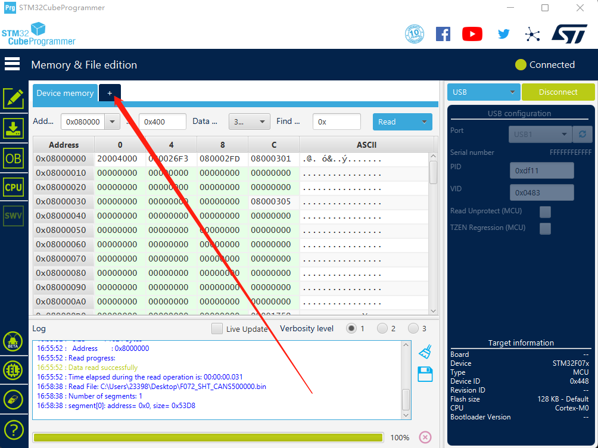

8. 确认页面有内容，不是00000。然后点击**Download**

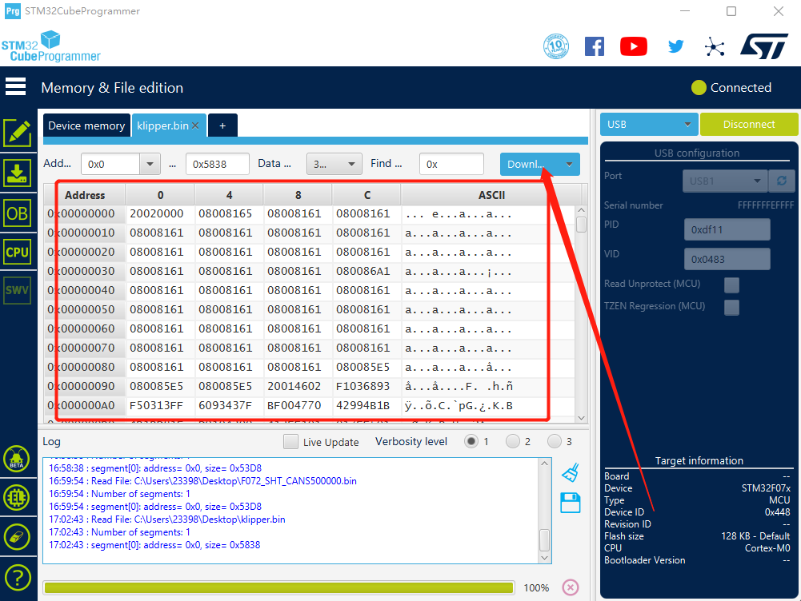

9. 出现图中就是烧录成功

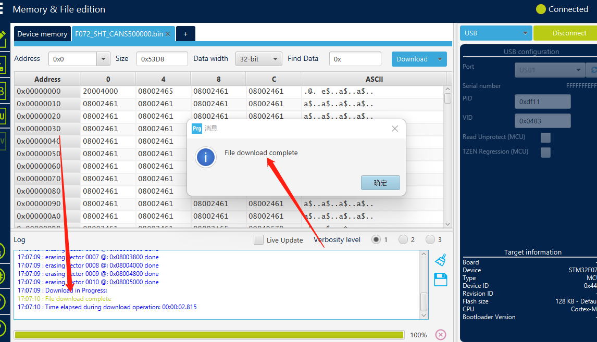

<!-- tabs:end -->

## 3.确定固件烧录完成

* 如果固件刷完后此led会变成常亮

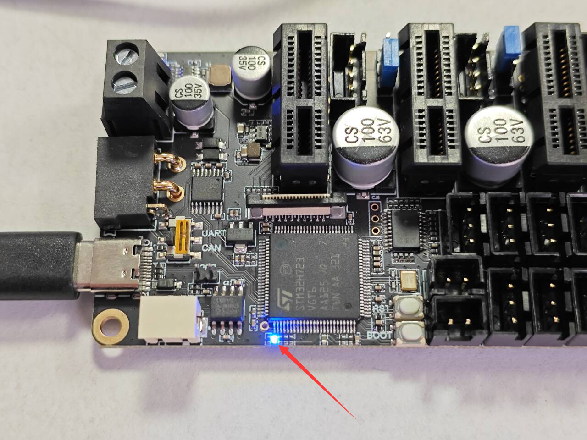