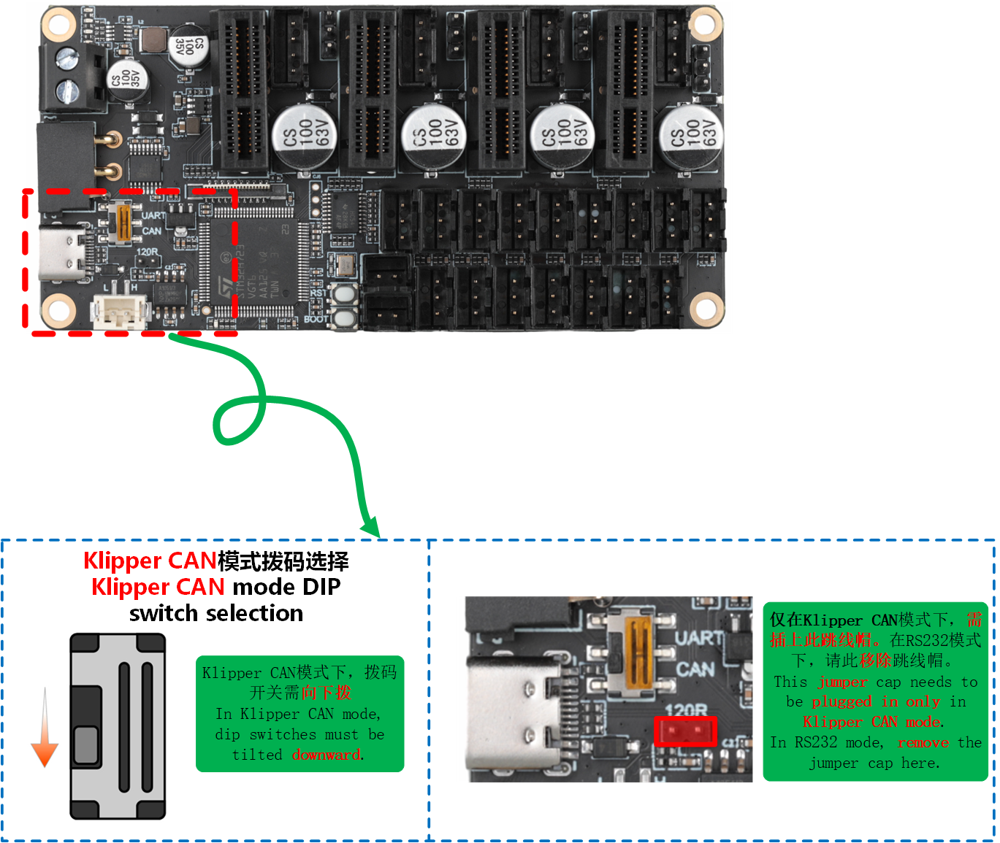
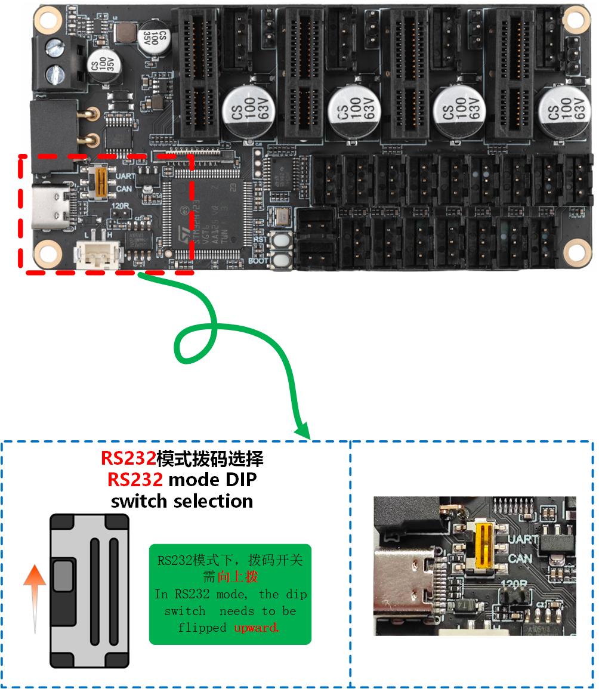
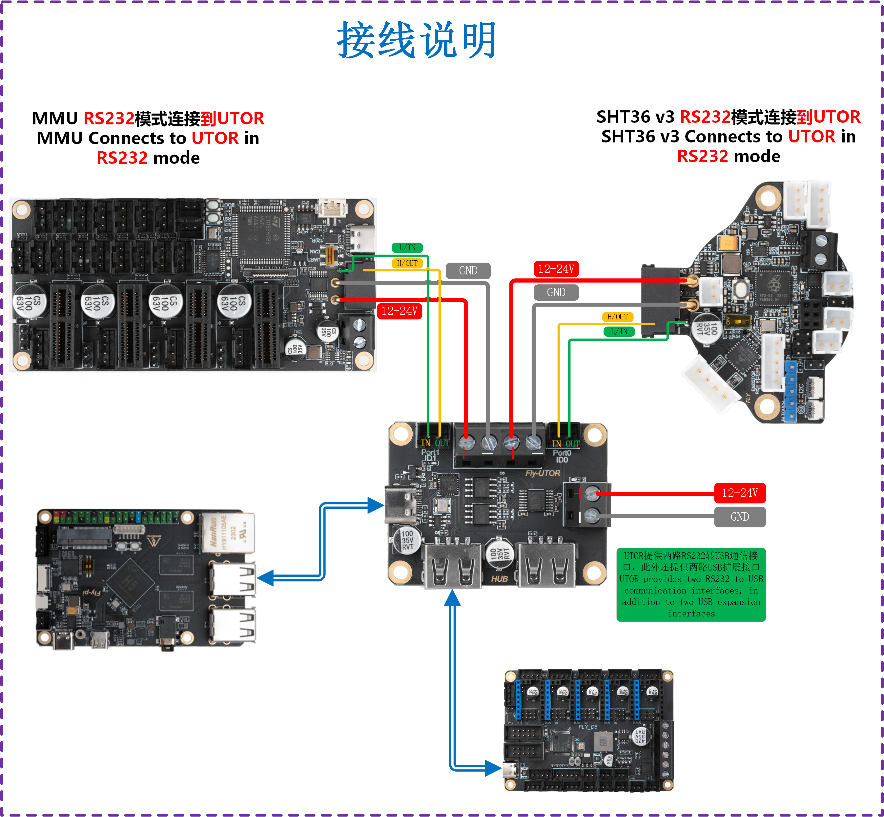

# 4. 注意事项与搜索ID

搜索id前面请确保已经连接CAN线


## 1. 安装支架

> [!TIP]
>
> 兔子V2[支架](https://cdn.mellow.klipper.cn/STEP/FLY_MMU.zip)

## 2. CAN连接注意事项

* MMU的**120R跳线**需要接上，并且**主板的120R**要接上

* 在断电情况下使用万用表量**H与L**的阻值正常应在**60R**左右

* 请注意拨码要拨到**正确位置**否则**无法正常使用**



> [!TIP]
> [搜索CANuuid](/introduction/id?id=搜索can固件id "点击即可跳转")方法

> [!TIP]
> 已经识别到的CAN ID是不会被查找到的（即已经写入配置文件printer.cfg中的ID，连接成功并正常运行的，是不会被查找到的）

在SSH中输入下面的命令查找uuid

```bash
~/klippy-env/bin/python ~/klipper/scripts/canbus_query.py can0
```


出现``Found canbus_uuid=b7c79ec3f948``则查找到设备ID，其中``b7c79ec3f948``为设备UUID。

每一个工具板的CANID都不一样

> [!TIP]
> 如果找不到CAN ID，请检查：

* 接线是否正确，例如CANH 和 CANL是否接反或者接触不良
* MMU板上的120Ω终端电阻跳线帽是否插上

* 是否正确供电，在刷固件时可以只使用TypeC接口供电
* 您的镜像内核是否支持CAN
* 固件是否编译正确
* 具体方法可以参考[ID搜索与配置](https://mellow.klipper.cn/#/introduction/id?id=搜索can固件id)

### 与UTOC的接线


### CAN参考配置

```bash
[mcu mmu]
canbus_uuid: b7c79ec3f948     #将读取到的uuid填写到此处
```

## 3. RS232连接


* 请注意拨码要拨到正确位置否则无法正常使用
* 工具板与上位机一定要供地！！！！否则无法连接
* 工具板与上位机一定要供地！！！！否则无法连接
* 工具板与上位机一定要供地！！！！否则无法连接
* RS232输出电压有6v请不要接到can上！！！
* RS232输出电压有6v请不要接到can上！！！
* RS232输出电压有6v请不要接到can上！！！



* 请注意串口工具板一定要与上位机共地否则无法连接！！！！

### 与UTOR接线

* 接线参考



* 上位机连接ssh后输入下方指令搜索设备！！

```
ls /dev/serial/by-path/*
```


* 请注意使用FLY UTOR会输出三个id，但是如果你过另外一个UTOR系统会记录下来导致搜索时候出现多个id
* 请确保id后面带有`-port0`否则无法使用

### RS232参考配置

```
[mcu mmu]  # 工具主板序列号
## RS232 ID
## 请根据固件配置填写波特率
serial: /dev/serial/by-path/platform-xhci-hcd.0.auto-usb-0:1.4.2:1.0-port0
baud: 250000
restart_method:command
```
