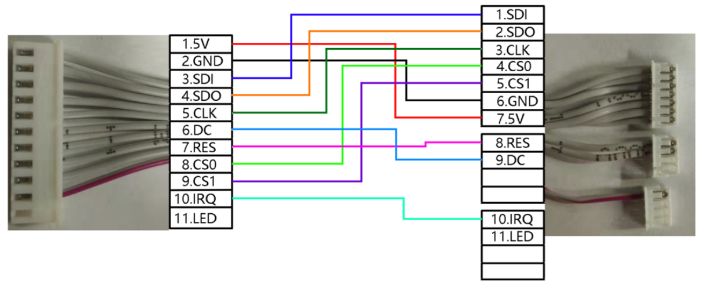
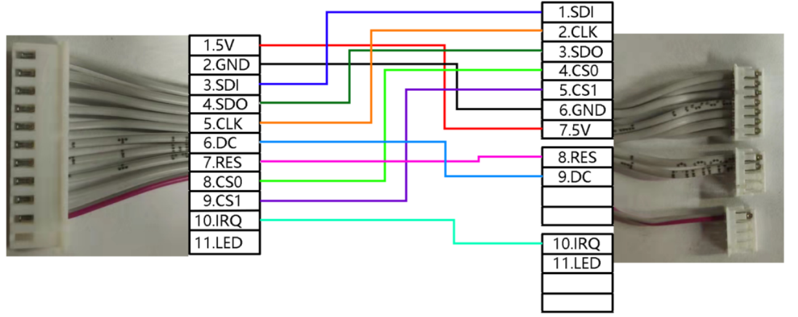
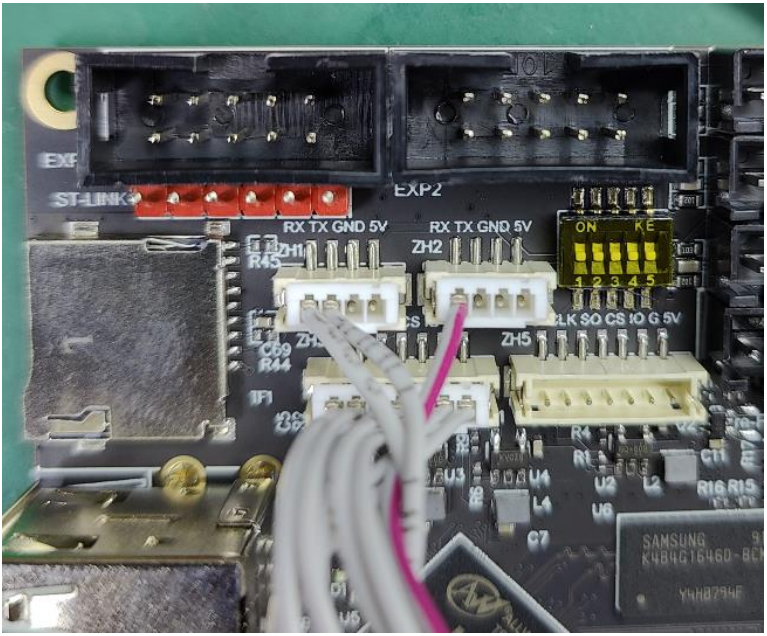
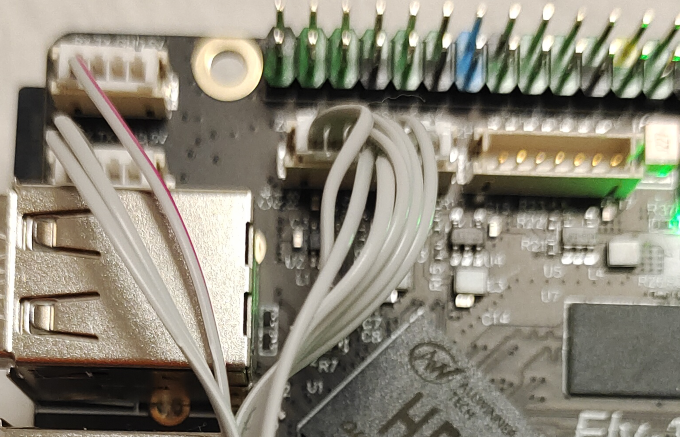
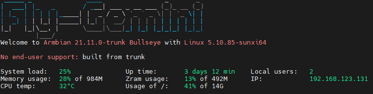

# FLY -TFT 的使用

## 1.1 修改配置

?> 首先，请打开FLY_config配置文件，打开方式请参照[打开fly_Config](/board/fly_pi/FLY_π_description2?id=_11-打开-fly_config "点击即可跳转")

1. 启用 klipperscreen 将``KlipperScreen=false``修改为``KlipperScreen=true``

2. 更改默认显示方式 将``Display=NONE``修改为``Display=FBTFT``。保存配置文件后弹出SD卡插到主板。如果为eMMC，则断电重新上电即可

## 1.2 屏幕接线

屏幕端子需要自己连接

* **Gemini-V1 屏幕接线图**

* **Gemini-V1.1接线图**

* **Gemini-V2、Gemini-V3 和 Fly- π 接线图**

## 1.3 连接屏幕与上位机

* **FLY Gemini**

  

* **FLY π**

  

  如果屏幕只显示下图所示界面，请检查``FLY_CONFIG``中``Klipperscreen``的配置是否修改正确。

5.上位机上电开机。

?>修改Display后首次开机时间较长，请耐心等待几分钟！如果遇到白屏等情况，请检查接线和配置是否正确！！！
