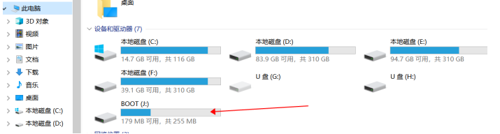
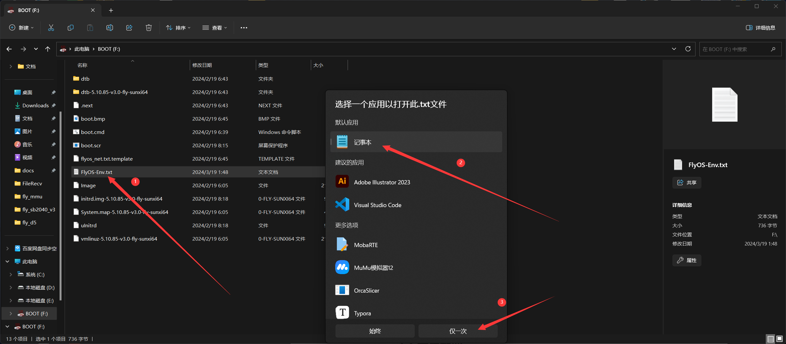
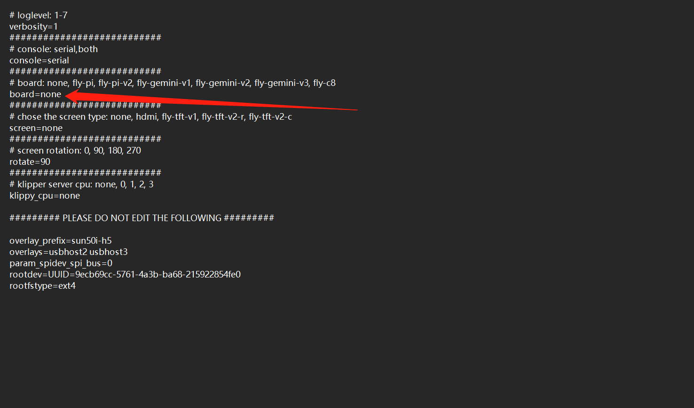
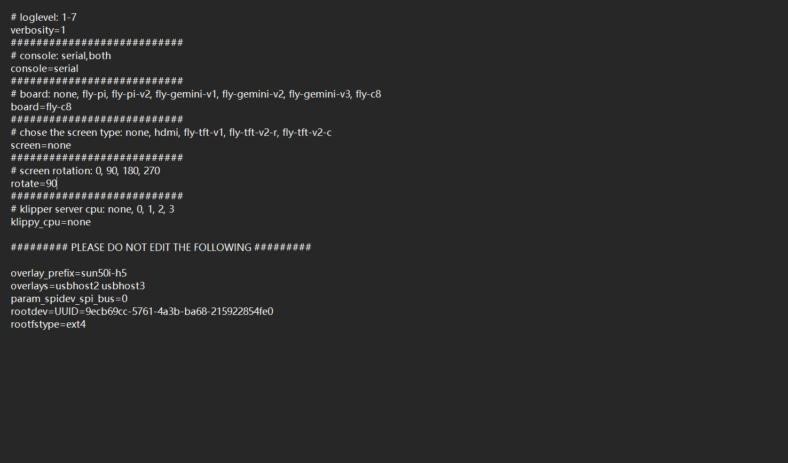

# FLY_Config 的使用

* FLY-Config用来简化系统配置等，适用于Klipper全家桶，免去进入ssh写命令的麻烦
* 只能在FLY定制Armbian系统运行
* 对初学者友好
* 直接配置Klipper及周边

## 打开 FlyOS-Env.txt

1. 如果您已经制作好SD卡，请使用读卡器连接到电脑。此时电脑应该会弹出资源管理器并且有一个“**可移动磁盘BOOT**” .如果未出现，请重新拔下 sd 卡，再插入电脑

   eMMc进入BOOT盘方法，请参考：[通过usb为emmc烧录系统镜像](/board/fly_pi_v2/FLY_π_M2WE?id=_4-使用usb烧录m2we)

   

   

2. 打开BOOT盘下的FlyOS-Env.txt

   

> [!Tip]
> 可用配置

* 指定FLY上位机型号 fly-pi, fly-pi-v2, fly-gemini-v1, fly-gemini-v2, fly-gemini-v3, fly-c8
* 配置屏幕
* 配置Klipper指定核心运行

## 指定上位机型号



* 将*board=none*中的*none*改成你的上位机型号，如下面几个

  ```
   fly-pi, fly-pi-v2, fly-gemini-v1, fly-gemini-v2, fly-gemini-v3, fly-c8
  ```

* 参考

```
board=fly-c8
```



> [!Tip]
>
> 保存配置并且通过[通过串口](https://mellow.klipper.cn/#/introduction/conntossh)且[连接WiFi](https://mellow.klipper.cn/#/board/fly_pi_v2/to_wifi?id=_2-通过ssh软件连接)
>
> 其他功能请通过FLY-Tools进行[设置](https://mellow.klipper.cn/#/board/fly_tools/setting)！！！

>[!Warning]
>
>FLY—Tools可以直接配置网页，屏幕，系统时区等等！！

