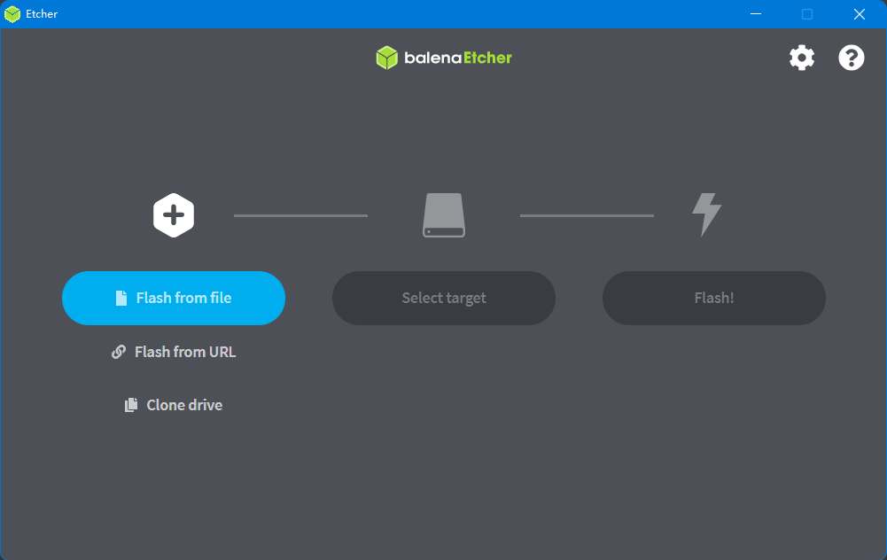
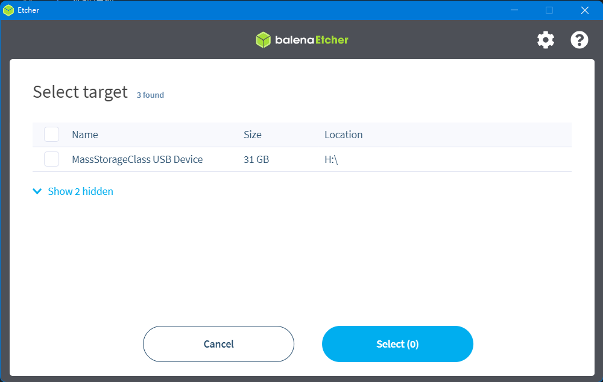
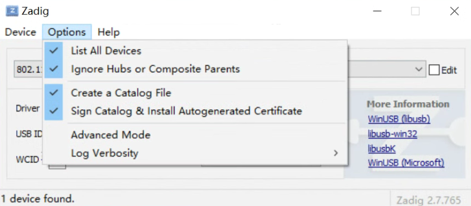
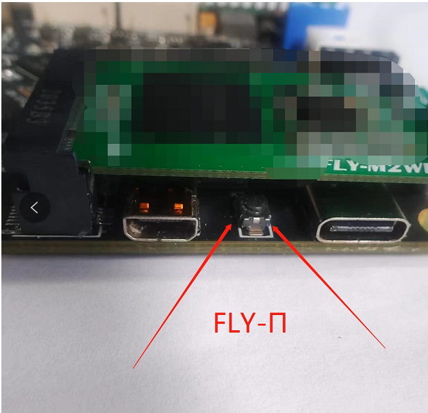
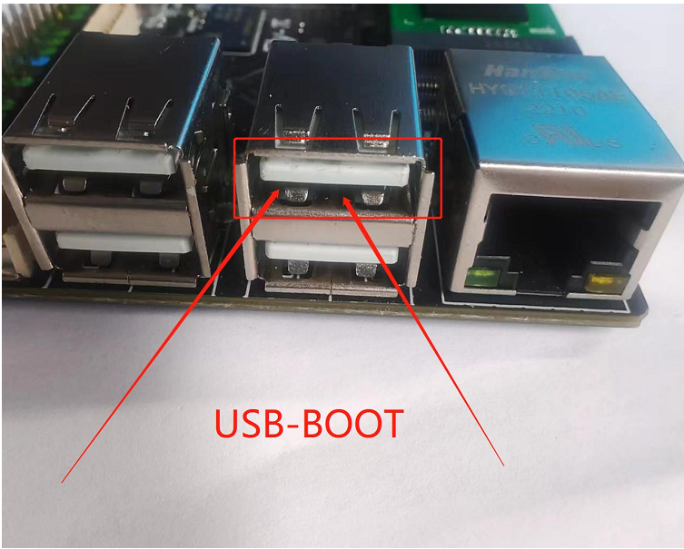

# 2. FLY π 的镜像烧录

## 2.1 烧录前的准备

**需要准备的东西：**

1. SD卡一张（>8GB）

2. 读卡器

3. 系统镜像

4. 工具软件请前往FLY官方群文件夹下载：Fly-Gemini系列；l 需要用到的软件有：balenaEtcher（fly群中文件名为系统镜像写入工具）、putty、WinSCP

5. [系统镜像](/introduction/downloadimg.md "点击即可跳转") 

**注：其他非FLY的上位机请勿使用FLY的专属镜像，否则会损坏上位机！！！**

**下载需要用到的工具和文件，国内用户请前往QQ群下载**

* [工具](https://drive.google.com/drive/folders/1llH-lq-WsbIdwkmLL51n3OHo5dNNpcPy)

## 2.2 系统镜像烧录

### 2.2.1 内存卡镜像烧录

1. 先安装好软件“balenaEtcher”，也可以用其他的(Win32DiskImager)等工具
2. SD卡插入读卡器，将读卡器插到电脑USB接口
3. 打开软件，点击“**Flash from file**”选择前面下载的系统镜像文件



4. 点击**“Select target**”选择SD卡，大小和SD卡容量差不多的就是，或进入资源管理器查看SD卡盘符

   

   5. 点击“**Falsh**”,出现进度条及“**Falshing…**”时开始写入系统镜像到SD卡。等待大约十多分钟，等待写入完成。

   6. 如果写入失败或者需要重新刷写镜像时，请按如下操作：

      1. 点击“**此电脑**” 

      

      2. 再点击“**磁盘管理**”，找到刚刚插入的内存卡（可移动磁盘），选中后单击右键，点击“**删除卷**”，

      

      3. 单击右键再单击右键**“新建简单卷**”，新建分区请注意选择文件系统格式为**FAT32**，一直点下一步，直至完成，便将内存卡格式化为只有一个盘。

         当然也可以借助第三方工具来格式化内存卡和eMMC。

      

      

   7. 至此已经完成FLY镜像的写入，但是请勿拔出内存卡，还需要修改boot盘中的FLY_config文件，具体修改方法请查看：[FLY_Config](/board/fly_pi/FLY_π_description2 "点击即可跳转")

### 2.2.2  FLY_M2WE(eMMC)镜像烧录

   FLY-M2WE提供了16G的eMMC和5G WiFi，能够提供更稳定的系统运行和更快的网络传输。（建议使用2.4GWiFi，虽然速度稍慢，但是距离远，连接也更稳定）

?> FLY-M2WE只适用于FLY-π和FLY-Gemini v2，不要带电插拔模块，此模块不支持热插拔

?>  FLY-M2WE只适用于FLY-π和FLY-Gemini v2

**[FLY_M2WE eMMC购买地址](https://item.taobao.com/item.htm?spm=a1z10.5-c-s.w4002-23066022675.38.25636b45lpxmgF&id=685372879431 "点击即可跳转")**

   1. FLYOS v2.9.6开始已经完全支持M2WE
   2. WiFi驱动已经预装，直接插上并固定好即可

   ?> 如果同时有SD卡和emmc，并且两个都有系统，会优先启动SD卡系统

   首先请安装好M2WE模块及天线，准备烧录系统。烧录镜像系统有两种方法，一种是将现有的SD卡系统迁移至eMMC模块，下面将对着两种使用方法做介绍。


   #### 1. 通过USB为eMMC烧录系统镜像

1. 先下载安装需要的软件

   [USB驱动安装工具 Zadig-2.7](https://cdn.mellow.klipper.cn/Utils/zadig-2.7.exe)

   [FLY-BOOT安装程序](https://cdn.mellow.klipper.cn/Utils/FLY-BOOT-Setup.msi)

   [系统镜像烧录工具 Win32diskimager-1.0](https://cdn.mellow.klipper.cn/Utils/win32diskimager-1.0.0-install.exe)

2. 除了第一个Zadig不需要安装可直接运行，另外两个需要安装。安装过程全都点``下一步``或者``Next``就可以了

----



3. 打开Zadig，顶部菜单栏``Options``里勾选``List All Devices``

----




4. 将附赠的双公头USB线一端连接到电脑，然后长按上图中的按钮，将双公头USB线另一端连接到Gemini或Pi的下图中的USB接口



?> 确保是在按键按下状态时将设备连接到电脑的

----


5. 如果一切正常，此时zadig中会多出一个``Unknow Device #x``或者``USB Device(VID_1f3a_PID_efe8)``，选择它

----


6. 选择设备后检查一下USB ID是否与上图一致，如果不是请重新选择其他设备
7. 上图中的第二处只能选择``WinUSB(vxxxxxxx)``版本号无所谓
8. 点击``Install Driver``安装驱动

----


9. USB驱动安装成功 (驱动只安装一次，如果以后再次烧录不用再安装驱动)

----

10. 打开安装好的FLY-BOOT，点击``检查设备``


11. 如果前面的步骤操作无误，则会提示发现可用设备（如果没有发现可用设备请仔细查看第4步）

----


12. 点击``启动BOOT``，如果正常则会提示已成功启用BOOT

----


13. 现在可以打开文件资源管理器，多出一个14.5G的U盘（16G eMMC显示大小为14.5G）
14. 这样就可以直接用Win32diskimager或balenaEtcher来烧录系统镜像，盘符选择为这个14.5GU盘的盘符
15. 系统镜像烧录可参考 [内存卡镜像烧录](#_221-内存卡镜像烧录 "点击即可跳转")
16. 镜像烧录完成后，请配置 [FLY_Config](/board/fly_pi/FLY_π_description2 "点击即可跳转")

   #### 2. 现有的SD卡系统迁移至eMMC模块


      1. 给Gemini 或 π 安装好M2WE模块并上电启动
      2. 连接到SSH
      3. 执行下面的命令, 可能会提示输入密码，输入``mellow``回车

   ```bash
sudo nand-sata-install
   ```


   4. 选择``Boot from eMMC - system on eMMC``选项后按回车键（一般默认选项就是，直接按回车键）

      

   5. 出现``This script will erase your eMMC. Continue?``时选择``Yes``按回车键（一般默认选项就是，直接按回车键）

      

   6. 选择文件系统类型为``ext4``按回车键（一般默认选项就是，直接按回车键）

   7. 耐心等待直到出现进度条（如果等待超过2分钟仍未出现下图进度条请按``CTRL+C``来终止操作，然后重启设备后重试）

      

   8. 系统迁移过程中请勿断电及进行其他操作，直到迁移完成

      

   9. 迁移完成，直接按回车键，等待设备完全关机

   10. 关机后取下SD卡，重新上电开机，此时已经可以通过eMMC中的系统来启动