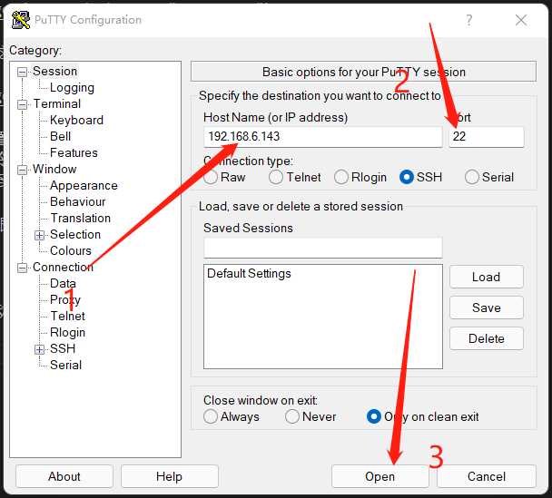
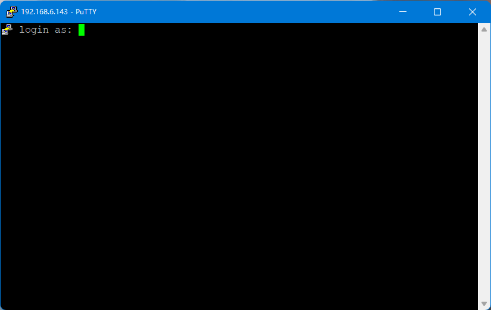
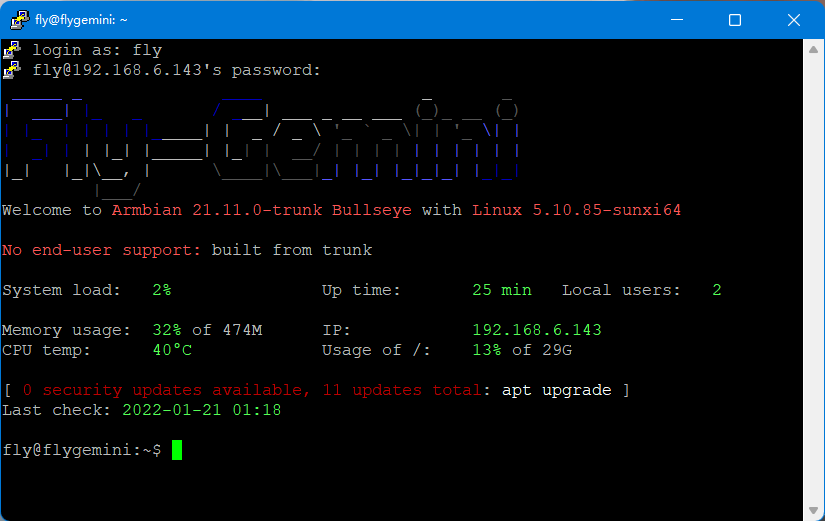

# 7. 连接到SSH

* 请提前准备好Putty或其他SSH终端工具

## 7.1 串口连接

* 使用USB Type-c线材将FLY-π与电脑连接


* 如果主板与电脑连接正常，打开设备管理器，就可以看到CH340的端口了


* 打开Putty，进行如下设置,端口填写前面在设备管理器看到的端口


* 一切正常的话就可以看到启动画面了


* 等待片刻，出现这个画面就是启动了


* 查看IP，如果配置了FLY-Config中的WIFI则开机后就会自动连接
* 在终端中输入命令```ip a|grep inet```回车
* 在返回内容中找到与你路由器同段的IP即可访问

> 如果是主板启动很久后才连接的SSH那么请连接后按几下回车键

## 7.2 远程连接

* 如果主板已经启动且已经连接到网络，可以使用IP连接到SSH
* 打开Putty，进行如下设置，IP填写前面查看的，也可以在路由器后台查看
* 注意，Putty选择SSH而不是Serial



* 第一次连接回弹出这个窗口，点击“是”即可


* 会提示输入用户名，在新窗口终端中输入```fly```后回车



* 提示输入密码，输入```mellow```后回车



* 登录成功

* 至此，您已经完成FLY-π的配置

