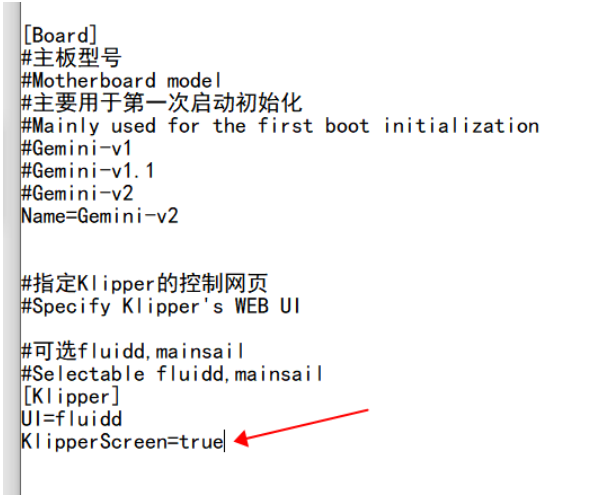
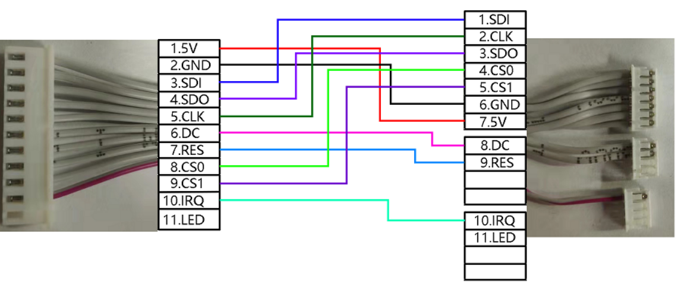
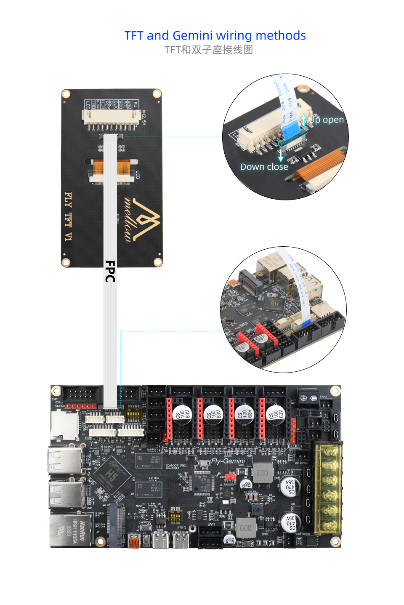
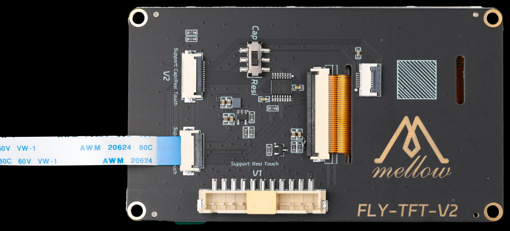
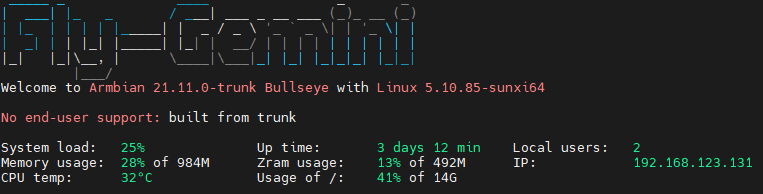

# 9. FLY -TFT 的使用

## 1. 修改配置

> [!TIP]
> 浏览器打开你的IP:9999来访问FLY-Tools

1. 启用 klipperscreen 需要将下方选项打开才可启用屏幕

然后保存重启系统

## 2. 屏幕接线

屏幕端子需要自己连接

* **Fly- π 接线图**

## 3. 连接屏幕与上位机

* **FLY π**

  

  * **Fly- π 一线通接线图**

    

  
  
  # FLY TFT V2接线图
  
  > [!Warning]
  >
  > 配置方法与TFT V1一样！！！
  >
  > PI用不了电容屏版本
  
  * 如果使用TFT V1接口需要在FLY Tools里面配置**fly-tft-v1**
  
  
  
  如果屏幕只显示下图所示界面，请检查``FLY_Tools``中``Klipperscreen``的配置是否打开。

5.上位机上电开机。
