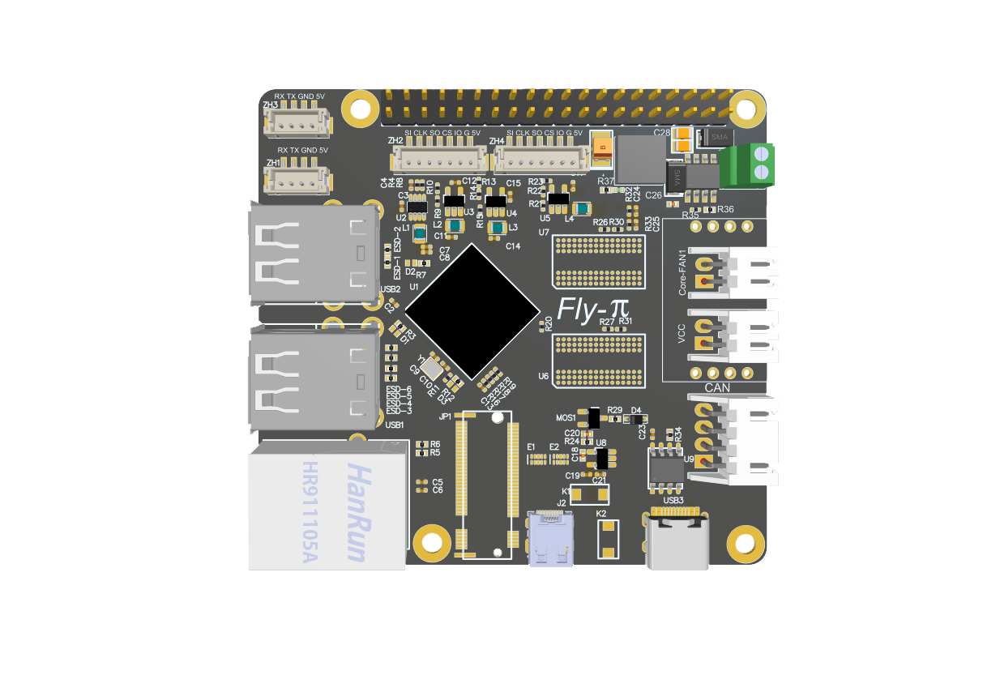

# 配置信息

* CPU: 高性能全志H5芯片，4核64位Cortex-A53
* GPU: 高性能6核Mali 450,像素填充率大于2.7gpixel/s
* RAM: 1GB DDR3 (与GPU共享)
* ROM: 支持最大128GB SDCARD
* 外设: SPI\*2, UART\*2, USB\*4, Micro HDMI\*1, ETH\*1, CAN
* 接口: 板载M.2接口，可拓展wifi，emmc等。(私有协议，切勿连接非FLY-π专用的M.2设备)
* 特点: 
  1. 40Pin接口，兼容树莓派
  2. 支持12-24V直流供电，供电更稳定，省去降压模块
  3. 板载一个5V可控风扇
  4. 预留CAN扩展接口
  5. 为Klipper定制的系统，小白更容易上手
  6. 系统与FLY-Gemini互相兼容

## FLY-π

