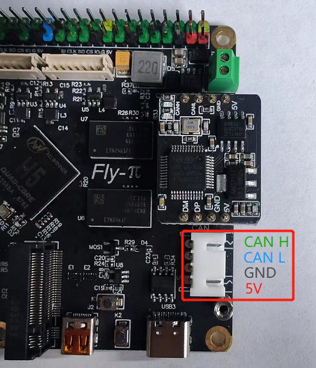

# 10. CAN HAT使用

## 10.1 CANHAT安装

1. CANHat的红色排针对应FLY-π的蓝色排母，黑色对应黑色（插反会烧毁设备）
2. FLY-π的CAN接口丝印有误，请按照下图接线

## 10.2 使用

1. FLY CANhat自带120ohm终端电阻
2. FLY-π使用CANHat且使用FLYOS的话系统无需做任何修改，直接使用
3. 将FLY-π的CANH和CANL连接到FLY-SHT的CANH和CANL即可（多个CAN设备之间并联）