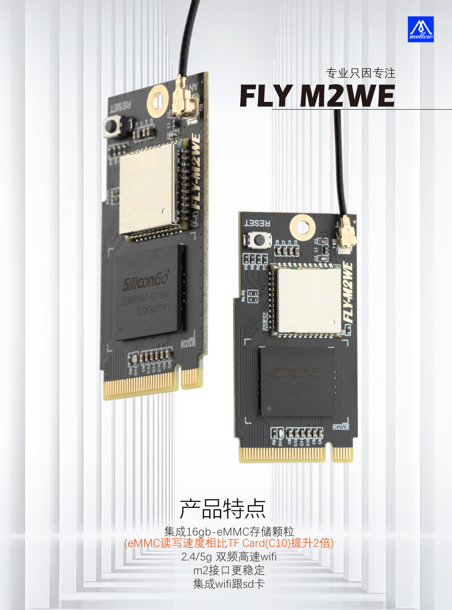

# eMMC WiFi模块使用

?> FLY-M2WE只适用于FLY-π和FLY-Gemini v2

?> 不要带电插拔模块，此模块不支持热插拔

<<<<<<< HEAD
**[FLY_M2WE eMMC购买地址](https://item.taobao.com/item.htm?spm=a1z10.5-c-s.w4002-23066022675.38.25636b45lpxmgF&id=685372879431 "点击即可跳转")**
=======
## 产品详情

[FLY3D打印机M2WE板16G eMMC 5g wifi用于KlIpper双子座V2.0PI主板-淘宝网 (taobao.com)](https://item.taobao.com/item.htm?spm=a230r.1.14.6.1a4840a8a8t04w&id=685372879431&ns=1&abbucket=16#detail "点击即可跳转")
>>>>>>> 5c05aa80531525af768e0e85464d928adf35d270

## WiFi使用

1. FLYOS v2.9.6开始已经完全支持M2WE
2. WiFi驱动已经预装，配置好[FLY_Config](/board/fly_pi/FLY_π_description2 "点击即可跳转")后可直接使用
<<<<<<< HEAD
=======
3. 请关闭2.4G/5GWiFi二合一模式
>>>>>>> 5c05aa80531525af768e0e85464d928adf35d270

## eMMC使用

eMMC的使用请查看[eMMC镜像烧录](/board/fly_pi/FLY_π_description1?id=_122-fly_m2weemmc镜像烧录 "点击即可跳转")