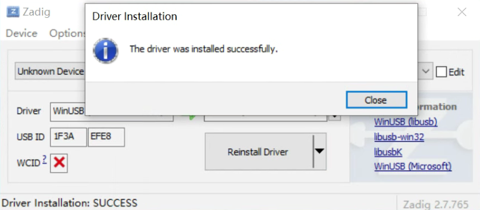
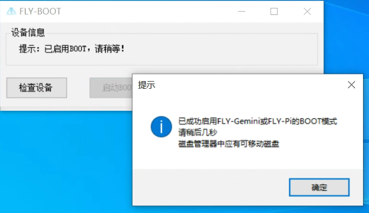
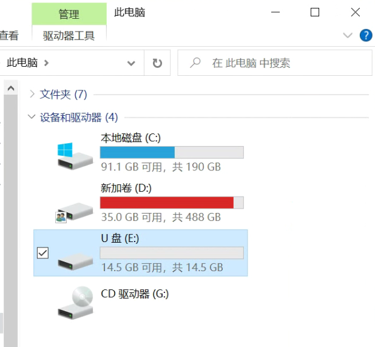

# eMMC WiFi模块使用

?> FLY-M2WE只适用于FLY-π和FLY-Gemini v2

?> 不要带电插拔模块，此模块不支持热插拔

## WiFi使用

1. FLYOS v2.9.6开始已经完全支持M2WE
2. WiFi驱动已经预装可直接使用

## eMMC使用

?> 如果同时有SD卡和emmc，并且两个都有系统，会优先启动SD卡系统

安装好M2WE模块及天线，准备烧录系统

### 现有SD卡系统迁移至eMMC模块

1. 给Gemini或Pi安装好M2WE模块并上电启动
2. 连接到SSH
3. 执行下面的命令, 可能会提示输入密码，输入mellow回车

```bash
sudo nand-sata-install
```


4. 选择``Boot from eMMC - system on eMMC``选项后按回车键（一般默认选项就是，直接按回车键）

----


5. 出现``This script will erase your eMMC. Continue?``时选择``Yes``按回车键（一般默认选项就是，直接按回车键）

----


6. 选择文件系统类型为``ext4``按回车键（一般默认选项就是，直接按回车键）
7. 耐心等待直到出现进度条（如果等待超过2分钟仍未出现下图进度条请按``CTRL+C``来终止操作，然后重启设备后重试）


8. 系统迁移过程中请勿断电及进行其他操作，直到迁移完成

----


9. 迁移完成，直接按回车键，等待设备完全关机
10. 关机后取下SD卡，重新上电开机，此时已经可以通过eMMC中的系统来启动

### 通过USB为eMMC烧录系统镜像

1. 先下载安装需要的软件

    [USB驱动安装工具 Zadig-2.7](https://cdn.mellow.klipper.cn/Utils/zadig-2.7.exe)

    [FLY-BOOT安装程序](https://cdn.mellow.klipper.cn/Utils/FLY-BOOT-Setup.msi)

    [系统镜像烧录工具 Win32diskimager-1.0](https://cdn.mellow.klipper.cn/Utils/win32diskimager-1.0.0-install.exe)

2. 除了第一个Zadig不需要安装可直接运行，另外两个需要安装。安装过程全都点``下一步``或者``Next``就可以了

----


3. 打开Zadig，顶部菜单栏``Options``里勾选``List All Devices``

----


4. 将附赠的双公头USB线一端连接到电脑，然后长按上图中的按钮，将双公头USB线另一端连接到Gemini或Pi的下图中的USB接口


?> 确保是在按键按下状态时将设备连接到电脑的

----


5. 如果一切正常，此时zadig中会多出一个``Unknow Device #x``或者``USB Device(VID_1f3a_PID_efe8)``，选择它

----


6. 选择设备后检查一下USB ID是否与上图一致，如果不是请重新选择其他设备
7. 上图中的第二处只能选择``WinUSB(vxxxxxxx)``版本号无所谓
8. 点击``Install Driver``安装驱动

----



9. USB驱动安装成功 (驱动只安装一次，如果以后再次烧录不用再安装驱动)

----

10. 打开安装好的FLY-BOOT，点击``检查设备``


11. 如果前面的步骤操作无误，则会提示发现可用设备（如果没有发现可用设备请仔细查看第4步）

----



12. 点击``启动BOOT``，如果正常则会提示已成功启用BOOT

----



13. 现在可以打开文件资源管理器，多出一个14.5G的U盘（16G eMMC显示大小为14.5G）
14. 这样就可以直接用Win32diskimager或balenaEtcher来烧录系统镜像，盘符选择为这个14.5GU盘的盘符
15. 系统镜像烧录可参考[系统镜像烧录](/introduction/system.md)