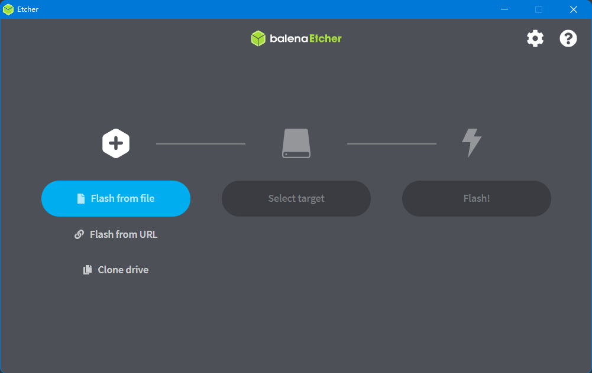
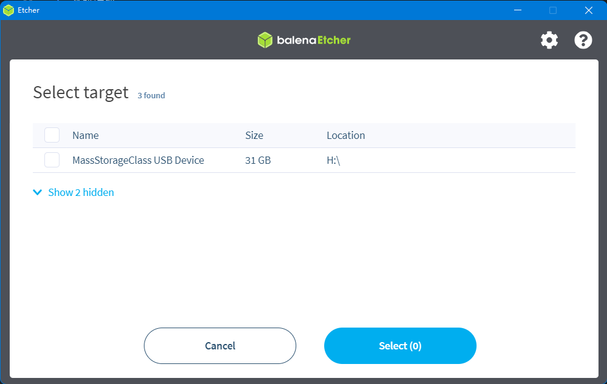
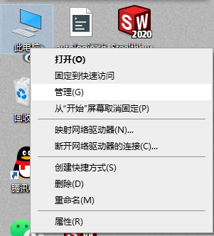
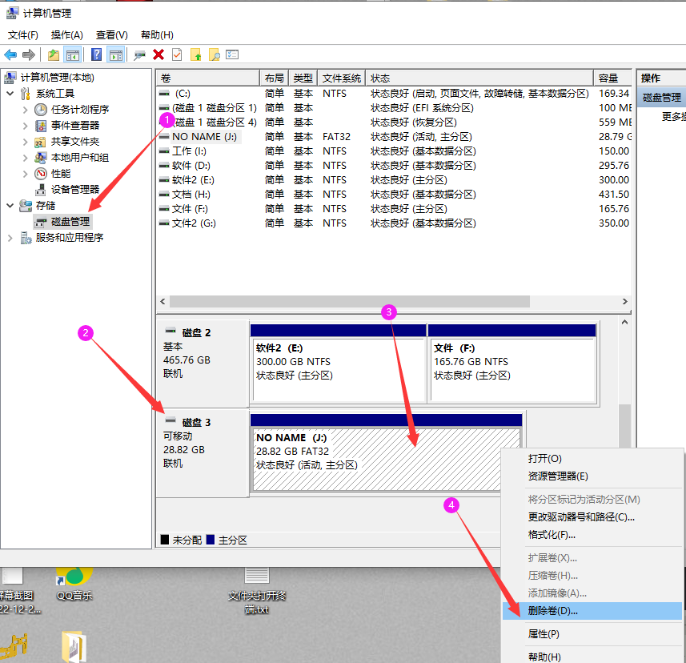
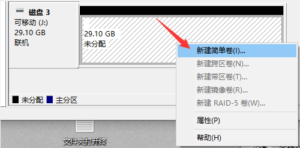
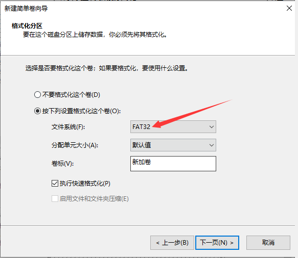

# 1. FLY π 的镜像烧录

## 1.1 烧录前的准备

**需要准备的东西：**

1. SD卡一张（>8GB）

2. 读卡器

3. 系统镜像

4. 工具软件请前往FLY官方群文件夹下载：Fly-Gemini系列；l 需要用到的软件有：balenaEtcher（fly群中文件名为系统镜像写入工具）、putty、WinSCP

   

5. [系统镜像](/introduction/downloadimg.md "点击即可跳转") 

**注：其他非FLY的上位机请勿使用FLY的专属镜像，否则会损坏上位机！！！**

**下载需要用到的工具和文件，国内用户请前往QQ群下载**

* [工具](https://drive.google.com/drive/folders/1llH-lq-WsbIdwkmLL51n3OHo5dNNpcPy)

## 1.2 系统镜像烧录

### 1.2.1 内存卡镜像烧录

1. 先安装好软件“balenaEtcher”，也可以用其他的(Win32DiskImager)等工具
2. SD卡插入读卡器，将读卡器插到电脑USB接口
3. 打开软件，点击“**Flash from file**”选择前面下载的系统镜像文件

4. 点击**“Select target**”选择SD卡，大小和SD卡容量差不多的就是，或进入资源管理器查看SD卡盘符

   

   5. 点击“**Falsh**”,出现进度条及“**Falshing…**”时开始写入系统镜像到SD卡。等待大约十多分钟，等待写入完成。

   6. 如果写入失败或者需要重新刷写镜像时，请按如下操作：

      1. 点击“**此电脑**” 

      

      2. 再点击“**磁盘管理**”，找到刚刚插入的内存卡（可移动磁盘），选中后单击右键，点击“**删除卷**”，

      

      3. 单击右键再单击右键**“新建简单卷**”，新建分区请注意选择文件系统格式为**FAT32**，一直点下一步，直至完成，便将内存卡格式化为只有一个盘。

         当然也可以借助第三方工具来格式化内存卡和eMMC。

      

      

   7. 至此已经完成FLY镜像的写入，但是请勿拔出内存卡，还需要修改boot盘中的NetWork文件，具体修改方法请查看：[FLY_Config](/board/fly_pi_lite/network "点击即可跳转")
