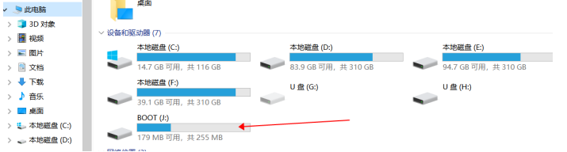
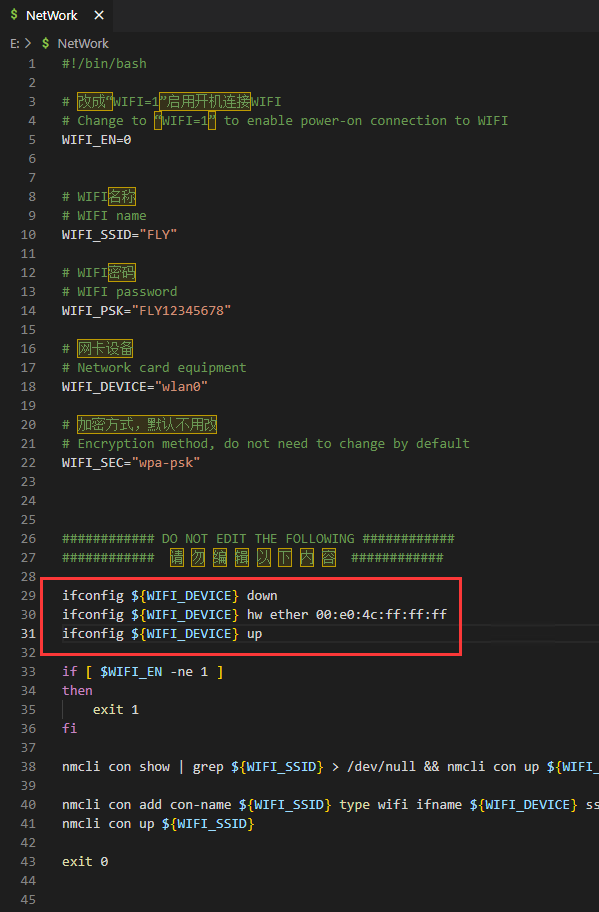

# 1.  NetWork 的使用

* NetWork用来简化系统配置等，适用于Klipper全家桶，免去进入ssh写命令的麻烦
* 只能在FLY定制Armbian系统运行
* 对初学者友好
* 直接配置Klipper及周边

## 1.1 打开 NetWork

1. 如果您已经制作好SD卡，请使用读卡器连接到电脑。此时电脑应该会弹出资源管理器并且有一个“**可移动磁盘BOOT**” .如果未出现，请重新拔下 sd 卡，再插入电脑

   

   

2. 使用记事本等文本编辑器打开BOOT盘下的NetWork文件

## 1.2 可用配置

* 配置WIFI

## 1.3 连接WiFi

   找到WIFI配置，将WIFI_EN=0改成WIFI，并将WiFi名称和密码填写上，保存，插回上位机。等待几分钟后，进入路由器后台管理界面查看IP地址。

?> 注意，FLY-PI-LITE会出现随机MAC地址的问题，导致每次开机IP都会变化，请按照下面的方法解决

Fly-pi-lite随机MAC临时解决办法。修改SD卡BOOT盘中的NetWork文件。在图片中位置加入下面的三行配置

```bash
ifconfig ${WIFI_DEVICE} down
ifconfig ${WIFI_DEVICE} hw ether 00:e0:4c:ff:ff:ff
ifconfig ${WIFI_DEVICE} up
```
其中 **00:e0:4c:ff:ff:ff** 里面的后三位 **ff** 可自行更改，按照16进制


