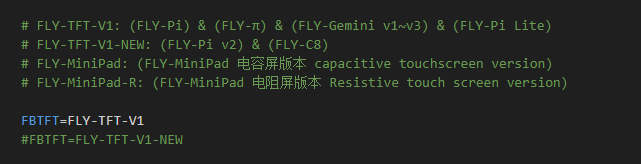
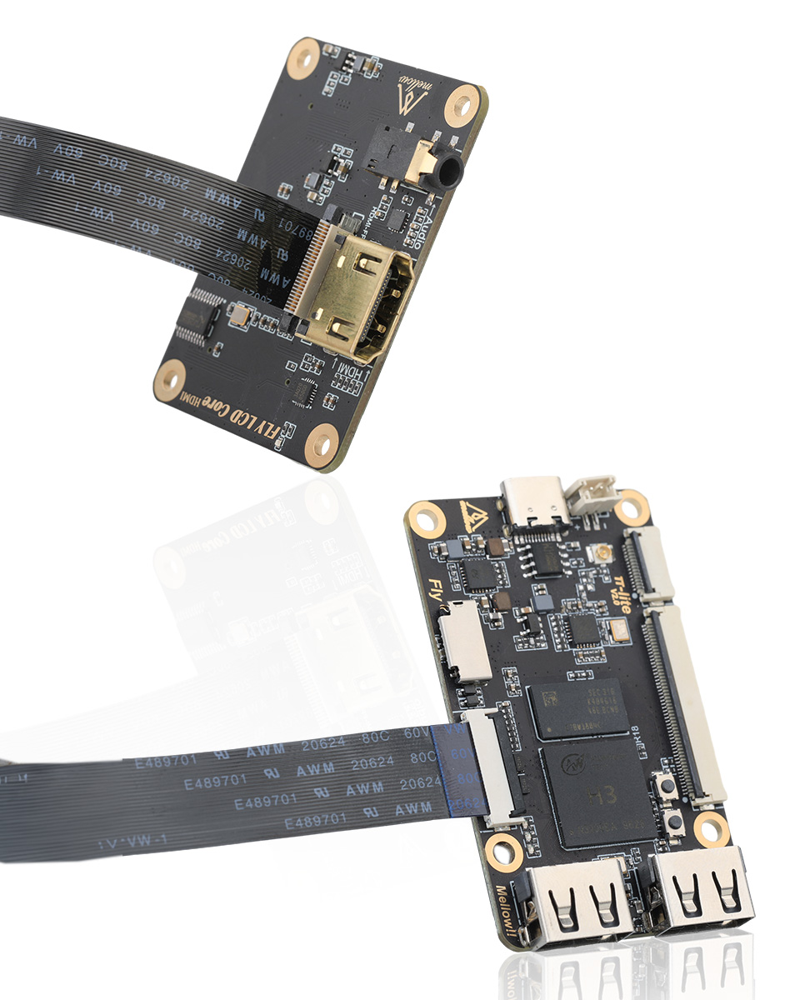

# 屏幕使用

找到下图所示选项，将``klipperscreen=flase``修改为``klipperscreen=true``，则可启用klipperscreen屏幕。

另外还需要指定使用的屏幕类型才能够正常使用！！！按下图中的提示修改为对应的配置即可。

<!-- tabs:start -->

### **HDMI**

* HDMI屏幕只需要修改Display此选项即可

### **TFT**

* 请注意(FLY-Pi) & (FLY-π) & (FLY-Gemini v1~v3) & (FLY-Pi Lite2) 使用FLY-TFT-V1
* (FLY-Pi v2) & (FLY-C8)使用FLY-TFT-V1-NEW

* TFT屏幕旋转只能选择**90**或者**270**

<!-- tabs:end -->

# TFT屏幕接线

# FLY TFT V2接线图

> [!Warning]
>
> 配置方法与TFT V1一样！！！

# HDMI屏幕接线

