# 7. 连接到SSH

* 请提前准备好MobaXterm或其他SSH终端工具

[MobaXterm下载链接:](https://mobaxterm.mobatek.net/download-home-edition.html "点击即可跳转")，选择右边的`` Installer edition``

## 1. 串口连接

* 使用USB Type-c线材将FLY-π与电脑连接

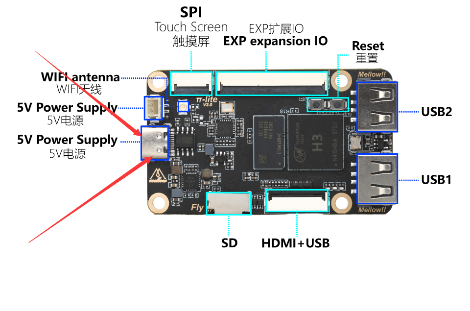

* 如果主板与电脑连接正常，打开设备管理器，就可以看到CH340的端口了

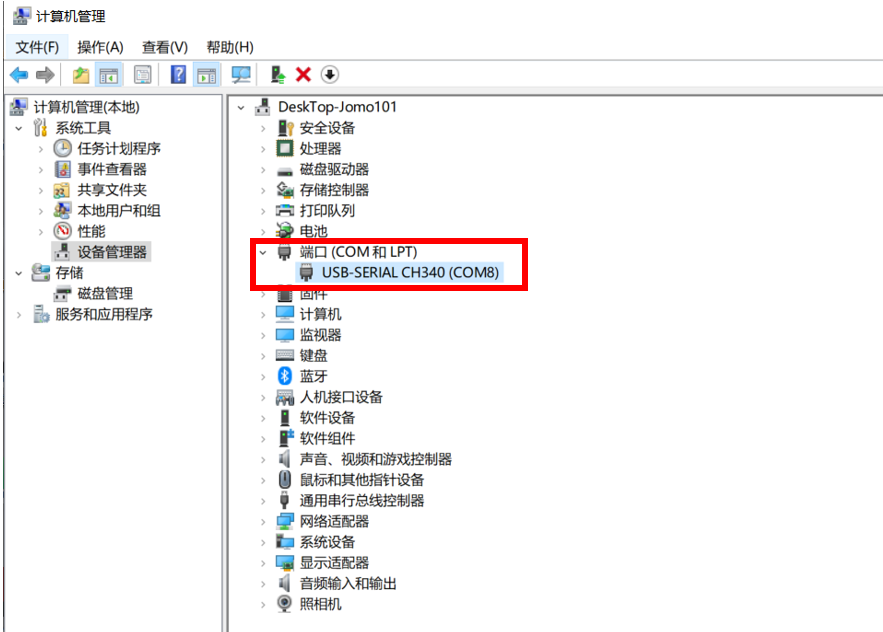

* 打开``MobaXterm``，进行如下设置，端口选择前面在设备管理器看到的端口

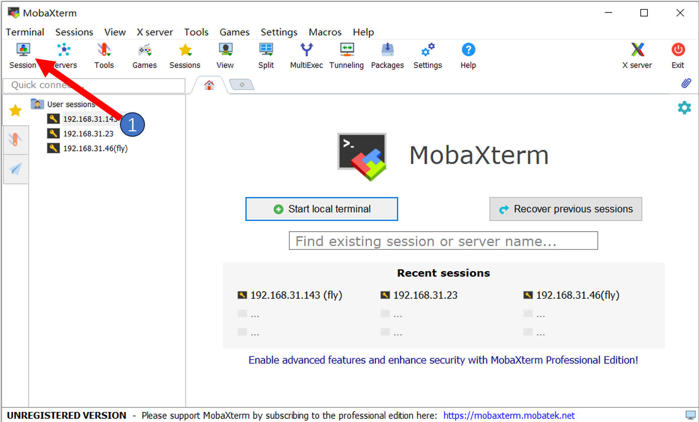

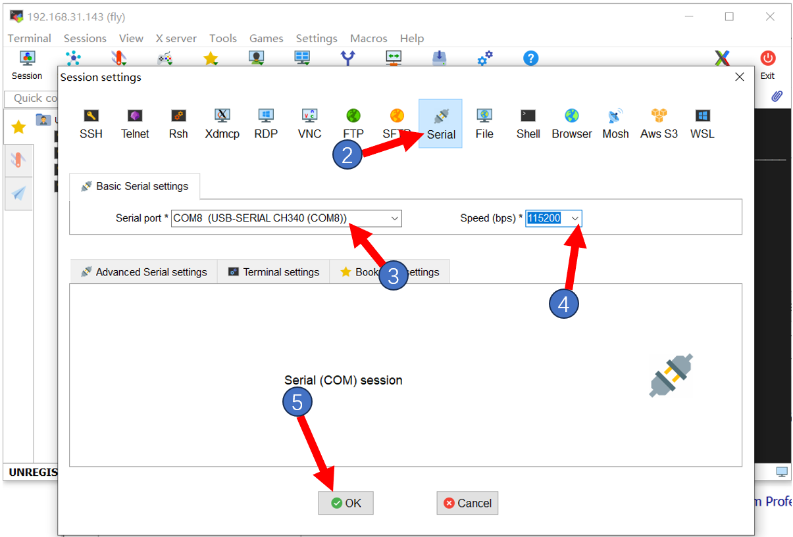

* 一切正常的话就可以看到启动画面了

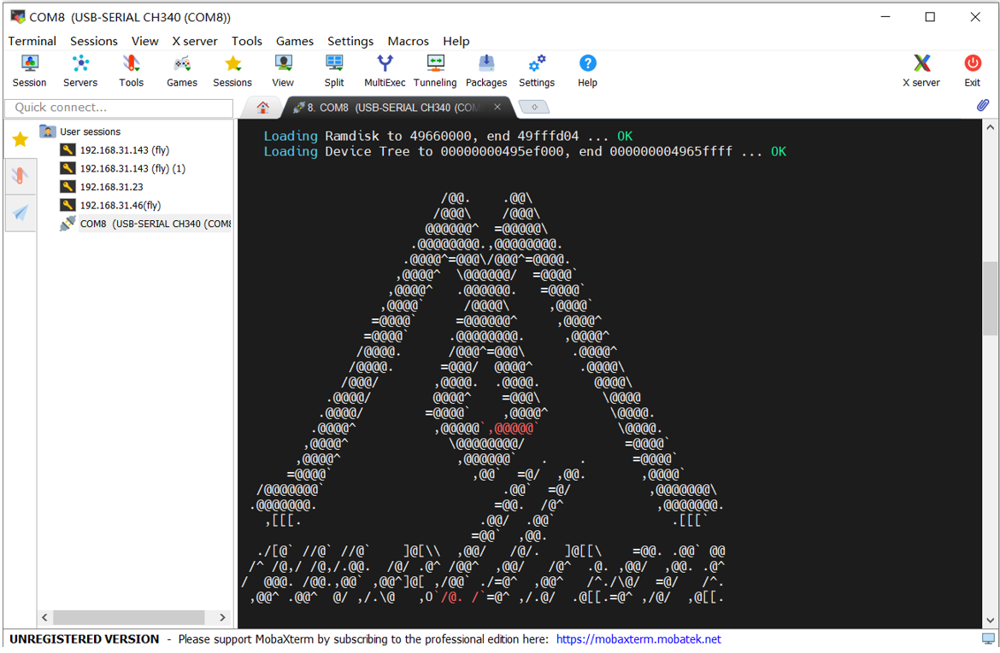


* 等待片刻，出现这个画面就是启动了

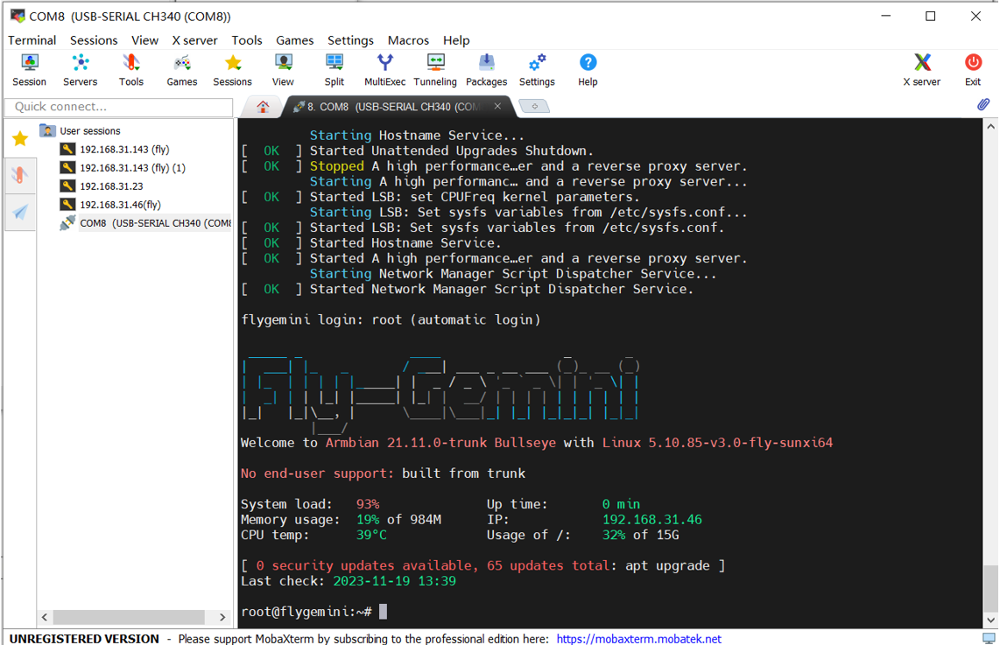

​                    **如果等了几分钟后，像下图一样，界面没有任何显示，按几下回车键即可**

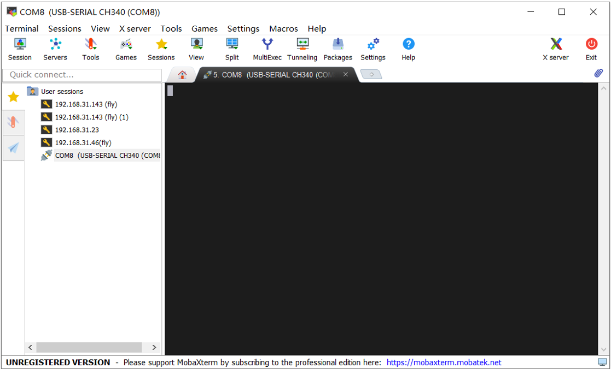

**回车后会出现下图所示内容**

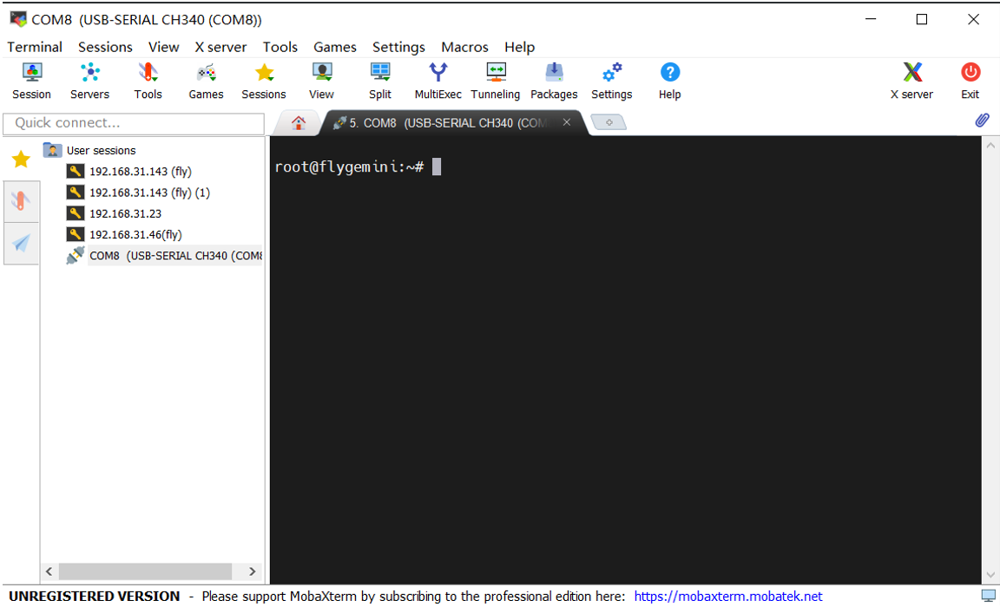

* 这时候需要切换用户，在ssh中输入：``su fly`` 后 再输入 ``cd ~``

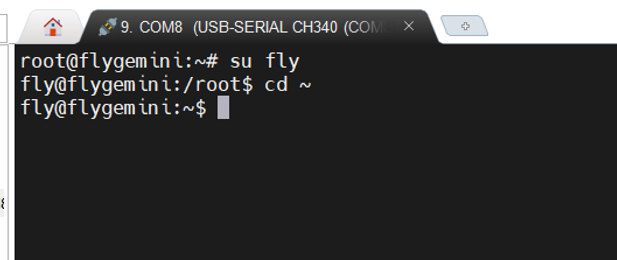

* 查看IP，如果配置了FLY-Config中的WIFI则开机后就会自动连接

  > 使用ssh软件和Fly_Config连接WiFi可以参考：[连接WiFi](/board/fly_pi_v2/to_wifi "点击即可跳转")

* 在终端中输入命令```ip a|grep inet```回车，在返回内容中找到与你路由器同段的IP即可访问


## 2. 远程连接

* 如果主板已经启动且已经连接到网络，可以使用IP连接到SSH
* 打开MobaXterm，进行如下设置，IP填写前面查看的，也可以在路由器后台查看


**注意：这里第4步输入的``fly``为用户名**

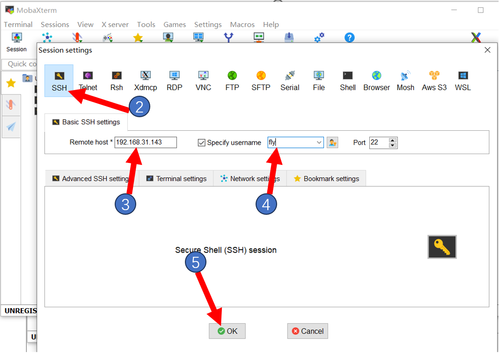


* 第一次连接回弹出这个窗口，点击``Accept``即可


* 提示输入密码，输入```mellow```后回车

**注意：这里输入的密码是看不到的，输完后直接回车即可**

用户名为：``fly`` 

密码为：`` mellow``

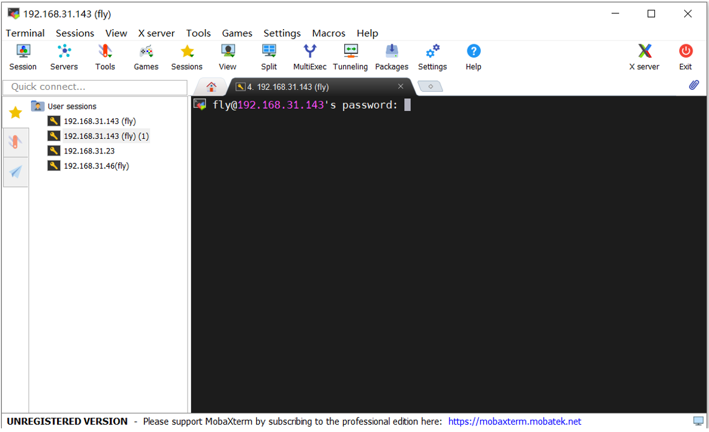

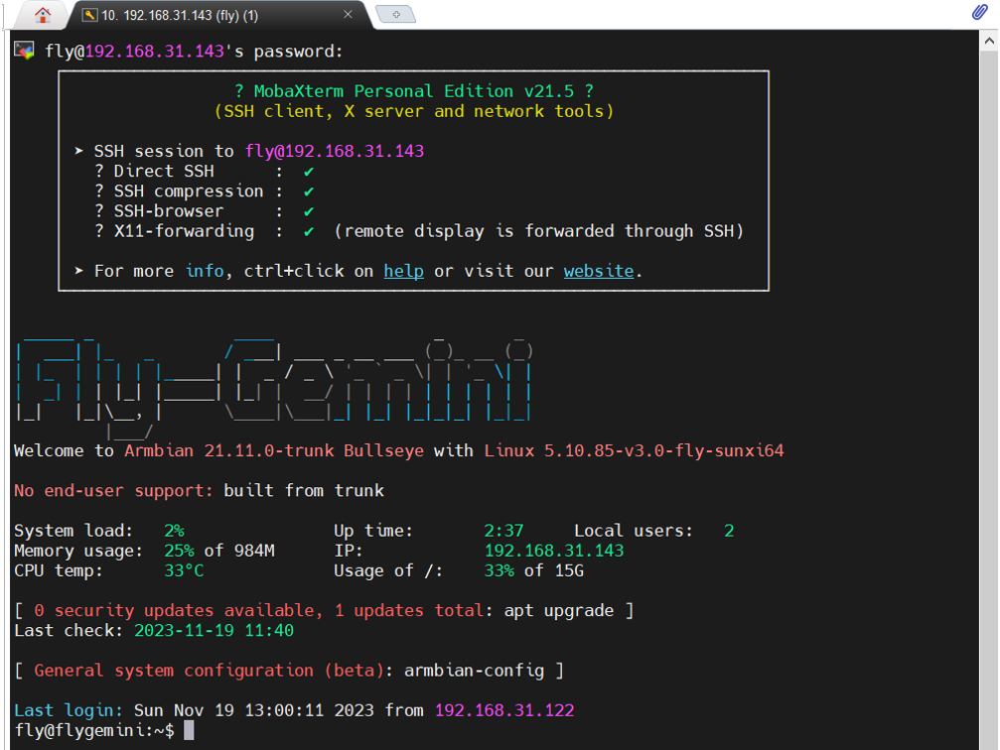

* 登录成功

* 至此，您已经完成FLY-Pi lite2的配置

