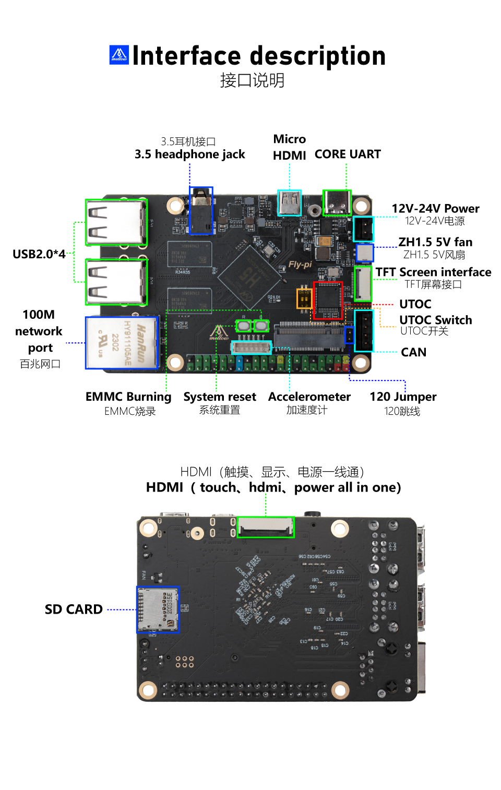
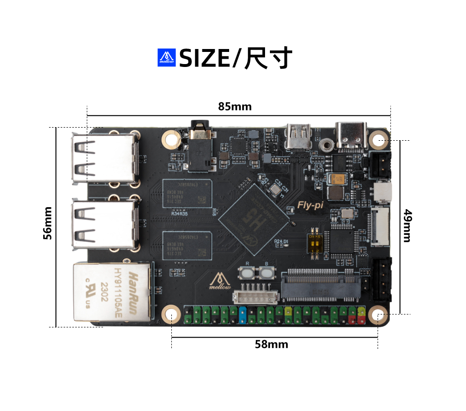

# 1. 产品简介 

我们很高兴地发布全新的FLY-π V2上位机。此板的安装尺寸与树莓派相同，可替代树莓派作为上位机运行，它拥有有1GB的板载DDR3内存，允许运行完整的LINUX桌面（基于 Armbian定制优化）。该板可与Klipper和RRF固件一起使用，甚至可以在使用SHT工具板时运行Klipper屏幕。

设计这款上位机的目的是让客户更容易使用Klipper固件或RRF固件。我们对LINUX系统镜像进行优化，更适合3D打印机使用，操作安装也更简单，小白稍有基础也能很快的学习使用。相对于其他上位机板子节省了学习成本，让你可以更专注于享受3D打印带来的快乐(购买带SD卡的套餐预装Klipper固件，上电就能用省时又省事)。

**特点**

* 与树莓派3B和4B同样版型

* CPU：高性能全志H5芯片，4核64位Cortex-A53

*  GPU：高性能6核Mali 450，像素填充率大于2.7gpixel/s

*  RAM：1GB DDR3（与GPU共享）(512+512)

* ROM：支持最大128GB SDCARD

* 外设：Spi x2，UART x2，USB x4（USB 2.0 x3，OTG x1），Micro HDMI x1，Eth x1（100M），CAN （板载USB转CAN模块，即板载UTOC）

* 接口：板载M.2接口，可扩展WIFI，eMMC等。（私有协议，切勿连接非FLY π专用的M.2设备）

* 40Pin接口，兼容树莓派

*  支持12-24V直流供电，供电更稳定

*  预留了一个5V风扇ZH1.5接口

*  为Klipper定制的系统，无需安装系统等复杂的操作，小白更容易上手

* 系统与FLY-Gemini互相兼容

## 1.1 产品详情

## 1.2 升级说明

* 将FLY-π v2的孔位尺寸升级，使其与树莓派4B的尺寸相同。

* 板载UTOC，无需再购买CAN Hat

## 1.3 FLY-π V2

