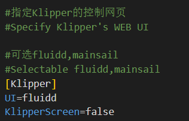

#  5. FLY_Config 的使用

* FLY-Config用来简化系统配置等，适用于Klipper全家桶，免去进入ssh写命令的麻烦
* 只能在FLY定制Armbian系统运行
* 对初学者友好
* 直接配置Klipper及周边

## 5.1 打开 FLY_Config

1. 如果您已经制作好SD卡，请使用读卡器连接到电脑。此时电脑应该会弹出资源管理器并且有一个“**可移动磁盘BOOT**” .如果未出现，请重新拔下 sd 卡，再插入电脑

   eMMc进入BOOT盘方法，请参考：[通过usb为emmc烧录系统镜像](/board/fly_pi/FLY_π_description1?id=_2-通过usb为emmc烧录系统镜像)

   

   

2. 打开BOOT盘下的FLY-Config.conf

   

## 5.2 可用配置

* 配置主板型号（仅限Gemini系列，其他系列默认即可）
* 指定Klipper的控制网页
* 配置WIFI
* 配置Klipperscreen

## 5.3 连接WiFi

   找到WIFI配置，将WIFI处的flase改成true，并将WiFi名称和密码填写上，保存，插回上位机。等待几分钟后，进入路由器后台管理界面查看IP地址。
   

## 5.4 其他可用配置

### 5.5.1 选择Klipper的控制网页

找到下图所示选项，将``UI=fluidd``修改为``UI=mainsail``，则可将控制网页由``fluidd``切换为``mainsail``。



### 5.5.2 Klipperscreen的配置

找到下图所示选项，将``klipperscreen=flase``修改为``klipperscreen=true``，则可启用klipperscreen屏幕。


另外还需要指定使用的屏幕类型才能够正常使用！！！按下图中的提示修改为对应的配置即可。


## 5.5 音频使用

**音频设备驱动启用方法**

1. 在

   ```
   /boot/armbianEnv.txt
   ```

   中加入一行配置

   ```
   overlays=analog-codec
   ```

   

2. 重启系统

3. 执行命令**cat /proc/asound/cards**来查看是否存在音频设备，存在“H3_Audio_Codec”设备则正常（无设备则不会有任何输出）

4. 安装播放器和解析器**sudo apt-get install sox libsox-fmt-all alsa-utils**

5. 执行命令测试发声speaker-test -Dplughw:CARD=0 Device -c2 -twav（CARD=0，这个0对应上一步中查看的设备编号，默认0）

6. 播放音频文件命令play xxx.mp3
