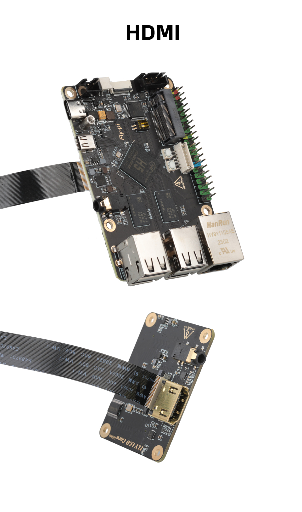

#  10. HDMI屏幕的使用

## 1. 修改配置

> [!TIP]
> 浏览器打开你的IP:9999来访问FLY-Tools

1. 启用 klipperscreen 需要将下方选项打开才可启用屏幕

> [!TIP]
>
> FLY π上板载的HDMI接口是Micro HDMI，购买HDMI线时请注意！！！

## 2. 连接屏幕

下图为FLY-π v2搭配 FLY LCD7/5电容触摸屏的接线方式（图中HDMI转FPC转接板需单独购买）：

购买链接：[FLY LCD43/50/70 显示屏触摸屏可更换核心DIS/Hdmi 3D打印机-淘宝网 (taobao.com)](https://item.taobao.com/item.htm?spm=a1z10.5-c.w4002-23066022675.52.57cd4ba4U3GZvE&id=707904441524)

