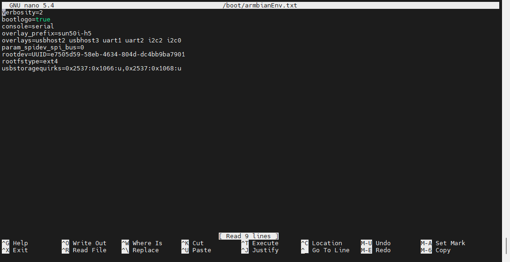
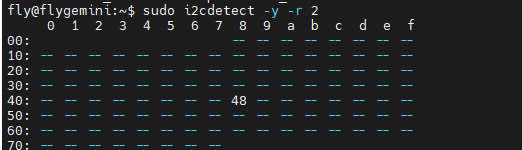

# 使用上位机40PIN的I2C接口

* 本次教程使用**FLY-PI V2**LM75**的I2C传感器与**I2C2做示例！！！
* 请注意**I2C1**被其他设备已经占用是无法使用！！！
* 请确保接线牢固稳定！！！

## 1.通过FLY Tools打开I2C



* 找到`Overlays `并且在后面选择`i2c2`与`i2c0`
* 请注意**I2C1**被其他设备已经占用是无法使用!!!
* 保存并且重启

## 2.接线并且搜索


* 使用SSH连接FLY上位机后输入下方指令将输出下面内容
* 如果使用**I2C0**则需要将下方指令的`2`替换成`0`

```
 sudo i2cdetect -y -r 2
```



* 请注意如果**一切正常情况下**，回车后是**立刻出现**上方的内容会附带一个地址
* 请注意**地址是随机的**
* 请注意如果**线没接对，线接反，配置没打开与模块损坏**这几种情况下是**输出不正常**
* **地址需要自己从十六进制换算到十进制在填写到配置中的`i2c_address:`后面**
* 可以使用浏览器搜索在线进制转换器来转换

## 3. 配置

```cfg
[mcu host]
serial: /tmp/klipper_host_mcu

[temperature_sensor my_sensor]
sensor_type: LM75
i2c_address:72
# #   Default is 72 (0x48). Normal range is 72-79 (0x48-0x4F) and the 3
# #   low bits of the address are configured via pins on the chip
# #   (usually with jumpers or hard wired).
i2c_mcu:host
i2c_bus:i2c.2
# i2c_software_scl
```
