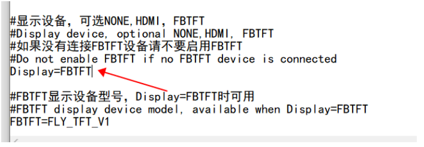
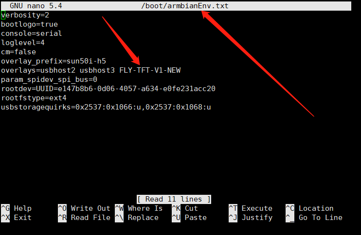

# 5. FLY -TFT 的使用

## 5.1 修改配置

> [!TIP]
> 首先，请打开FLY_config配置文件，打开方式请参照[打开fly_Config](/board/fly_pi/FLY_π_description2?id=_11-打开-fly_config "点击即可跳转")

1. 启用 klipperscreen 将``KlipperScreen=false``修改为``KlipperScreen=true``


2. 更改默认显示方式 将``Display=NONE``修改为``Display=FBTFT``。保存配置文件后弹出SD卡插到主板。如果为eMMC，则断电重新上电即可



3.启用TFT屏幕方法

```
sudo nano /boot/armbianEnv.txt
```

如果是FLY-Pi&FLY-πFLY-Gemini v1~v3&FLY-Pi Lite选择FLY-TFT-V1

如果是FLY-Pi v2&FLY-Gemini Plus选择FLY-TFT-V1-NEW

> [!WARNING]
>
> 只能使用其中一个

> [!NOTE]
>
> **如果需要旋转180度请在后面加入-h，例如：FLY-TFT-V1-h**
>
> **If you need to rotate 180 degrees, please add -h, for example: FLY-TFT-V1-h**

```
FLY-TFT-V1
#FLY-TFT-V1-h
#FLY-TFT-V1-NEW
#FLY-TFT-V1-NEW-h
```

保存 退出 重启即可

```
CTRL S
CTRL X
sudo reboot
```



## 5.2 连接屏幕与上位机

连接方式如下图所示：


* 如果屏幕只显示下图所示界面，请检查``FLY_CONFIG``中``Klipperscreen``的配置是否修改正确。


5.上位机上电开机。

> [!TIP]
> 修改Display后首次开机时间较长，请耐心等待几分钟！如果遇到白屏等情况，请检查排线是否接反，配置是否修改正确！！！
