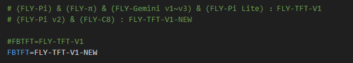

# 9. FLY -TFT 的使用

## 1. 修改配置

> [!TIP]
> 首先，请打开FLY_config配置文件，打开方式请参照[打开fly_Config](/board/fly_pi/FLY_π_description2?id=_11-打开-fly_config "点击即可跳转")

* 请注意(FLY-Pi) & (FLY-π) & (FLY-Gemini v1~v3) & (FLY-Pi Lite) 使用FLY-TFT-V1
* (FLY-Pi v2) & (FLY-C8)使用FLY-TFT-V1-NEW

* TFT屏幕旋转只能选择**90**或者**270**

## 2. 连接屏幕与上位机

连接方式如下图所示：

## FLY TFT V2接线图

> [!Warning]
>
> 配置方法与TFT V1一样！！！

* 如果屏幕只显示下图所示界面，请检查``FLY_CONFIG``中``Klipperscreen``的配置是否修改正确。

5.上位机上电开机。

> [!TIP]
> 修改Display后首次开机时间较长，请耐心等待几分钟！如果遇到白屏等情况，请检查排线是否接反，配置是否修改正确！！！
