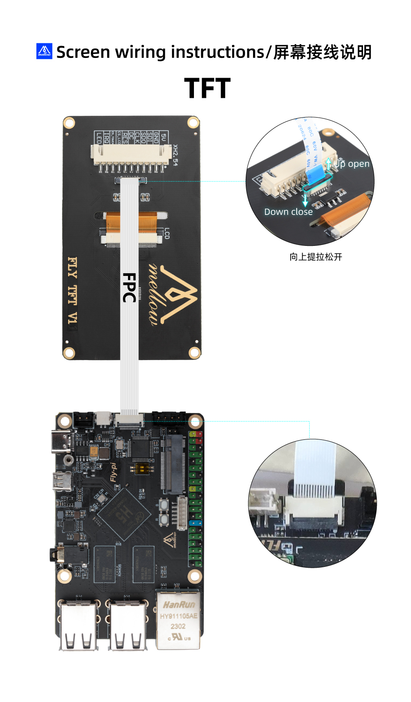

# 9. FLY -TFT 的使用

## 1. 修改配置

> [!TIP]
> 浏览器打开你的IP:9999来访问FLY-Tools

1. 启用 klipperscreen 需要将下方选项打开才可启用屏幕

然后保存重启系统

## 2. 连接屏幕与上位机

连接方式如下图所示：

## FLY TFT V2接线图

G2T+TFTV2使用方法请看这:[FLY_G2T](https://mellow.klipper.cn/#/board/fly_g2t/fly)

* 如果屏幕只显示下图所示界面，请检查``FLY_Tools``中``Klipperscreen``的配置是否打开。

5.上位机上电开机。

