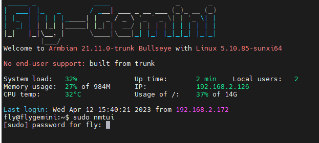
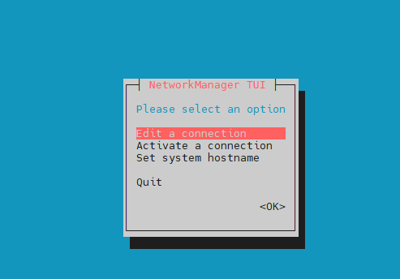
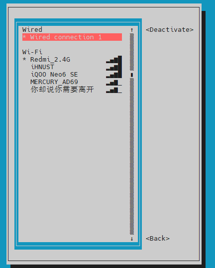
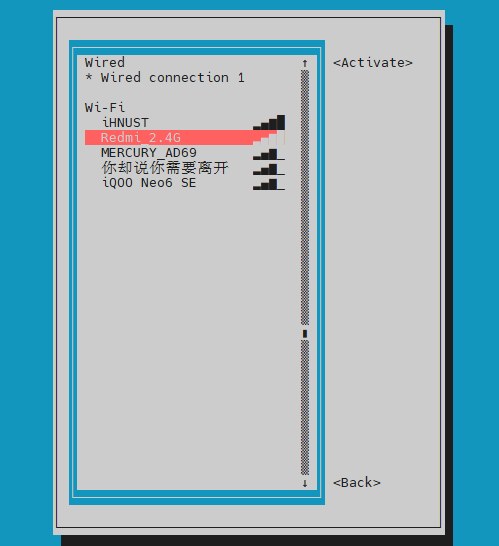
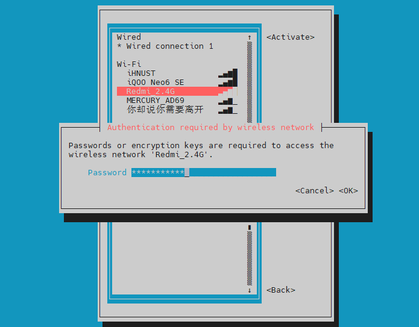
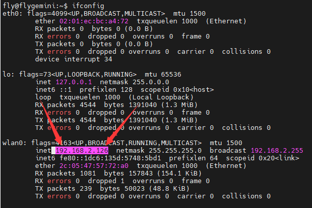

# 6. 连接WiFi

连接WiFi一共有两种方式

## 6.1 通过FLY_Config连接WiFi

[连接WiFi](/board/fly_pi/FLY_π_fly_config?id=_13-连接wifi "点击即可跳转")

## 6.2 通过SSH软件连接

使用 [串口连接](/board/fly_pi/FLY_π_ssh "点击即可跳转") 到SSH软件后使用nmtui命令连接WiFi

1. 在SSH软件输入`sudo nmtui`命令后回车，再输入`mellow`，会出现下图所示界面

2. 选择`Activate a connection`后回车

3. 进入如下界面，通过键盘上的`↑``↓`键选择要连接的WiFi后，回车，输入密码后等待连接成功

4.连接成功后如图所示

5. 按`ESC`键退出，返回命令行界面，输入`ifconfig`，图中`192.168.2.126`即为上位机的IP地址

