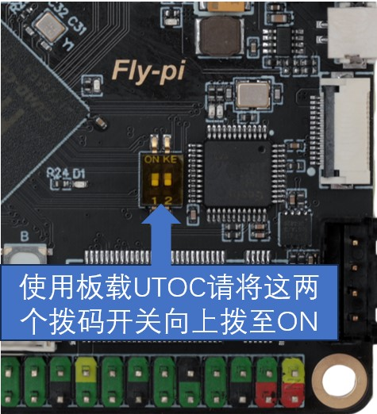
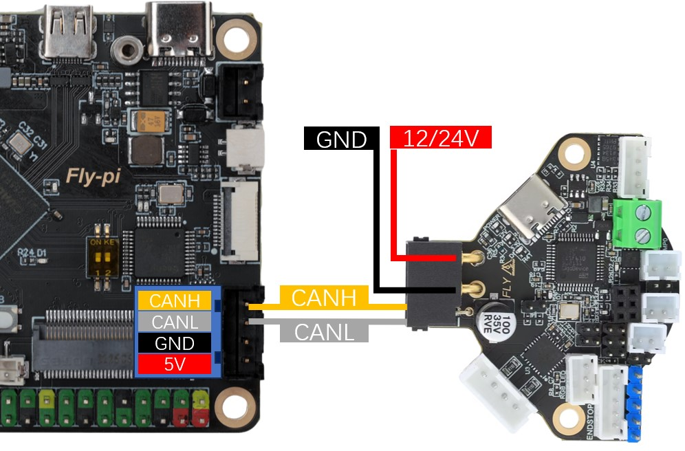

#  12. 板载UTOC的使用

## 12.1 CAN速率查询

> [!WARNING]
>
> **系统默认速率为1M**

> [!NOTE]
>
> 查看方法

```
cat /etc/network/interfaces.d/can0
```

> [!NOTE]
>
> 修改方法

```
sudo sed -i 's/1000000/500000/g' /etc/network/interfaces.d/can0
```

保存重启即可

## 12.2 拨码开关设置

启用板载**UTOC**，需将下图所示的两个拨码开关向上拨至ON状态！！！默认为关闭状态！！！



> [!WARNING]
> 使用拨码开关启用板载**UTOC**后，下图所示的USB口会被占用，不能再接入任何设备！！！


## 12.3 跳线帽设置

请按下图所示，插上跳线帽


## 12.4 接线

下图以SHT36 V2为例，介绍FLY-π v2的接线方式


