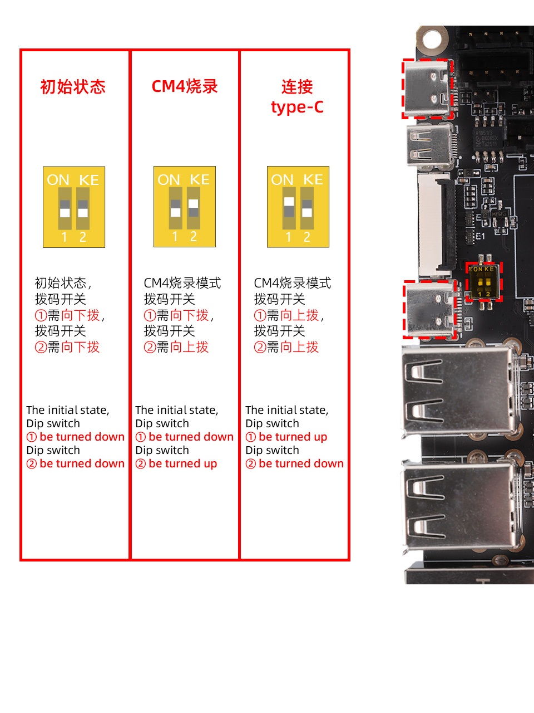
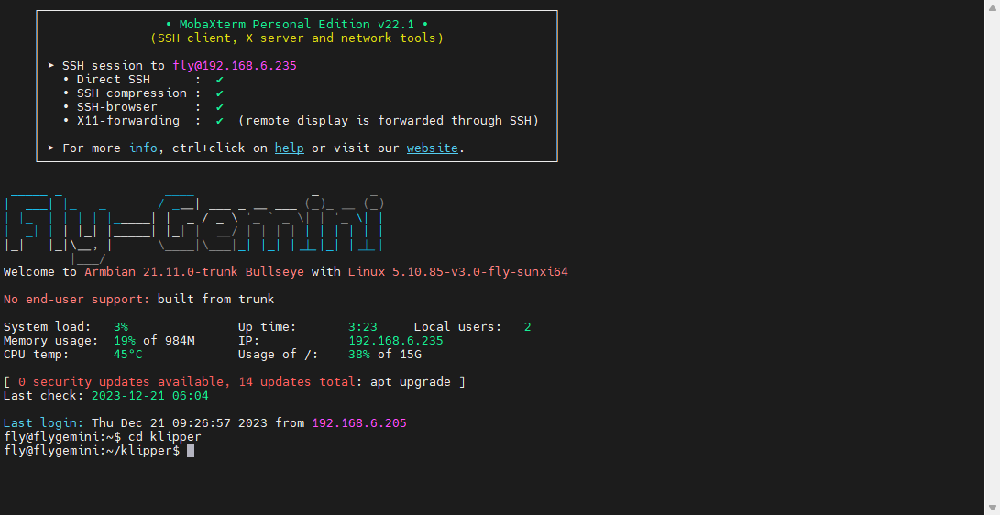
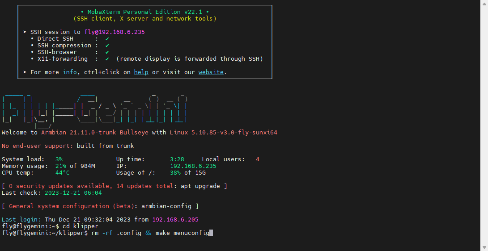
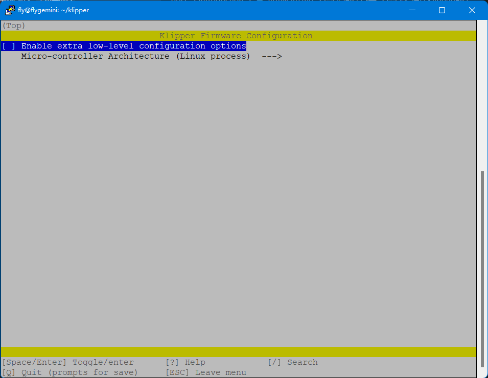
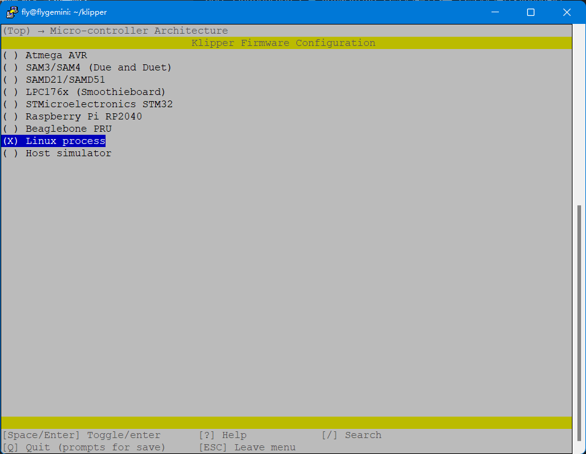
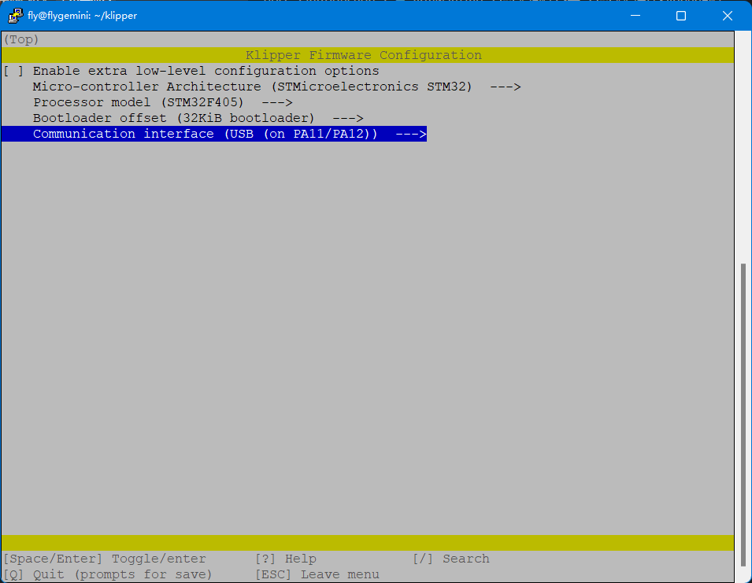
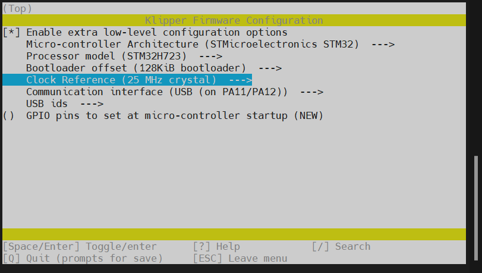
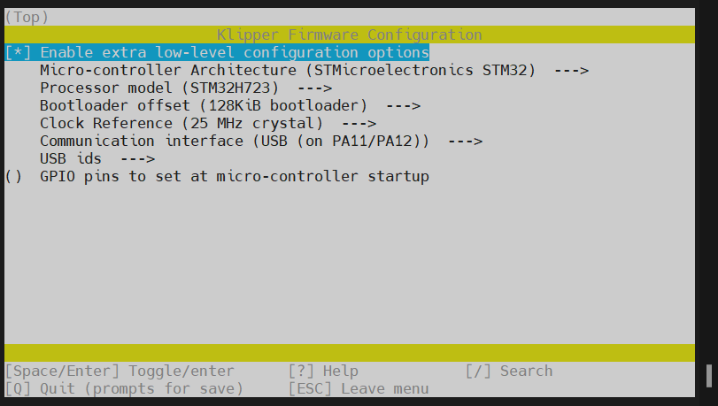
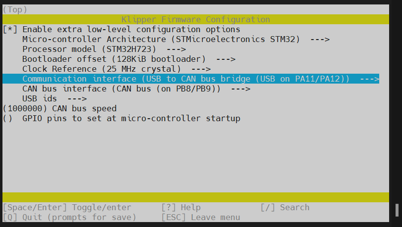
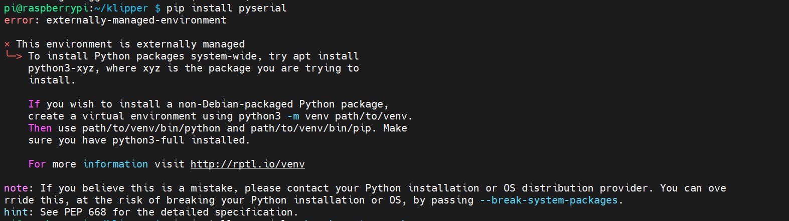

# 固件烧录

## 固件注意事项

请使用**MobaXterm_Personal**等**SSH工具**连接通过**WIFI**到您的上位机，并且需要确定以下几点

1. **请确保上位机安装好了Klipper服务**
2. **请确保登录的用户必须是安装好Klipper的用户**
3. **请确保你的输入法是英文**
4. **请确保你的上位机可以正常搜索到设备**
5. **请确保以上注意事项都做到，否则无法进行下一步**

6. **出厂预刷Katapult，如果需要使用Micro SD卡刷固件需要手动进入DFU并且烧录BL**



## 编译Klipper固件

* 请根据自己的机器选择编译相应的固件

* 请确保使用**MobaXterm_Personal**等**SSH工具**连接到上位机，并且是**安装好klipper的用户**参考教程:[上位机连接 SSH](https://mellow-old.klipper.cn/#/introduction/conntossh?id=通过wifi或者网线连接上位机)

* 上位机连接SSH后输入`cd klipper`并且回车



* 输入`rm -rf .config && make menuconfig`，并且回车
* 其中`rm -rf .config`是为了清理之前编译的固件参数



* 回车后将出现下面界面
* 看到此界面后就可以开始编译固件



* 选择`Enable extra low-level configuration options`并且**回车**，此项是打开其他配置选项



* 选择`STMicroelectronics STM32`并且**回车**，然后选择**STM32H723**!!!



* `Bootloader offset`默认`128KiB bootloader`无需修改
* 选择`Clock Reference (8 MHz crystal)  --->`回车，然后选择`25 MHz crystal`在回车



* 至此USB固件编译完成输入`Q`与`Y`进行退出保存
* 如果需要编译**USB桥接CAN固件需要修改选择**`Communication interface (USB (on PA11/PA12)) `回车，在选择` USB to CAN bus bridge (USB on PA11/PA12)`即可

<!-- tabs:start -->

### ****USB固件配置****





### ****USB桥接CAN固件配置****

* 此方法是桥接工具板的配置，请确保工具板CAN速率与上位机的CAN配置



<!-- tabs:end -->

## 固件烧录

* 输入 ``ls /dev/serial/by-id/*`` 回车。如果一切正常，则会出现下面一行蓝色的ID。


* 第一次刷固件需要使用下方指令，请注意`-d`后面有空格

```
~/klippy-env/bin/python ~/klipper/lib/canboot/flash_can.py  -d <你的设备串口地址>
```

* 参考指令

```
~/klippy-env/bin/python ~/klipper/lib/canboot/flash_can.py -d /dev/serial/by-id/usb-katapult_stm32f072xb_12345-if00
```

* 安装`pip install pyserial`

```
pip install pyserial
```

  * 如果提示`-bash: pip: command not found`需要执行

```
sudo apt-get install pip
```

* 如果提示出现下方报错需要执行



```
 pip install pyserial --break-system-packages
```

* 更新USB固件需要在编译好最新固件后输入下方命令更新，请注意`=`后面没有空格

```
make flash FLASH_DEVICE=<你的设备串口地址>
```

* 更新USB桥接CAN固件需要在编译好最新固件后输入下方命令重置进去Katapult

```
~/klippy-env/bin/python3 ~/katapult/scripts/flashtool.py -i can0 -u <MCU ID> -r
```

* 然后输入即可更新，请注意`=`后面没有空格

```
make flash FLASH_DEVICE=<你的设备串口地址>
```

