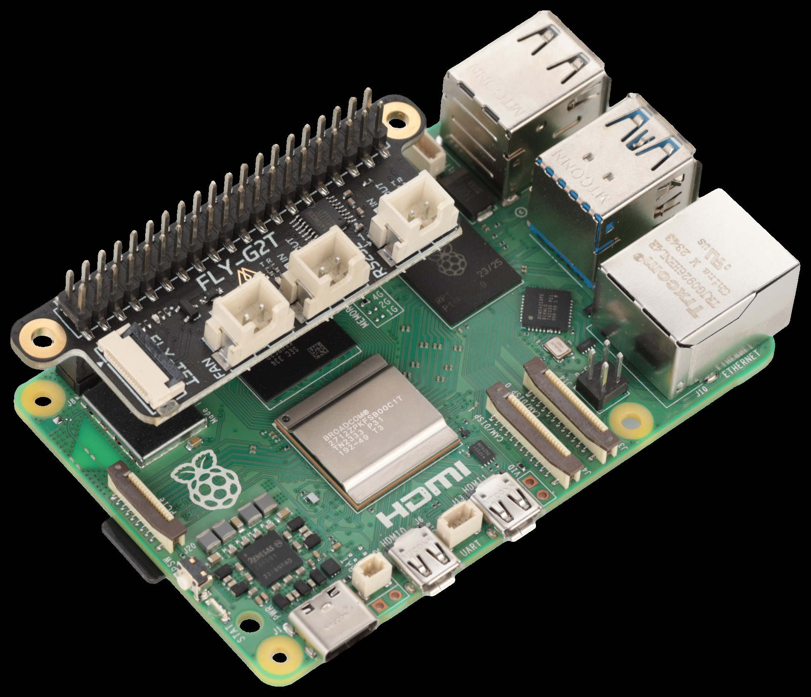
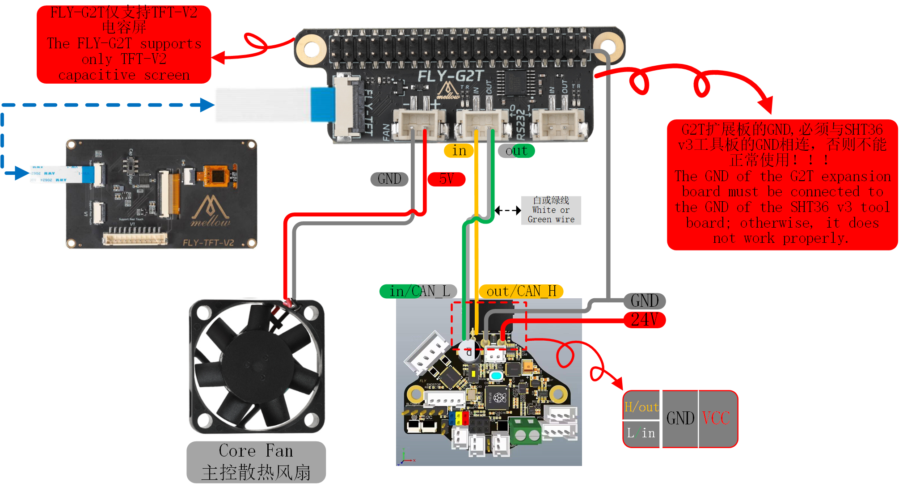

# 树莓派使用说明

本次教程使用FLY CM4扩展版与**树莓派CM4**为例

## 注意事项：

- 确保在安装扩展板前，上位机已经关闭电源。
- 避免在潮湿或灰尘环境中使用扩展板。
- 安装屏幕时，请注意不要带电拔插注意屏线方向，以免造成损坏。
- 安装风扇时，请注意风扇的电流和电压规格，以免造成损坏。
- 请注意UART1已经默认启用无需在配置
- 请刷最新镜像比如`mainsailos`，不是升级内核
- **树莓派可以使用全部接口！！！**
- **注意：树莓派使用的系统内核版本必须大于`5.17.x`, 执行命令`uname -r`查看内核版本**

## 树莓派预安装TFTV2系统下载链接

* 适用于树莓派3B/3B+/4B/CM4/5B的系统镜像

```
https://cdn.mellow.klipper.cn/IMG/Beta/RPI-TFT-IMG-new.img.xz
```

## 安装方法



## 串口使用方法

**正在完善仅供参考**

* 树莓派刷好最新系统后需要在**编辑boot盘下的config.txt文件**
* 在**config.txt**中添加即可

```
dtoverlay=uart3
```

uart1的id为

```
[mcu] 
serial: /dev/ttyAMA0
baud: 250000
restart_method:command
```

uart3的id为

```
[mcu] 
serial: /dev/ttyAMA1
baud: 250000
restart_method:command
```

## FAN使用方法

* 如果需要树莓派40PIN控制设备需要根据Klipper教程进行安装[RPi 微控制器](https://www.klipper3d.org/zh/RPi_microcontroller.html?h=rpi)

添加配置

```
[mcu host]       
serial: /tmp/klipper_host_mcu 

[temperature_sensor Raspberry Pi]
sensor_type: temperature_host

[temperature_fan core_fan] 
pin: host:gpio12
max_power: 1.0
sensor_type: temperature_host   #设置为上位机主控温度
control:watermark                  #控制方式
target_temp: 48                   #上位机散热风扇启动温度
min_temp: 0                     #最低温度，低于此温度将会报错
max_temp: 90                    #最高温度，高于此温度将会报错
off_below: 0.10
kick_start_time: 0.50
max_speed: 0.8                   #最大转速，为满功率运转时的80%
min_speed: 0.3                    #最小转速，为满功率运转时的30%
```

## 屏幕使用方法

Github地址:[FLY-TFT](https://github.com/kluoyun/FLY-TFT)


### 1. 介绍

FLY-TFT-V2是一款基于st7796的TFT液晶屏，支持电容触摸与电阻触摸两种，分辨率320x480，使用SPI接口

* 需要自行安装[KlipperScreen](https://klipperscreen.readthedocs.io/en/latest/Installation/)

### 2. 系统安装

> 注意：树莓派使用的系统内核版本必须大于`5.17.x`, 执行命令`uname -r`查看内核版本
>
> 请刷最新镜像比如`mainsailos`，不是升级内核

* 使用 [Raspberry Imager](https://www.raspberrypi.com/software/) 安装最新的 **MainsailOS**
    1. 下载并安装 [Raspberry Imager](https://www.raspberrypi.com/software/) 
    2. 打开**Raspberry Imager**
    3. 点击**CHOOSE DEVICE**
    4. 根据你的设备选择对应型号
    5. 点击**CHOOSE OS**
    6. 选择**Other specific-purpose OS**
    7. 选择**3D printing**
    8. 选择**Mainsail OS**
    9. 选择最新的版本。如果你的设置支持64位系统则选择**rpi64**
    10. 点击**CHOOSE STORAGE**
    11. 选择你的存储设备，比如SD卡
    12. 点击**NEXT**，等待安装完成

### 4. 驱动安装

1. 安装FLY-TFT-V2驱动
   
    ```
    git clone https://github.com/kluoyun/FLY-TFT.git
    cd FLY-TFT
    sudo chmod +x ./scripts/install.sh
    ./scripts/install.sh
    ```
    
    

### 5. 使用

> 触摸需要启用I2C支持，对应配置为`dtparam=i2c_arm=on`

1. 安装驱动后需要在config.txt文件中添加了 `dtoverlay=fly-tft-v2` 的覆盖层支持
2. 打开 `/boot/config.txt` (bookworm系统为`/boot/firmware/config.txt`)
    ```bash
    sudo nano /boot/config.txt
    ```
3. 在文件末尾添加下面的配置
   ```bash
    dtoverlay=fly-tft-v2
   ```
   * 默认屏幕为90度横屏显示，如果需要旋转屏幕请使用下面的配置
   ```bash
    dtoverlay=fly-tft-v2,r90  # 与默认方向一致，横向
    dtoverlay=fly-tft-v2,r270 # 270度横屏，横向(翻转)
    dtoverlay=fly-tft-v2,r0   # 0度竖屏，纵向
    dtoverlay=fly-tft-v2,r180 # 180度竖屏，纵向(翻转)
   ```
    * 只能添加任意一个配置，不能添加多个
    * 正常情况下，TFT的触摸方向会自动旋转跟随显示方向，无需修改系统内的触摸配置
4. 添加到文件末尾后，执行命令 `sudo reboot` 重启系统

* 请确保硬件连接正确
* 安装了驱动
* 在`/boot/config.txt` (bookworm系统为`/boot/firmware/config.txt`)文件中添加了`dtoverlay=fly-tft-v2` 的覆盖层支持
* 部分系统可能存在默认的fb0设备，FLY-TFT会被分配到fb1设备，需要修改配置文件使能fb1设备
* 执行命令`ls /dev/fb*`查看设备，如果出现两个设备fb0和fb1，请执行下面的命令将fb1设备使能（默认是fb0）
* 执行下面的命令修改默认配置为fb1设备
    ```bash
    sudo sed -i 's/\/dev\/fb0/\/dev\/fb1/g' /etc/X11/xorg.conf.d/99-fbdev.conf
    ```

### 6. 使用KlipperScreen

* MainsailOS默认没有安装KlipperScreen，需要手动安装
* 请参考[KlipperScreen](https://github.com/KlipperScreen/KlipperScreen)或使用[kiauh](https://github.com/dw-0/kiauh)安装
* 如果成功安装了KlipperScreen，且第5步骤已正确完成，此时应该已经显示了KlipperScreen界面

### 7. 所有可用配置

* `speed` [**需要参数**]：设置TFT的最大SPI时钟频率，单位为Hz，默认96000000(如果出现严重花屏请适当降低该值)
  * 示例：`dtoverlay=fly-tft-v2,speed=80000000` 

* `r0/r90/r180/r270` [**可选**][**无需参数**]：设置TFT的显示和触摸方向，默认为90度，可选值为0,90,180,270,(只能添加一个配置)
  * 示例：`dtoverlay=fly-tft-v2,r90`或`dtoverlay=fly-tft-v2,r180`

* `disable_touch` [**无需参数**]：禁用TFT的触摸功能，默认为启用
  * 示例：`dtoverlay=fly-tft-v2,disable_touch`

* `invx`,`invy` [**无需参数**]：设置TFT的触摸方向，`invx`为X方向翻转，`invy`为Y方向翻转
  * 示例：`dtoverlay=fly-tft-v2,invx`或`dtoverlay=fly-tft-v2,invy`或`dtoverlay=fly-tft-v2,invx,invy`

* `swapxy` [**无需参数**]：设置TFT的触摸方向，X轴与Y轴互换，即横屏
    * 示例：`dtoverlay=fly-tft-v2,swapxy`

> **注意：** 所有参数可以同时设置(可选参数只能选择一个设置)，多个参数之间用逗号隔开，多个参数只能在同一行

> **警告：** 正常情况只有`r0`,`r90`,`r180`,`r270`四个参数使用，其他参数仅在特殊情况下使用，尤其是`invx`,`invy`,`swapxy`
* 示例：`dtoverlay=fly-tft-v2,speed=80000000,r270`

### 屏幕接线


## 接线方法


