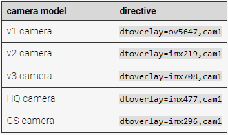

# 使用DSI与CSI

CM4不支持摄像头和显示器自动检测，因此您需要在**boot.txt**中手动配置它

打开**boot.txt**在里面添加下方代码并且保存重启

* 请注意需要将 [type] 替换为其中之一

```
dtoverlay=vc4-kms-dsi-7inch
dtoverlay=[type]，cam1
```


```
dtoverlay=ov647，cam1
dtoverlay=imx219，cam1
dtoverlay=imx708，cam1
dtoverlay=imx477，cam1
dtoverlay=imx296，cam1
```
