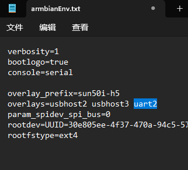
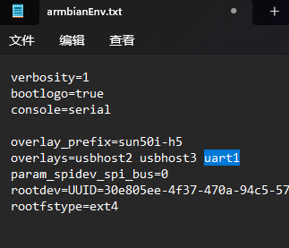

# 配合FLY-PI使用

* 安装图


1. 烧录系统

* [FLY PI 系统烧录](/board/fly_pi/mirror/FLY_π_mirror)

> [!TIP]
> 烧录完成后请先不要启动系统，完成以下设置

* 烧录好的SD卡在电脑中是一个boot磁盘


2. 打开其中的**armbianEnv.txt**文件并在**overlays**行加入配置(如果对应配置已存在则不处理)

> [!TIP]
> **overlays**里面的多个配置用空格分开，只修改文档中说明的内容，其余原有配置不要修改

<!-- tabs:start -->

#### **FLY-PI V2**

* FLY-PI V2 加入**uart1**

    ```cfg
    overlays=usbhost2 usbhost3 uart1
    ```

    

#### **FLY-PI**

* FLY-PI 加入**uart2**

    ```cfg
    overlays=usbhost2 usbhost3 uart2
    ```

    

<!-- tabs:end -->

7. 准备工作完成，现在可以将SD卡装到Puppet上电启动了

## 安装klipper Linux MCU

> [!TIP]
> FLY-PI系统已经预装Linux MCU

## Klipper配置

* 浏览器打开[http://fluiddpi](http://fluiddpi) 或 [http://mainsailos](http://mainsailos) 或http://ip/

<!-- tabs:start -->

#### **FLY-PI V2**

```cfg
[mcu]
serial: /dev/ttyS1
restart_method: command

[mcu host]
serial: /tmp/klipper_host_mcu
```

#### **FLY-PI**

```cfg
[mcu]
serial: /dev/ttyS2
restart_method: command

[mcu host]
serial: /tmp/klipper_host_mcu
```

<!-- tabs:end -->


* 具体配置请参考[示例配置](/board/fly_puppet/cfg.md)
