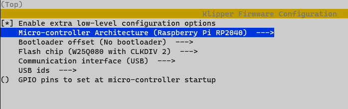
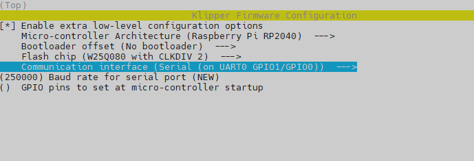
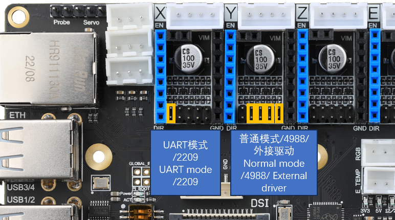

# PUPPET使用教程

## 6Pin拨码开关使用

* 使用FLY-π时,不需要调整拨码开关
* 6P拨码开关用于USB控制，2P为一组，默认全部是OFF，需用户自行开启
* 第一组：拨码开关1,2 。 **ON：将CM4的USB拓展到板载的4个USB口** 不能与第三组同时ON
* 第二组：拨码开关3,4 。 **ON：将下位机RP2040的USB连接到板载Type-c接口** 不能与第三组同时ON
* 第三组：拨码开关5,6 。 **ON：将CM4的USB连接到板载Type-c接口** 用于CM4 EMMC烧录

## 编译固件

1.Puppet的Klipper固件配置

* 打开第二组拨码开关时使用USB连接如下图配置
  

2.使用串口配置

* 使用40pin串口与上位机连接时使用如下配置

  

3.编译固件

  * 执行下面的命令编译固件

  ```bash
  cd ~/klipper
  make -j4
  ```

## 烧录固件

### USB烧录模式

> [!TIP]
> PUPPET需要插入BOOT跳线帽来进入烧录模式

* 请提前将拨码开关第二组拨至ON，打开状态

1. 插入BOOT跳线帽
2. 使用USB Type-c数据线连接RPFMEX板到电脑
3. 如果一切正常，电脑中会出现一个可移动磁盘 RPI-RP2
   


4. 将前面编译生成的固件文件(klipper.uf2)复制到RPI-RP2磁盘
5. 如无异常主板板会自动烧录并重启

## 安装使用

* FLY-Puppet可配合RPI使用，RPI-CM4和RPI-3/3B/4B，FLY-π
* 不可同时连接CM4和其他RPI

* 与上位机配合使用请查看左侧目录中对应选项

## 驱动跳线设置

