# PUPPET使用教程

## 6Pin拨码开关使用

* 6P拨码开关用于USB控制，2P为一组，默认全部是OFF，需用户自行开启
* 第一组：拨码开关1,2 。 **ON：将CM4的USB拓展到板载的4个USB口** 不能与第三组同时ON
* 第二组：拨码开关3,4 。 **ON：将下位机RP2040的USB连接到板载Type-c接口** 不能与第三组同时ON
* 第三组：拨码开关5,6 。 **ON：将CM4的USB连接到板载Type-c接口** 用于CM4 EMMC烧录

## 编译固件

PUPPET的Klipper固件配置

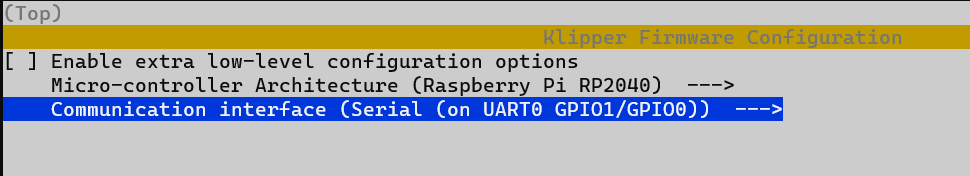

* 如何编译固件参考[固件烧录](/introduction/firmware)

## 烧录固件

### USB烧录模式

?> PUPPET需要插入BOOT跳线帽来进入烧录模式

* 请提前将拨码开关第二组拨至ON，打开状态

1. 插入BOOT跳线帽
2. 使用USB Type-c数据线连接RPFMEX板到电脑
3. 如果一切正常，电脑中会出现一个可移动磁盘 RPI-RP2
   
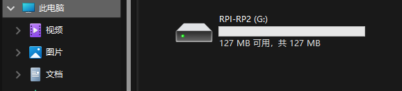

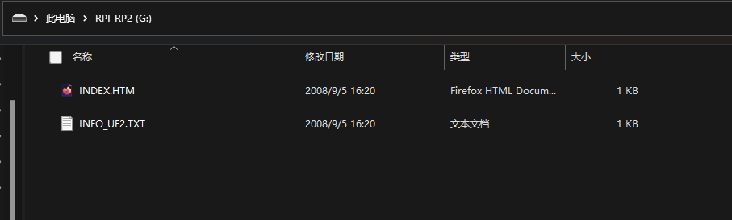

4. 将前面编译生成的固件文件(klipper.uf2)复制到RPI-RP2磁盘
5. 如无异常RHT板会自动烧录并重启

## 与RPI连接

* FLY-Puppet可配合RPI使用，RPI-CM4和RPI-3/3B/4B
* 不可同时连接CM4和其他RPI

<!-- tabs:start -->

#### **安装RPI-CM4**

* 安装时注意方向，确保孔位正确

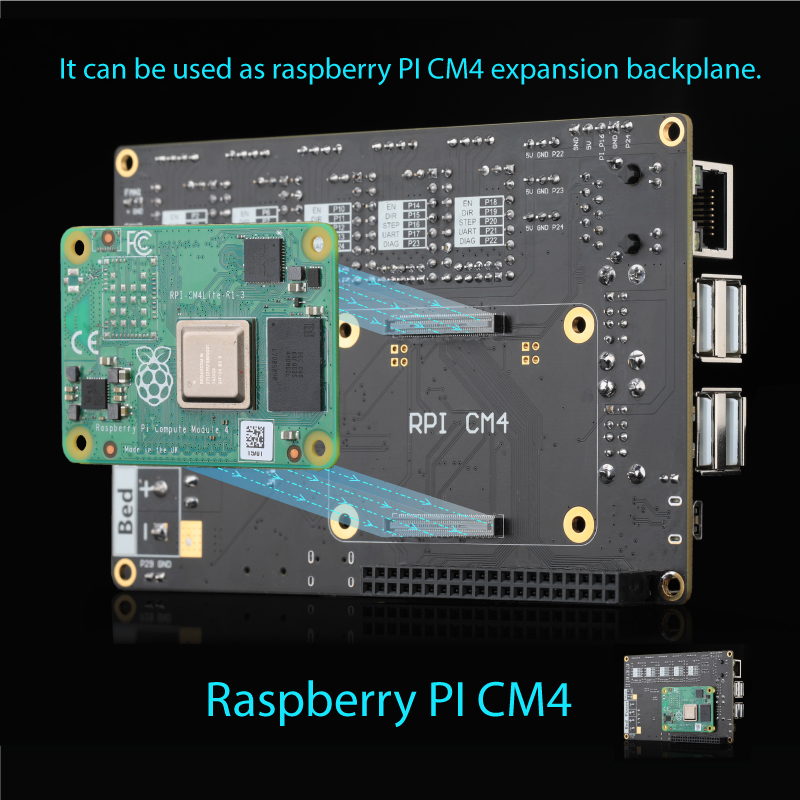

#### **安装RPI-3/3B/4B**

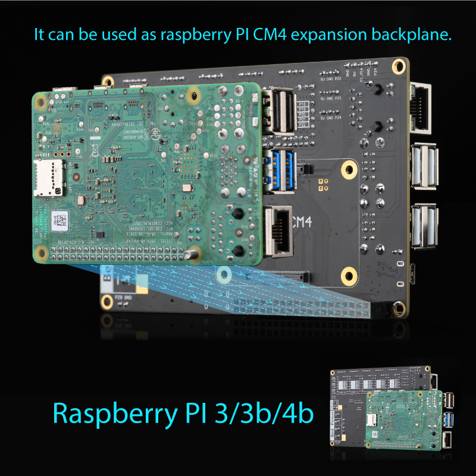

#### **安装FLY-PI**

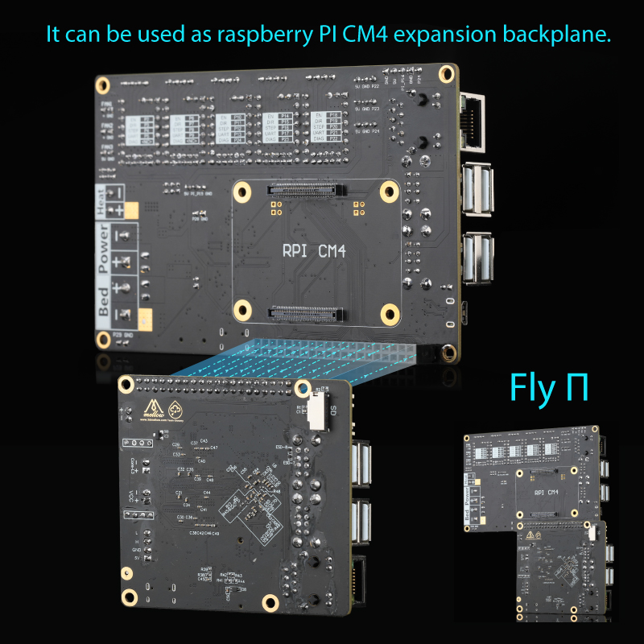

<!-- tabs:end -->

## 系统烧录

1. CM4板载EMMC烧录

* 如果你的CM4没有emmc，而是使用SD卡请直接跳过这步，开始阅读第2步
* 将Puppet板的拨码开关第三组打开，其余关闭
* 使用镊子短接PI_BOOT，如下图。(为了确保主板插入CM4的安全性，默认没有焊接排针)

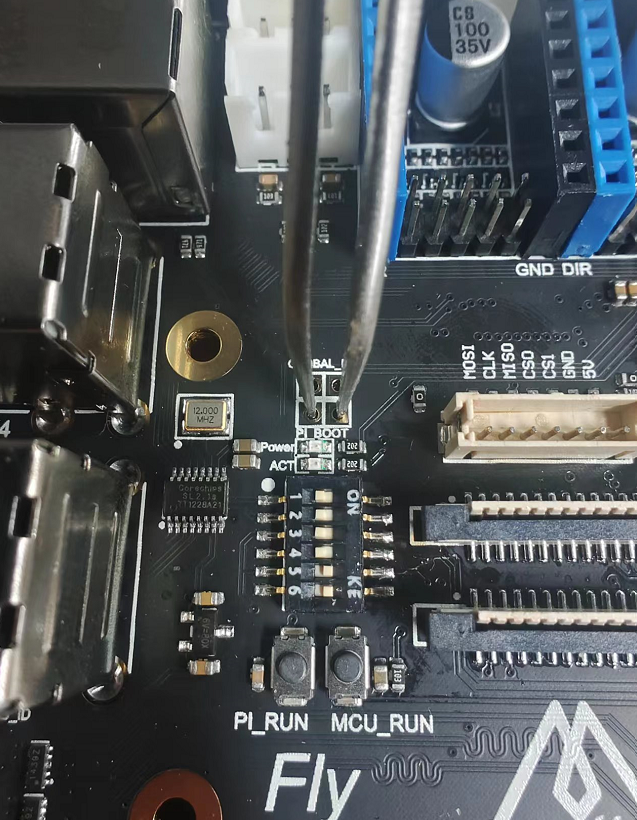

* 使用type-c数据线将puppet连接到电脑
* [下载rpiboot](https://github.com/raspberrypi/usbboot/raw/master/win32/rpiboot_setup.exe)
* 下载后直接运行，如果一切正常会出现下图成功字样

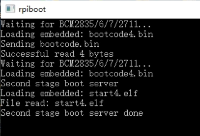

* 运行成功后CM4的emmc会直接挂载成U盘到系统，可直接烧录系统

1. 烧录系统

* 建议使用mainsailos或者fluiddpi
* [MainsailOS 下载](https://github.com/mainsail-crew/MainsailOS/releases/latest)
* [MainsailOS 烧录教程](https://docs.mainsail.xyz/setup/mainsailos/pi-imager)
  
* [FluiddPi 下载](https://github.com/fluidd-core/FluiddPi/releases/latest)
* [FluiddPi 烧录教程](https://docs.fluidd.xyz/installation/fluiddpi)

?> 烧录完成后请先不要启动系统，完成以下设置

* 烧录好的SD卡在电脑中是一个boot磁盘

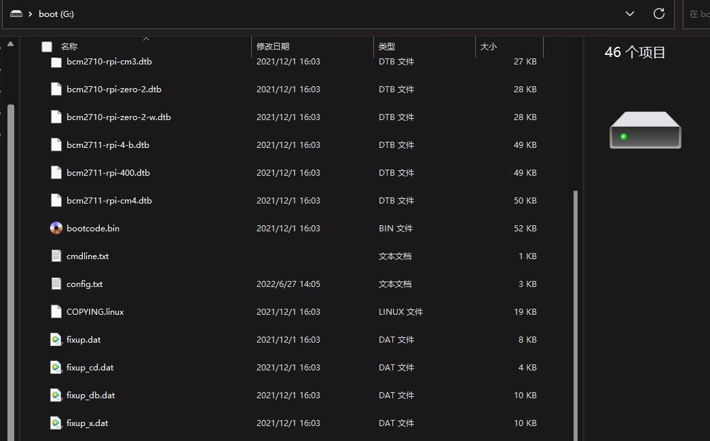

3. 打开其中的**config.txt**文件加入两行配置

```cfg
dtoverlay=pi3-miniuart-bt
dtoverlay=dwc2,dr_mode=host
```


4. 在boot磁盘下新建一个空白文件，文件名为**SSH**，没有后缀

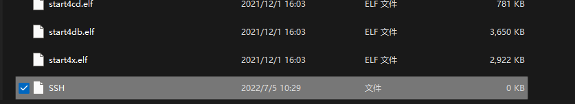

5. 如果需要设置RPI连接WiFi请修改以下文件

* MainsailOS修改**mainsailos-wpa-supplicant.txt**
* FluiddPi修改**fluiddpi-wpa-supplicant.txt**
* 删除这4行前面的#
* 将ssid和psk分别修改为你的WiFi名及密码

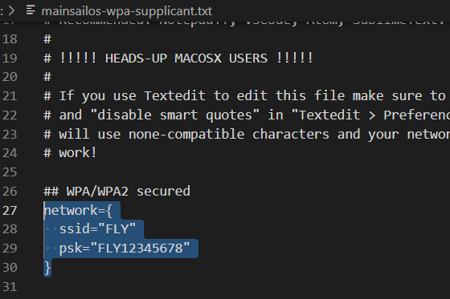

6. 准备工作完成，现在可以将SD卡装到Puppet上电启动了

## 安装klipper RPI MCU

* 为了确保您能使用FLY-Puppet主板所有功能，请安装Linux mcu

1. 先使用终端工具连接到您的主板SSH
2. 安装脚本

```bash
cd ~/klipper/
sudo cp "./scripts/klipper-mcu-start.sh" /etc/init.d/klipper_mcu
sudo update-rc.d klipper_mcu defaults

```

3. 配置固件

```bash
cd ~/klipper/
make menuconfig
```

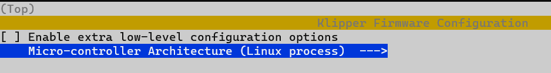


4. 编译安装

```bash
sudo service klipper stop
make flash
sudo service klipper start

```

## Klipper配置

* 浏览器打开[http://fluiddpi](http://fluiddpi) 或 [http://mainsailos](http://mainsailos)
* 使用UART连接的可直接配置MCU serial为**/dev/serial0**

```cfg
[mcu]
serial: /dev/serial0
restart_method: command

[mcu host]
serial: /tmp/klipper_host_mcu
```

* 具体配置请参考[示例配置](/board/fly_puppet/cfg.md)
